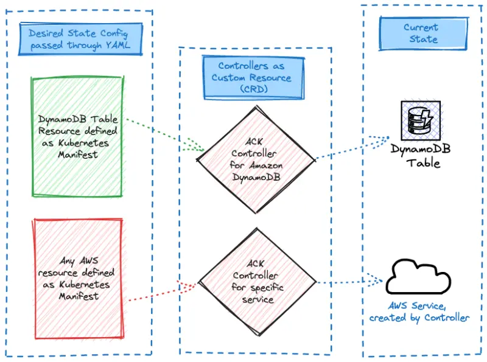

デフォルトでは、サンプルアプリケーションの**Carts**コンポーネントは、EKSクラスター内でポッドとして実行されている`carts-dynamodb`というDynamoDBローカルインスタンスを使用しています。このセクションでは、Kubernetesカスタムリソースを使用してアプリケーション用のAmazon DynamoDBクラウドベーステーブルをプロビジョニングし、**Carts**デプロイメントをローカルコピーの代わりにこの新しくプロビジョニングされたDynamoDBテーブルを使用するように構成します。



Kubernetesマニフェストを使用してDynamoDBテーブルを作成する方法を見てみましょう：

```file
manifests/modules/automation/controlplanes/ack/dynamodb/dynamodb-create.yaml
```

:::info
注意深い観察者は、YAMLの仕様がDynamoDBの[APIシグネチャ](https://docs.aws.amazon.com/amazondynamodb/latest/APIReference/API_CreateTable.html)に非常に似ていることに気づくでしょう。`tableName`や`attributeDefinitions`などの馴染みのあるフィールドが含まれています。
:::

では、これらの更新をクラスターに適用しましょう：

```bash wait=10
$ kubectl kustomize ~/environment/eks-workshop/modules/automation/controlplanes/ack/dynamodb \
  | envsubst | kubectl apply -f-
table.dynamodb.services.k8s.aws/items created
```

クラスター内のACKコントローラーはこれらの新しいリソースに応答し、マニフェストで定義されたAWSインフラストラクチャをプロビジョニングします。ACKがテーブルを作成したことを確認するには、次のコマンドを実行します：

```bash timeout=300
$ kubectl wait table.dynamodb.services.k8s.aws items -n carts --for=condition=ACK.ResourceSynced --timeout=15m
table.dynamodb.services.k8s.aws/items condition met
$ kubectl get table.dynamodb.services.k8s.aws items -n carts -ojson | yq '.status."tableStatus"'
ACTIVE
```

最後に、AWS CLIを使用してテーブルが作成されたことを確認しましょう：

```bash
$ aws dynamodb list-tables

{
    "TableNames": [
        "eks-workshop-carts-ack"
    ]
}
```

この出力は、新しいテーブルが正常に作成されたことを確認しています！

ACKを活用することで、Kubernetesクラスターから直接クラウドベースのDynamoDBテーブルをシームレスにプロビジョニングし、AWSリソースを管理するためのこのアプローチの力と柔軟性を実証しました。
