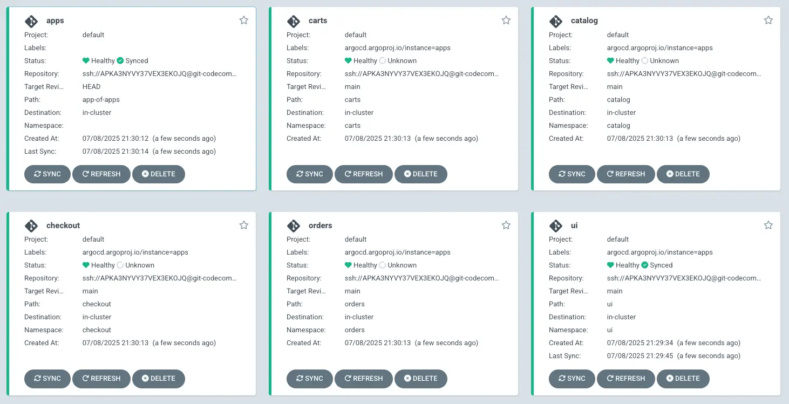

Helmチャートを使用してDRY（Don't Repeat Yourself）アプローチでArgo CDアプリケーションのテンプレートを作成します：

```text
.
|-- app-of-apps
|   |-- Chart.yaml
|   |-- templates
|   |   |-- _application.yaml
|   |   `-- application.yaml
|   `-- values.yaml
|-- ui
`-- catalog
    ...
```

`_application.yaml`はテンプレートファイルで、コンポーネント名のリストに基づいてアプリケーションを動的に作成するために使用されます：

<!-- prettier-ignore-start -->
::yaml{file="manifests/modules/automation/gitops/argocd/app-of-apps/templates/_application.yaml"}
<!-- prettier-ignore-end -->

`values.yaml`ファイルは、Argo CDアプリケーションが生成されるコンポーネントのリストと、すべてのアプリケーション間で共通となるGitリポジトリに関連する設定を指定します：

::yaml{file="manifests/modules/automation/gitops/argocd/app-of-apps/values.yaml"}

まず、このApp of Appsの基本構成をGitディレクトリにコピーしましょう：

```bash
$ export GITOPS_REPO_URL_ARGOCD="ssh://git@${GITEA_SSH_HOSTNAME}:2222/workshop-user/argocd.git"
$ cp -R ~/environment/eks-workshop/modules/automation/gitops/argocd/app-of-apps ~/environment/argocd/
$ yq -i ".spec.source.repoURL = env(GITOPS_REPO_URL_ARGOCD)" ~/environment/argocd/app-of-apps/values.yaml
```

次に、これらの変更をGitリポジトリにコミットしてプッシュしましょう：

```bash wait=10
$ git -C ~/environment/argocd add .
$ git -C ~/environment/argocd commit -am "Adding App of Apps"
$ git -C ~/environment/argocd push
```

次に、App of Appsパターンを実装するための新しいArgo CDアプリケーションを作成する必要があります。この際、`--sync-policy automated`フラグを使用して、Argo CDがクラスター内の状態をGitリポジトリの構成と自動的に[同期](https://argo-cd.readthedocs.io/en/stable/user-guide/auto_sync/)できるようにします：

```bash
$ argocd app create apps --repo ssh://git@${GITEA_SSH_HOSTNAME}:2222/workshop-user/argocd.git \
  --dest-server https://kubernetes.default.svc \
  --sync-policy automated --self-heal --auto-prune \
  --set-finalizer \
  --upsert \
  --path app-of-apps
 application 'apps' created
$ argocd app wait apps --timeout 120
```

Argo CD UIを開いて、メインの「Applications」ページに移動します。私たちのApp of Apps構成はデプロイされ同期されていますが、UIコンポーネントを除くすべてのワークロードアプリは「Unknown」とマークされています。



次のステップで、ワークロードの構成をデプロイします。
