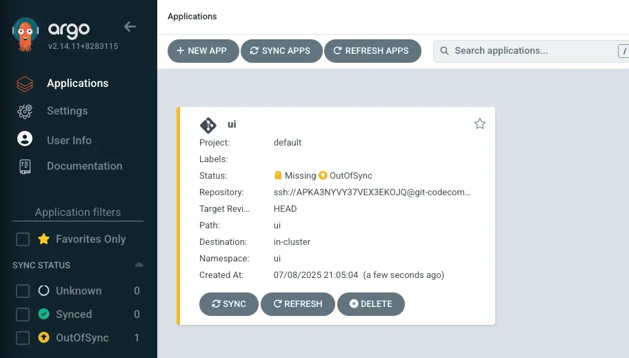

Argo CDをクラスターに正常に設定したので、アプリケーションをデプロイしましょう。GitOpsベースの配信アプローチと従来のデプロイ方法の違いを示すために、サンプルアプリケーションのUIコンポーネントを`kubectl apply -k`アプローチからArgo CD管理のデプロイに移行します。

Argo CDアプリケーションは、環境内のデプロイされたアプリケーションインスタンスを表すCustom Resource Definition（CRD）です。アプリケーション名、Gitリポジトリの場所、Kubernetesマニフェストへのパスなどの重要な情報を定義します。アプリケーションリソースはまた、望ましい状態、ターゲットリビジョン、同期ポリシー、およびヘルスチェックポリシーも指定します。

まず、既存のサンプルアプリケーションをクラスターから削除しましょう：

```bash
$ kubectl delete namespace -l app.kubernetes.io/created-by=eks-workshop
namespace "carts" deleted
namespace "catalog" deleted
namespace "checkout" deleted
namespace "orders" deleted
namespace "other" deleted
namespace "ui" deleted
```

次に、シンプルなHelmチャートでGitリポジトリを設定します：

::yaml{file="manifests/modules/automation/gitops/argocd/Chart.yaml"}

このチャートは、UIコンポーネント用の公開チャートをHelm依存関係として使用することでラップしています。

このファイルをGitディレクトリにコピーしましょう：

```bash
$ mkdir -p ~/environment/argocd/ui
$ cp ~/environment/eks-workshop/modules/automation/gitops/argocd/Chart.yaml \
  ~/environment/argocd/ui
```

Gitディレクトリは以下のような構造になっているはずです：

```bash
$ tree ~/environment/argocd
`-- ui
    `-- Chart.yaml
```

次に、構成をGitリポジトリにプッシュします：

```bash
$ git -C ~/environment/argocd add .
$ git -C ~/environment/argocd commit -am "Adding the UI service"
$ git -C ~/environment/argocd push
```

次に、Gitリポジトリを使用するように構成されたArgo CDアプリケーションを作成します：

```bash
$ argocd app create ui --repo ssh://git@${GITEA_SSH_HOSTNAME}:2222/workshop-user/argocd.git \
  --path ui --dest-server https://kubernetes.default.svc \
  --dest-namespace ui --sync-option CreateNamespace=true
application 'ui' created
```

アプリケーションが作成されたことを確認できます：

```bash
$ argocd app list
NAME         CLUSTER                         NAMESPACE  PROJECT  STATUS     HEALTH   SYNCPOLICY  CONDITIONS
argocd/ui    https://kubernetes.default.svc  ui         default  OutOfSync  Missing  Manual      <none>
```

このアプリケーションはArgo CD UIで確認できます：



あるいは、`kubectl`コマンドを使用してArgo CDオブジェクトを直接操作することもできます：

```bash
$ kubectl get applications.argoproj.io -n argocd
NAME   SYNC STATUS   HEALTH STATUS
apps   OutOfSync     Missing
```

Argo CDを開いて`apps`アプリケーションに移動すると、以下のように表示されます：


Argo CDでは、「out of sync」（同期していない）は、Gitリポジトリで定義された望ましい状態がKubernetesクラスター内の実際の状態と一致していないことを示します。Argo CDは自動同期が可能ですが、今は手動でこのプロセスをトリガーします：

```bash
$ argocd app sync ui
$ argocd app wait ui --timeout 120
```

しばらくすると、アプリケーションは`Synced`状態に到達し、すべてのリソースがデプロイされます。UIは次のようになります：


これにより、Argo CDがHelmチャートを正常にインストールし、クラスターと同期していることが確認されました。

これでUIコンポーネントをArgo CDを使用してデプロイするように正常に移行しました。今後Gitリポジトリにプッシュされた変更は、自動的にEKSクラスターに調整されます。

UIサービスに関連するすべてのリソースがデプロイされたことを確認するために、次のコマンドを実行します：

```bash hook=deploy
$ kubectl get deployment -n ui ui
NAME   READY   UP-TO-DATE   AVAILABLE   AGE
ui     1/1     1            1           61s
$ kubectl get pod -n ui
NAME                 READY   STATUS   RESTARTS   AGE
ui-6d5bb7b95-rjfxd   1/1     Running  0          62s
```
