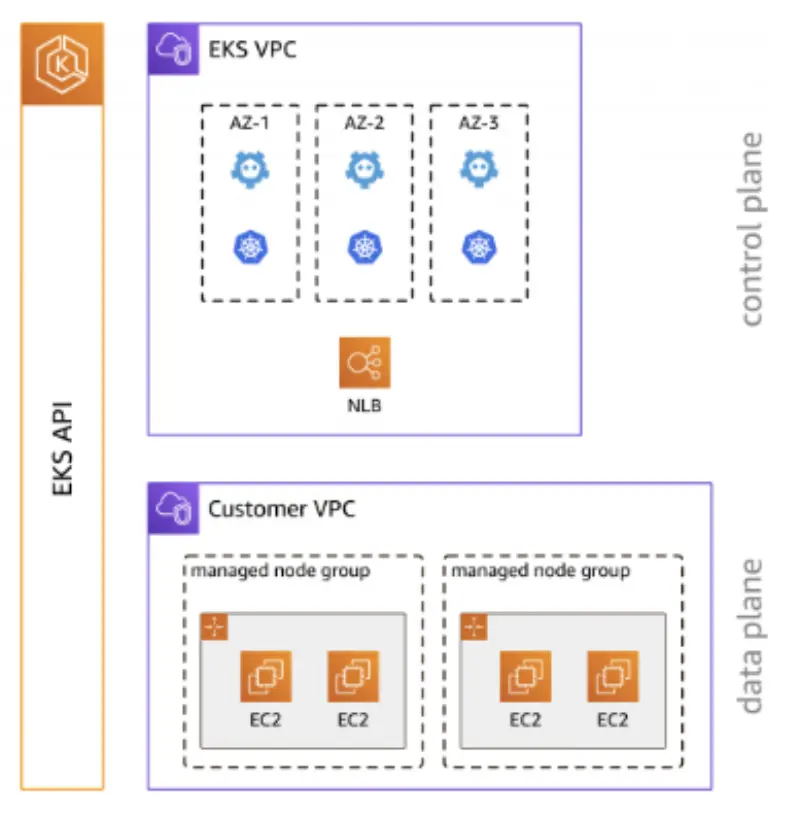

EKSクラスターには、Podがスケジュールされる1つ以上のEC2ノードが含まれています。EKSノードはAWSアカウント内で実行され、クラスターAPIサーバーエンドポイントを通じてクラスターのコントロールプレーンに接続します。ノードグループに1つ以上のノードをデプロイします。ノードグループは、EC2 Auto Scalingグループにデプロイされる1つ以上のEC2インスタンスです。

EKSノードは標準的なAmazon EC2インスタンスです。EC2の価格に基づいて課金されます。詳細は、[Amazon EC2の料金](https://aws.amazon.com/ec2/pricing/)を参照してください。

[Amazon EKSマネージドノードグループ](https://docs.aws.amazon.com/eks/latest/userguide/managed-node-groups.html)は、Amazon EKSクラスター用のノードのプロビジョニングとライフサイクル管理を自動化します。これにより、新しいAMIやKubernetesバージョンのデプロイメントのローリングアップデートなどの運用アクティビティが大幅に簡素化されます。

Amazon EKSマネージドノードグループの利点には以下が含まれます：

- Amazon EKSコンソール、`eksctl`、AWS CLI、AWS API、またはAWS CloudFormationとTerraformなどのインフラストラクチャアズコードツールを使用して、1つの操作でノードの作成、自動更新、または終了が可能
- プロビジョニングされたノードは最新のAmazon EKS最適化AMIを使用して実行
- MNGの一部としてプロビジョニングされたノードは、アベイラビリティーゾーン、CPU アーキテクチャ、インスタンスタイプなどのメタデータで自動的にタグ付けされる
- ノードの更新と終了は自動的かつ丁寧にノードをドレインし、アプリケーションが利用可能な状態を維持することを保証
- Amazon EKSマネージドノードグループの使用に追加料金はなく、プロビジョニングされたAWSリソースに対してのみ支払う

このセクションのラボでは、EKSマネージドノードグループを使用してクラスターにコンピューティング能力を提供するさまざまな方法について説明します。
