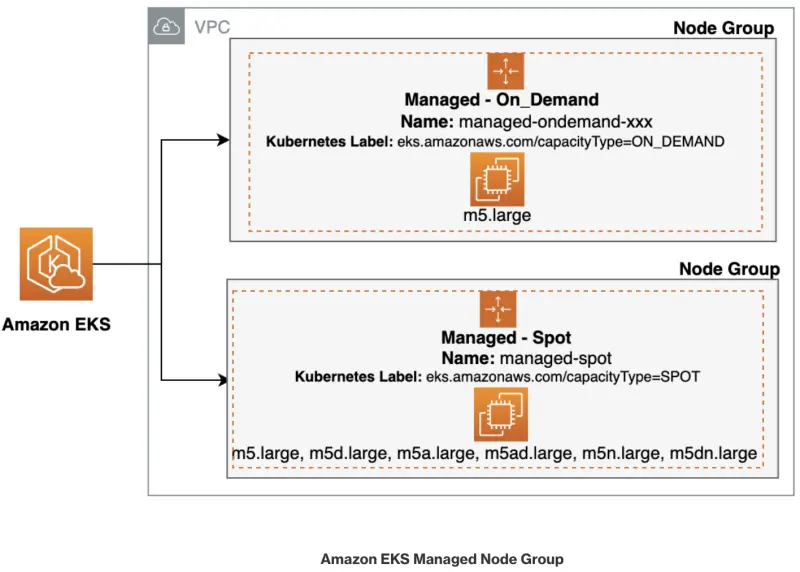

スポットインスタンスを作成するマネージドノードグループをデプロイし、その後、アプリケーションの既存の `catalog` コンポーネントを新しく作成したスポットインスタンス上で実行するように変更しましょう。

既存のEKSクラスタ内のすべてのノードをリストすることから始めましょう。`kubectl get nodes` コマンドを使用してKubernetesクラスタ内のノードをリストできますが、キャパシティタイプに関する追加の詳細情報を取得するために、`-L eks.amazonaws.com/capacityType` パラメータを使用します。

以下のコマンドは、現在のノードが**オンデマンド**インスタンスであることを示しています。

```bash
$ kubectl get nodes -L eks.amazonaws.com/capacityType
NAME                                          STATUS   ROLES    AGE    VERSION                CAPACITYTYPE
ip-10-42-103-103.us-east-2.compute.internal   Ready    <none>   133m   vVAR::KUBERNETES_NODE_VERSION      ON_DEMAND
ip-10-42-142-197.us-east-2.compute.internal   Ready    <none>   133m   vVAR::KUBERNETES_NODE_VERSION      ON_DEMAND
ip-10-42-161-44.us-east-2.compute.internal    Ready    <none>   133m   vVAR::KUBERNETES_NODE_VERSION      ON_DEMAND
```

:::tip
`on-demand`インスタンスなど、特定のキャパシティタイプに基づいてノードを取得したい場合は、「<b>ラベルセレクター</b>」を利用できます。この特定のシナリオでは、ラベルセレクターを`capacityType=ON_DEMAND`に設定することでこれを実現できます。

```bash
$ kubectl get nodes -l eks.amazonaws.com/capacityType=ON_DEMAND

NAME                                         STATUS   ROLES    AGE     VERSION
ip-10-42-10-119.us-east-2.compute.internal   Ready    <none>   3d10h   vVAR::KUBERNETES_NODE_VERSION
ip-10-42-10-200.us-east-2.compute.internal   Ready    <none>   3d10h   vVAR::KUBERNETES_NODE_VERSION
ip-10-42-11-94.us-east-2.compute.internal    Ready    <none>   3d10h   vVAR::KUBERNETES_NODE_VERSION
ip-10-42-12-235.us-east-2.compute.internal   Ready    <none>   4h34m   vVAR::KUBERNETES_NODE_VERSION
```

:::

以下の図では、クラスタ内のマネージドノードグループを表す2つの別個の「ノードグループ」があります。最初のノードグループボックスは、オンデマンドインスタンスを含むノードグループを表し、2番目はスポットインスタンスを含むノードグループを表します。どちらも指定されたEKSクラスタに関連付けられています。



スポットインスタンスを持つノードグループを作成しましょう。次のコマンドは、新しいノードグループ `managed-spot` を作成します。

```bash wait=10
$ aws eks create-nodegroup \
  --cluster-name $EKS_CLUSTER_NAME \
  --nodegroup-name managed-spot \
  --node-role $SPOT_NODE_ROLE \
  --subnets $PRIMARY_SUBNET_1 $PRIMARY_SUBNET_2 $PRIMARY_SUBNET_3 \
  --instance-types c5.large c5d.large c5a.large c5ad.large c6a.large \
  --capacity-type SPOT \
  --scaling-config minSize=2,maxSize=3,desiredSize=2 \
  --disk-size 20
```

`--capacity-type SPOT`引数は、このマネージドノードグループのすべてのキャパシティがスポットであることを示しています。

:::tip
aws `eks wait nodegroup-active`コマンドを使用して、特定のEKSノードグループがアクティブになり、使用準備が整うまで待機できます。このコマンドはAWS CLIの一部であり、指定されたノードグループが正常に作成され、関連するすべてのインスタンスが実行中で準備ができていることを確認するために使用できます。

```bash wait=30 timeout=300
$ aws eks wait nodegroup-active \
  --cluster-name $EKS_CLUSTER_NAME \
  --nodegroup-name managed-spot
```

:::

新しいマネージドノードグループが**アクティブ**になったら、以下のコマンドを実行します。

```bash
$ kubectl get nodes -L eks.amazonaws.com/capacityType,eks.amazonaws.com/nodegroup

NAME                                          STATUS   ROLES    AGE     VERSION                CAPACITYTYPE   NODEGROUP
ip-10-42-103-103.us-east-2.compute.internal   Ready    <none>   3h38m   vVAR::KUBERNETES_NODE_VERSION      ON_DEMAND      default
ip-10-42-142-197.us-east-2.compute.internal   Ready    <none>   3h38m   vVAR::KUBERNETES_NODE_VERSION      ON_DEMAND      default
ip-10-42-161-44.us-east-2.compute.internal    Ready    <none>   3h38m   vVAR::KUBERNETES_NODE_VERSION      ON_DEMAND      default
ip-10-42-178-46.us-east-2.compute.internal    Ready    <none>   103s    vVAR::KUBERNETES_NODE_VERSION      SPOT           managed-spot
ip-10-42-97-19.us-east-2.compute.internal     Ready    <none>   104s    vVAR::KUBERNETES_NODE_VERSION      SPOT           managed-spot
```

出力は、ノードグループ `managed-spot` の下に2つの追加ノードがプロビジョニングされ、キャパシティタイプが `SPOT` であることを示しています。

