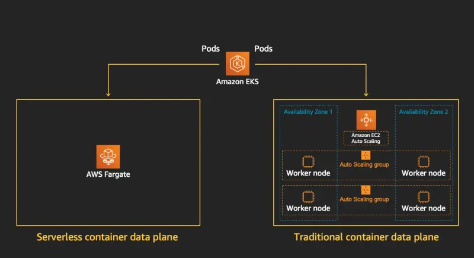

::required-time

:::tip 始める前に
このセクションの環境を準備してください：

```bash timeout=400 wait=30
$ prepare-environment fundamentals/fargate
```

これにより、ラボ環境に以下の変更が適用されます：

- Fargateで使用するIAMロールを作成

この変更を適用するTerraformは[こちら](https://github.com/VAR::MANIFESTS_OWNER/VAR::MANIFESTS_REPOSITORY/tree/VAR::MANIFESTS_REF/manifests/modules/fundamentals/fargate/.workshop/terraform)で確認できます。

:::

前のモジュールでは、EKSクラスターでPodを実行するためのEC2コンピューティングインスタンスのプロビジョニング方法と、マネージドノードグループが運用の負担を軽減する方法を見てきました。しかし、このモデルでは、基盤となるインフラストラクチャの可用性、容量、メンテナンスに対する責任はまだあなたにあります。

[AWS Fargate](https://aws.amazon.com/fargate/)は、コンテナに対してオンデマンドの適切なサイズのコンピューティング容量を提供する技術です。AWS Fargateを使用すると、コンテナを実行するための仮想マシンのグループをプロビジョニング、設定、またはスケーリングする必要がありません。また、サーバータイプを選択したり、ノードグループをいつスケーリングするかを決定したり、クラスターのパッキングを最適化したりする必要もありません。Fargateプロファイルを使用して、どのPodがFargateで起動し、どのように実行されるかを制御できます。FargateプロファイルはAmazon EKSクラスターの一部として定義されます。



Amazon EKSは、Kubernetesが提供する上流の拡張可能なモデルを使用してAWSが構築したコントローラーを使用して、KubernetesとAWS Fargateを統合します。これらのコントローラーはAmazon EKSマネージドKubernetesコントロールプレーンの一部として実行され、ネイティブKubernetes PodをFargateにスケジュールする責任を負っています。Fargateコントローラーには、デフォルトのKubernetesスケジューラーと並行して実行される新しいスケジューラーと、いくつかの変更および検証アドミッションコントローラーが含まれています。Fargateで実行するための基準を満たすPodを起動すると、クラスターで実行されているFargateコントローラーがPodを認識、更新し、Fargateにスケジュールします。

Fargateの利点には以下が含まれます：

- AWS Fargateを使用すると、アプリケーションに集中できます。アプリケーションのコンテンツ、ネットワーク、ストレージ、スケーリング要件を定義します。プロビジョニング、パッチ適用、クラスター容量管理、インフラストラクチャ管理は必要ありません。
- AWS Fargateは、マイクロサービスアーキテクチャのアプリケーション、バッチ処理、機械学習アプリケーション、オンプレミスアプリケーションのクラウドへの移行など、一般的なすべてのコンテナのユースケースをサポートしています。
- 隔離モデルとセキュリティのためにAWS Fargateを選択してください。また、EC2インスタンスをプロビジョニングまたは管理することなくコンテナを起動したい場合もFargateを選択してください。EC2インスタンスの制御をより強くしたり、カスタマイズオプションを広げたりする必要がある場合は、Fargateなしでのマネージドなノードを選択してください。
