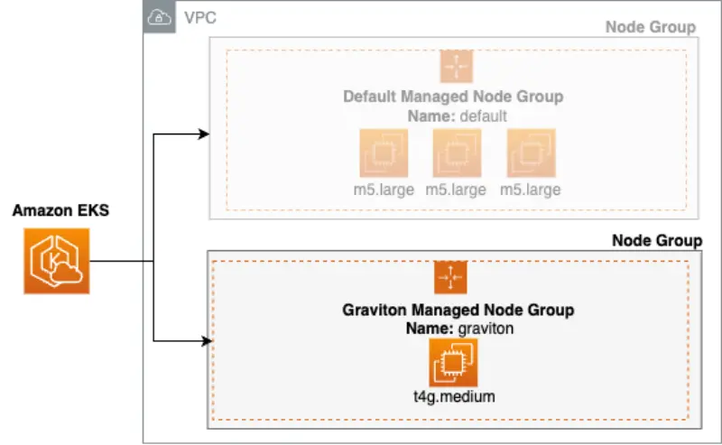

::required-time

:::tip 始める前に
このセクションのために環境を準備しましょう：

```bash timeout=600 wait=30
$ prepare-environment fundamentals/mng/graviton
```

:::

オンデマンドインスタンスやスポットインスタンスを使用する場合でも、AWSはEC2およびEC2ベースのEKSマネージドノードグループに対して3種類のプロセッサを提供しています。お客様は、Intel、AMD、ARM（AWS Graviton）プロセッサから選択できます。[AWS Gravitonプロセッサ](https://aws.amazon.com/ec2/graviton/)は、Amazon EC2で実行されるクラウドワークロードに最適な価格性能比を提供するためにAWSによって設計されています。

Gravitonベースのインスタンスは、[インスタンスタイプの命名規則](https://docs.aws.amazon.com/AWSEC2/latest/UserGuide/instance-types.html#instance-type-names)のプロセッサファミリーセクションの文字「g」で識別できます。


AWS Gravitonプロセッサは[AWS Nitroシステム](https://aws.amazon.com/ec2/nitro/?p=pm&pd=graviton&z=3)上に構築されています。AWSはNitroシステムを構築し、ホストハードウェアのほぼすべてのコンピューティングおよびメモリリソースをインスタンスに提供できるようにしました。これは、ハイパーバイザー機能と管理機能をホストから分離し、専用のハードウェアとソフトウェアにオフロードすることで実現されています。これにより、仮想マシンと同じ物理ホスト上でハイパーバイザーソフトウェアを実行する従来の仮想化プラットフォームとは異なり、全体的なパフォーマンスが向上します。従来のプラットフォームでは、仮想マシンがホストのリソースを100％利用することができません。AWS Nitroシステムは、人気のあるLinuxオペレーティングシステム、およびAWSと独立系ソフトウェアベンダーの多くの人気アプリケーションとサービスによってサポートされています。

## Gravitonプロセッサによるマルチアーキテクチャ

:::info
AWS GravitonにはARM互換のコンテナイメージが必要です。理想的にはマルチアーキテクチャ（ARM64とAMD64）対応で、Gravitonとx86インスタンスタイプの両方と互換性があるものが望ましいです。
:::

Gravitonプロセッサは、最大20％のコスト削減、最大40％の価格性能向上、同等の第5世代x86ベースインスタンスと比較して最大60％のエネルギー消費削減を実現するインスタンスを提供することで、マネージドノードグループのEKSエクスペリエンスを強化します。GravitonベースのEKSマネージドノードグループは、Gravitonプロセッサを搭載したEC2 Auto Scalingグループを起動します。

EKSマネージドノードグループにGravitonベースのインスタンスを追加することで、マルチアーキテクチャインフラストラクチャが導入され、アプリケーションが異なるCPUで実行できる必要があります。つまり、アプリケーションコードは異なる命令セットアーキテクチャ（ISA）実装で利用可能である必要があります。チームがGravitonベースのインスタンスへのアプリケーションの計画と移植を支援するためのさまざまなリソースがあります。[Graviton導入計画](https://pages.awscloud.com/rs/112-TZM-766/images/Graviton%20Challenge%20Plan.pdf)と[Graviton用ポーティングアドバイザー](https://github.com/aws/porting-advisor-for-graviton)を参考にしてください。



:::tip
[小売店のサンプルWebアプリケーション](https://github.com/aws-containers/retail-store-sample-app/tree/main#application-architecture)アーキテクチャには、[x86-64とARM64の両方のCPUアーキテクチャ向けに事前ビルドされたコンテナイメージ](https://gallery.ecr.aws/aws-containers/retail-store-sample-ui)が含まれています。
:::

Gravitonインスタンスを使用する場合、ARM CPUアーキテクチャ向けに構築されたコンテナのみがGravitonインスタンス上でスケジュールされるようにする必要があります。ここで污染（taints）と許容（tolerations）が役立ちます。

## 污染と許容

污染はノードのプロパティで、特定のポッドを排除します。許容はポッドに適用され、一致する污染を持つノード上でのスケジューリングを許可します。污染と許容は連携して、ポッドが不適切なノードにスケジュールされないようにします。

污染されたノードの構成は、特定のポッドのみが特別なハードウェア（GravitonベースのインスタンスやGPUが接続されたものなど）を持つ特定のノードグループにスケジュールされるようにする必要があるシナリオで有用です。この実習では、マネージドノードグループに污染を構成する方法と、Gravitonベースのプロセッサを実行する污染されたノードを利用するようにアプリケーションをセットアップする方法を学びます。
