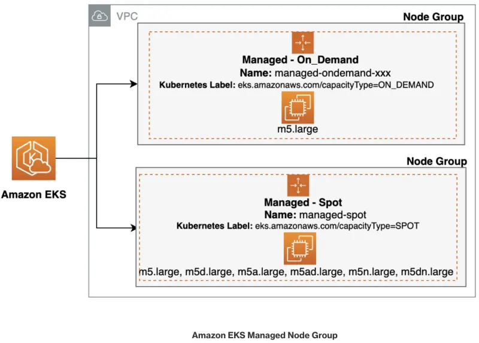

Spotインスタンスを作成するマネージドノードグループをデプロイし、続いて既存の`catalog`コンポーネントを新しく作成されたSpotインスタンス上で実行するように変更しましょう。

まず、既存のEKSクラスタ内のすべてのノードをリストアップすることから始めます。`kubectl get nodes`コマンドを使用してKubernetesクラスタのノードをリストできますが、キャパシティタイプに関する追加情報を取得するために、`-L eks.amazonaws.com/capacityType`パラメータを使用します。

以下のコマンドは、現在のノードが**on-demand**インスタンスであることを示しています。

```bash
$ kubectl get nodes -L eks.amazonaws.com/capacityType
NAME                                          STATUS   ROLES    AGE    VERSION                CAPACITYTYPE
ip-10-42-103-103.us-east-2.compute.internal   Ready    <none>   133m   vVAR::KUBERNETES_NODE_VERSION      ON_DEMAND
ip-10-42-142-197.us-east-2.compute.internal   Ready    <none>   133m   vVAR::KUBERNETES_NODE_VERSION      ON_DEMAND
ip-10-42-161-44.us-east-2.compute.internal    Ready    <none>   133m   vVAR::KUBERNETES_NODE_VERSION      ON_DEMAND
```

:::tip
`on-demand`インスタンスなど、特定のキャパシティタイプに基づいてノードを取得したい場合は、<b>ラベルセレクタ</b>を使用できます。この特定のシナリオでは、ラベルセレクタを`capacityType=ON_DEMAND`に設定することでこれを実現できます。

```bash
$ kubectl get nodes -l eks.amazonaws.com/capacityType=ON_DEMAND

NAME                                         STATUS   ROLES    AGE     VERSION
ip-10-42-10-119.us-east-2.compute.internal   Ready    <none>   3d10h   vVAR::KUBERNETES_NODE_VERSION
ip-10-42-10-200.us-east-2.compute.internal   Ready    <none>   3d10h   vVAR::KUBERNETES_NODE_VERSION
ip-10-42-11-94.us-east-2.compute.internal    Ready    <none>   3d10h   vVAR::KUBERNETES_NODE_VERSION
ip-10-42-12-235.us-east-2.compute.internal   Ready    <none>   4h34m   vVAR::KUBERNETES_NODE_VERSION
```

:::

下の図では、クラスター内のマネージドノードグループを表す2つの別々の「ノードグループ」があります。最初のノードグループボックスはオンデマンドインスタンスを含むノードグループを表し、2番目のボックスはSpotインスタンスを含むノードグループを表しています。どちらも指定されたEKSクラスターに関連付けられています。



Spotインスタンスでノードグループを作成しましょう。以下のコマンドで新しいノードグループ`managed-spot`を作成します。

```bash wait=10
$ aws eks create-nodegroup \
  --cluster-name $EKS_CLUSTER_NAME \
  --nodegroup-name managed-spot \
  --node-role $SPOT_NODE_ROLE \
  --subnets $PRIMARY_SUBNET_1 $PRIMARY_SUBNET_2 $PRIMARY_SUBNET_3 \
  --instance-types c5.large c5d.large c5a.large c5ad.large c6a.large \
  --capacity-type SPOT \
  --scaling-config minSize=2,maxSize=3,desiredSize=2 \
  --disk-size 20
```

`--capacity-type SPOT`引数は、このマネージドノードグループのすべてのキャパシティがSpotであることを示しています。

:::tip
aws `eks wait nodegroup-active`コマンドを使用して、特定のEKSノードグループがアクティブで使用準備ができるまで待機できます。このコマンドはAWS CLIの一部であり、指定したノードグループが正常に作成され、関連するすべてのインスタンスが実行中で準備完了していることを確認するために使用できます。

```bash wait=30 timeout=300
$ aws eks wait nodegroup-active \
  --cluster-name $EKS_CLUSTER_NAME \
  --nodegroup-name managed-spot
```

:::

新しいマネージドノードグループが**Active**になったら、次のコマンドを実行してください。

```bash
$ kubectl get nodes -L eks.amazonaws.com/capacityType,eks.amazonaws.com/nodegroup

NAME                                          STATUS   ROLES    AGE     VERSION                CAPACITYTYPE   NODEGROUP
ip-10-42-103-103.us-east-2.compute.internal   Ready    <none>   3h38m   vVAR::KUBERNETES_NODE_VERSION      ON_DEMAND      default
ip-10-42-142-197.us-east-2.compute.internal   Ready    <none>   3h38m   vVAR::KUBERNETES_NODE_VERSION      ON_DEMAND      default
ip-10-42-161-44.us-east-2.compute.internal    Ready    <none>   3h38m   vVAR::KUBERNETES_NODE_VERSION      ON_DEMAND      default
ip-10-42-178-46.us-east-2.compute.internal    Ready    <none>   103s    vVAR::KUBERNETES_NODE_VERSION      SPOT           managed-spot
ip-10-42-97-19.us-east-2.compute.internal     Ready    <none>   104s    vVAR::KUBERNETES_NODE_VERSION      SPOT           managed-spot
```

出力から、キャパシティタイプが`SPOT`で、ノードグループ`managed-spot`の下に2つの追加ノードがプロビジョニングされたことがわかります。

