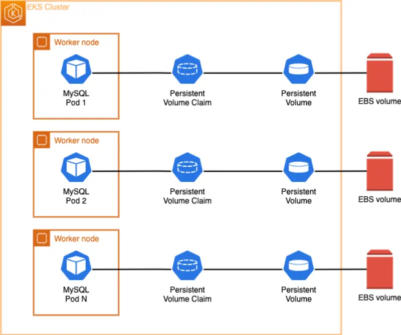
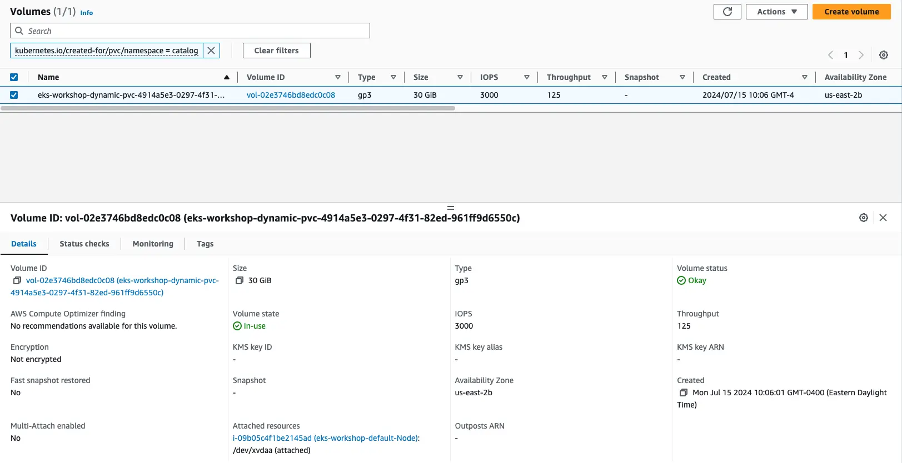

[StatefulSets](https://kubernetes.io/docs/concepts/workloads/controllers/statefulset/)と[Dynamic Volume Provisioning](https://kubernetes.io/docs/concepts/storage/dynamic-provisioning/)を理解したので、Catalogマイクロサービスの MySQL DBを変更して、データベースファイルを永続的に保存するための新しいEBSボリュームをプロビジョニングしましょう。



Kustomizeを使用して、次の2つのことを行います：

- カタログコンポーネントで使用されるMySQLデータベース用のEBSボリュームを使用する新しいStatefulSetを作成する
- `catalog`コンポーネントを更新して、このデータベースの新しいバージョンを使用する

:::info
なぜ既存のStatefulSetを更新しないのですか？更新する必要のあるフィールドは変更不可であり、変更できないためです。
:::

こちらが新しいカタログデータベースStatefulSetです：

::yaml{file="manifests/modules/fundamentals/storage/ebs/statefulset-mysql.yaml" paths="spec.volumeClaimTemplates,spec.volumeClaimTemplates.0.spec.storageClassName,spec.volumeClaimTemplates.0.spec.resources.requests.storage"}

1. `volumeClaimTemplates`フィールドは、新しいEBSボリューム、[PersistentVolume (PV)](https://kubernetes.io/docs/concepts/storage/persistent-volumes/)、および[PersistentVolumeClaim (PVC)](https://kubernetes.io/docs/concepts/storage/persistent-volumes/#persistentvolumeclaims)をすべて自動的に作成するためにDynamic Volume Provisioningを利用するようKubernetesに指示します。
2. `storageClassName`をデフォルトのストレージクラスの名前である`ebs-csi-default-sc`として指定します
3. `30GB`のEBSボリュームをリクエストしています

これが、新しいStatefulSetを使用するようにcatalogコンポーネント自体を再設定する方法です：

```kustomization
modules/fundamentals/storage/ebs/configMap.yaml
ConfigMap/catalog
```

変更を適用し、新しいPodがロールアウトされるのを待ちます：

```bash hook=check-pvc
$ kubectl apply -k ~/environment/eks-workshop/modules/fundamentals/storage/ebs/
$ kubectl rollout status --timeout=100s statefulset/catalog-mysql-ebs -n catalog
```

新しくデプロイされたStatefulSetが実行されていることを確認しましょう：

```bash
$ kubectl get statefulset -n catalog catalog-mysql-ebs
NAME                READY   AGE
catalog-mysql-ebs   1/1     79s
```

`catalog-mysql-ebs` StatefulSetを調査すると、30GiBのPersistentVolumeClaimが`storageClassName`としてebs-csi-driverで接続されていることがわかります。

```bash
$ kubectl get statefulset -n catalog catalog-mysql-ebs \
  -o jsonpath='{.spec.volumeClaimTemplates}' | jq .
[
  {
    "apiVersion": "v1",
    "kind": "PersistentVolumeClaim",
    "metadata": {
      "creationTimestamp": null,
      "name": "data"
    },
    "spec": {
      "accessModes": [
        "ReadWriteOnce"
      ],
      "resources": {
        "requests": {
          "storage": "30Gi"
        }
      },
      "storageClassName": "ebs-csi-default-sc",
      "volumeMode": "Filesystem"
    },
    "status": {
      "phase": "Pending"
    }
  }
]
```

Dynamic Volume ProvisioningがPersistentVolume（PV）を自動的に作成した方法を分析できます：

```bash
$ kubectl get pv | grep -i catalog
pvc-1df77afa-10c8-4296-aa3e-cf2aabd93365   30Gi       RWO            Delete           Bound         catalog/data-catalog-mysql-ebs-0          gp2                            10m
```

[AWS CLI](https://aws.amazon.com/cli/)を使用して、自動的に作成されたAmazon EBSボリュームを確認できます：

```bash
$ aws ec2 describe-volumes \
    --filters Name=tag:kubernetes.io/created-for/pvc/name,Values=data-catalog-mysql-ebs-0 \
    --query "Volumes[*].{ID:VolumeId,Tag:Tags}" \
    --no-cli-pager
```

[AWSコンソール](https://console.aws.amazon.com/ec2/home#Volumes)で確認することもできます。キー`kubernetes.io/created-for/pvc/name`と値`data-catalog-mysql-ebs-0`のタグを持つEBSボリュームを探します：



`catalog-mysql-ebs`コンテナのシェルを検査して、LinuxOSに接続された新しいEBSボリュームを確認したい場合は、次の手順を実行してください。マウントされているファイルシステムを検査します：

```bash
$ kubectl exec --stdin catalog-mysql-ebs-0  -n catalog -- bash -c "df -h"
Filesystem      Size  Used Avail Use% Mounted on
overlay         100G  7.6G   93G   8% /
tmpfs            64M     0   64M   0% /dev
tmpfs           3.8G     0  3.8G   0% /sys/fs/cgroup
/dev/nvme0n1p1  100G  7.6G   93G   8% /etc/hosts
shm              64M     0   64M   0% /dev/shm
/dev/nvme1n1     30G  211M   30G   1% /var/lib/mysql
tmpfs           7.0G   12K  7.0G   1% /run/secrets/kubernetes.io/serviceaccount
tmpfs           3.8G     0  3.8G   0% /proc/acpi
tmpfs           3.8G     0  3.8G   0% /sys/firmware
```

`/var/lib/mysql`にマウントされている現在のディスクを確認してください。これは、永続的に保存されているステートフルなMySQLデータベースファイル用のEBSボリュームです。

それでは、データが実際に永続的かどうかをテストしましょう。このモジュールの最初のセクションで行ったのと同じように、同じ`test.txt`ファイルを作成します：

```bash
$ kubectl exec catalog-mysql-ebs-0 -n catalog -- bash -c  "echo 123 > /var/lib/mysql/test.txt"
```

次に、`test.txt`ファイルが`/var/lib/mysql`ディレクトリに作成されたことを確認します：

```bash
$ kubectl exec catalog-mysql-ebs-0 -n catalog -- ls -larth /var/lib/mysql/ | grep -i test
-rw-r--r-- 1 root  root     4 Oct 18 13:57 test.txt
```

では、現在の`catalog-mysql-ebs` Podを削除しましょう。これにより、StatefulSetコントローラーが自動的にPodを再作成します：

```bash hook=pod-delete
$ kubectl delete pods -n catalog catalog-mysql-ebs-0
pod "catalog-mysql-ebs-0" deleted
```

数秒待ってから、次のコマンドを実行して`catalog-mysql-ebs` Podが再作成されたことを確認します：

```bash
$ kubectl wait --for=condition=Ready pod -n catalog \
  -l app.kubernetes.io/component=mysql-ebs --timeout=60s
pod/catalog-mysql-ebs-0 condition met
$ kubectl get pods -n catalog -l app.kubernetes.io/component=mysql-ebs
NAME                  READY   STATUS    RESTARTS   AGE
catalog-mysql-ebs-0   1/1     Running   0          29s
```

最後に、MySQLコンテナのシェルに戻り、`/var/lib/mysql`パスで`ls`コマンドを実行して、作成した`test.txt`ファイルを探し、ファイルが保持されているかどうかを確認します：

```bash
$ kubectl exec catalog-mysql-ebs-0 -n catalog -- ls -larth /var/lib/mysql/ | grep -i test
-rw-r--r-- 1 mysql root     4 Oct 18 13:57 test.txt
$ kubectl exec catalog-mysql-ebs-0 -n catalog -- cat /var/lib/mysql/test.txt
123
```

ご覧のように、Podが削除され再起動された後も、`test.txt`ファイルは引き続き使用可能で、正しいテキスト`123`が含まれています。これはPersistent Volumes（PV）の主要な機能です。Amazon EBSはデータを保存し、AWS可用性ゾーン内でデータを安全かつ利用可能な状態に保ちます。
