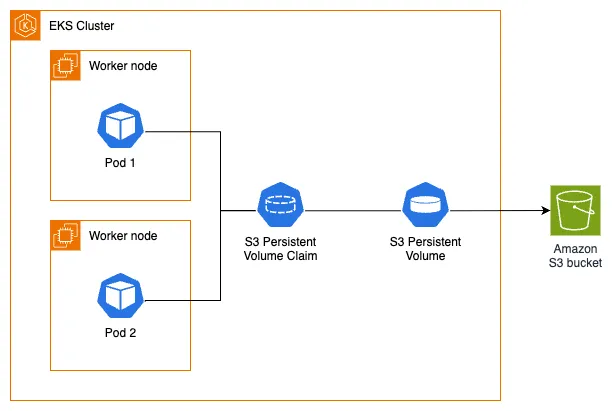

このセクションに進む前に、[ストレージ](../index.md)の主要セクションで説明されているKubernetesのストレージ概念（ボリューム、永続ボリューム（PV）、永続ボリューム要求（PVC）、動的プロビジョニング、一時ストレージ）を理解することが重要です。

[Amazon S3用のMountpoint Container Storage Interface（CSI）ドライバ](https://github.com/awslabs/mountpoint-s3-csi-driver)を使用すると、KubernetesアプリケーションがAmazon S3オブジェクトに標準ファイルシステムインターフェースからアクセスできるようになります。[Amazon S3用のMountpoint](https://github.com/awslabs/mountpoint-s3)を基盤としており、Mountpoint CSIドライバはAmazon S3バケットをストレージボリュームとして公開し、Kubernetesクラスター内のコンテナがシームレスにアクセスできるようにします。このドライバは[CSI](https://github.com/container-storage-interface/spec/blob/master/spec.md)仕様を実装しており、コンテナオーケストレータ（CO）がストレージボリュームを効率的に管理できるようにします。

以下のアーキテクチャ図は、Amazon S3用のMountpointをPodの永続ストレージとして使用する方法を示しています：



まず、イメージホスティングWebアプリケーションに必要な画像のためのステージングディレクトリを作成しましょう：

```bash
$ mkdir ~/environment/assets-images/
$ wget https://github.com/aws-containers/retail-store-sample-app/releases/download/v1.2.1/sample-images.zip \
  -O /tmp/sample-images.zip
$ unzip /tmp/sample-images.zip -d ~/environment/assets-images/
Archive:  /tmp/sample-images.zip
  inflating: /home/ec2-user/environment/assets-images/1ca35e86-4b4c-4124-b6b5-076ba4134d0d.jpg
  inflating: /home/ec2-user/environment/assets-images/4f18544b-70a5-4352-8e19-0d070f46745d.jpg
  inflating: /home/ec2-user/environment/assets-images/631a3db5-ac07-492c-a994-8cd56923c112.jpg
  inflating: /home/ec2-user/environment/assets-images/79bce3f3-935f-4912-8c62-0d2f3e059405.jpg
  inflating: /home/ec2-user/environment/assets-images/8757729a-c518-4356-8694-9e795a9b3237.jpg
  inflating: /home/ec2-user/environment/assets-images/87e89b11-d319-446d-b9be-50adcca5224a.jpg
  inflating: /home/ec2-user/environment/assets-images/a1258cd2-176c-4507-ade6-746dab5ad625.jpg
  inflating: /home/ec2-user/environment/assets-images/cc789f85-1476-452a-8100-9e74502198e0.jpg
  inflating: /home/ec2-user/environment/assets-images/d27cf49f-b689-4a75-a249-d373e0330bb5.jpg
  inflating: /home/ec2-user/environment/assets-images/d3104128-1d14-4465-99d3-8ab9267c687b.jpg
  inflating: /home/ec2-user/environment/assets-images/d4edfedb-dbe9-4dd9-aae8-009489394955.jpg
  inflating: /home/ec2-user/environment/assets-images/d77f9ae6-e9a8-4a3e-86bd-b72af75cbc49.jpg
```

次に、`aws s3 cp`コマンドを使用して、これらの画像アセットをS3バケットにコピーします：

```bash
$ aws s3 cp --recursive ~/environment/assets-images/ s3://$BUCKET_NAME/
upload: assets-images/79bce3f3-935f-4912-8c62-0d2f3e059405.jpg to s3://eks-workshop-mountpoint-s320250709143521722200000002/79bce3f3-935f-4912-8c62-0d2f3e059405.jpg
[...]
```

`aws s3 ls`コマンドを使用して、バケットにアップロードされたオブジェクトを確認できます：

```bash
$ aws s3 ls $BUCKET_NAME
2025-07-09 14:43:36     102950 1ca35e86-4b4c-4124-b6b5-076ba4134d0d.jpg
2025-07-09 14:43:36     118546 4f18544b-70a5-4352-8e19-0d070f46745d.jpg
2025-07-09 14:43:36     147820 631a3db5-ac07-492c-a994-8cd56923c112.jpg
2025-07-09 14:43:36     100117 79bce3f3-935f-4912-8c62-0d2f3e059405.jpg
2025-07-09 14:43:36     106911 8757729a-c518-4356-8694-9e795a9b3237.jpg
2025-07-09 14:43:36     113010 87e89b11-d319-446d-b9be-50adcca5224a.jpg
2025-07-09 14:43:36     171045 a1258cd2-176c-4507-ade6-746dab5ad625.jpg
2025-07-09 14:43:36     170438 cc789f85-1476-452a-8100-9e74502198e0.jpg
2025-07-09 14:43:36      97592 d27cf49f-b689-4a75-a249-d373e0330bb5.jpg
2025-07-09 14:43:36     169246 d3104128-1d14-4465-99d3-8ab9267c687b.jpg
2025-07-09 14:43:36     151884 d4edfedb-dbe9-4dd9-aae8-009489394955.jpg
2025-07-09 14:43:36     134344 d77f9ae6-e9a8-4a3e-86bd-b72af75cbc49.jpg
```

初期オブジェクトがAmazon S3バケットに保存されたので、Mountpoint for Amazon S3 CSIドライバを設定して、Pod用の永続的な共有ストレージを提供します。

EKSクラスタにMountpoint for Amazon S3 CSIアドオンをインストールしましょう。この操作は完了するまで数分かかります：

```bash
$ aws eks create-addon --cluster-name $EKS_CLUSTER_NAME --addon-name aws-mountpoint-s3-csi-driver \
  --service-account-role-arn $S3_CSI_ADDON_ROLE
$ aws eks wait addon-active --cluster-name $EKS_CLUSTER_NAME --addon-name aws-mountpoint-s3-csi-driver
```

完了したら、デプロイされたDaemonSetを確認することで、アドオンがEKSクラスタに何を作成したのかを確認できます：

```bash
$ kubectl get daemonset s3-csi-node -n kube-system
NAME          DESIRED   CURRENT   READY   UP-TO-DATE   AVAILABLE   NODE SELECTOR            AGE
s3-csi-node   3         3         3       3            3           kubernetes.io/os=linux   61s
```
