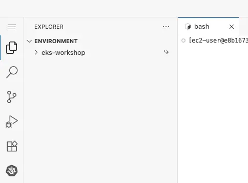
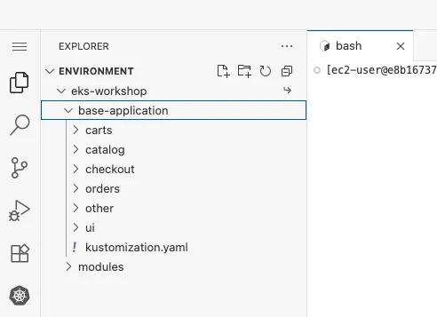
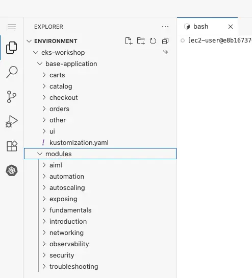

サンプルアプリケーションは、Kustomizeで簡単に適用できるように整理されたKubernetesマニフェストのセットで構成されています。Kustomizeはオープンソースのツールであり、`kubectl` CLIのネイティブ機能としても提供されています。このワークショップではKustomizeを使用してKubernetesマニフェストに変更を適用し、YAMLを手動で編集する必要なく、マニフェストファイルの変更を理解しやすくします。このワークショップのさまざまなモジュールを進めていく中で、Kustomizeを使用してオーバーレイとパッチを段階的に適用していきます。

サンプルアプリケーションとこのワークショップのモジュールのYAMLマニフェストを閲覧する最も簡単な方法は、IDEのファイルブラウザを使用することです：



`eks-workshop`を展開し、次に`base-application`項目を展開すると、**サンプルアプリケーション**セクションで説明したサンプルアプリケーションの初期状態を構成するマニフェストを閲覧できます：



この構造は、**サンプルアプリケーション**セクションで説明した各アプリケーションコンポーネント用のディレクトリで構成されています。

`modules`ディレクトリには、後続のラボ演習で適用するマニフェストのセットが含まれています：



何かをする前に、まずEKSクラスタの現在のNamespaceを確認しましょう：

```bash
$ kubectl get namespaces
NAME                            STATUS   AGE
default                         Active   1h
kube-node-lease                 Active   1h
kube-public                     Active   1h
kube-system                     Active   1h
```

リストされたエントリはすべて、事前にインストールされたシステムコンポーネント用のNamespaceです。[Kubernetesラベル](https://kubernetes.io/docs/concepts/overview/working-with-objects/labels/)を使用して、Namespaceを作成したものだけにフィルタリングすることで、これらを無視します：

```bash
$ kubectl get namespaces -l app.kubernetes.io/created-by=eks-workshop
No resources found
```

最初に行うことは、カタログコンポーネントを単独でデプロイすることです。このコンポーネントのマニフェストは、`~/environment/eks-workshop/base-application/catalog`にあります。

```bash
$ ls ~/environment/eks-workshop/base-application/catalog
configMap.yaml
deployment.yaml
kustomization.yaml
namespace.yaml
secrets.yaml
service-mysql.yaml
service.yaml
serviceAccount.yaml
statefulset-mysql.yaml
```

これらのマニフェストには、カタログAPIの望ましい状態を表現するカタログAPIコンポーネントのDeploymentが含まれています：

::yaml{file="manifests/base-application/catalog/deployment.yaml" paths="spec.replicas,spec.template.metadata.labels,spec.template.spec.containers.0.image,spec.template.spec.containers.0.ports,spec.template.spec.containers.0.livenessProbe,spec.template.spec.containers.0.resources"}

1. 1つのレプリカを実行する
2. 他のリソースが参照できるようにPodにラベルを適用する
3. `public.ecr.aws/aws-containers/retail-store-sample-catalog`コンテナイメージを使用する
4. `http`という名前のポート8080でコンテナを公開する
5. `/health`パスに対して[プローブ/ヘルスチェック](https://kubernetes.io/docs/tasks/configure-pod-container/configure-liveness-readiness-startup-probes/)を実行する
6. Kubernetesスケジューラが十分な利用可能なリソースを持つノードに配置できるように、特定の量のCPUとメモリを[リクエスト](https://kubernetes.io/docs/concepts/configuration/manage-resources-containers/)する

マニフェストには、他のコンポーネントがカタログAPIにアクセスするために使用するServiceも含まれています：

::yaml{file="manifests/base-application/catalog/service.yaml" paths="spec.ports,spec.selector"}

1. ポート80で公開され、Deploymentが公開する`http`ポート（ポート8080に変換される）をターゲットとする
2. 上記のDeploymentで表現したものと一致するラベルを使用してカタログPodを選択する

カタログコンポーネントを作成しましょう：

```bash
$ kubectl apply -k ~/environment/eks-workshop/base-application/catalog
namespace/catalog created
serviceaccount/catalog created
configmap/catalog created
secret/catalog-db created
service/catalog created
service/catalog-mysql created
deployment.apps/catalog created
statefulset.apps/catalog-mysql created
```

これで新しいNamespaceが表示されます：

```bash
$ kubectl get namespaces -l app.kubernetes.io/created-by=eks-workshop
NAME      STATUS   AGE
catalog   Active   15s
```

このNamespace内で実行されているPodを確認してみましょう：

```bash
$ kubectl get pod -n catalog
NAME                       READY   STATUS    RESTARTS      AGE
catalog-846479dcdd-fznf5   1/1     Running   2 (43s ago)   46s
catalog-mysql-0            1/1     Running   0             46s
```

カタログAPIのPodとMySQLデータベース用の別のPodがあることに注意してください。`catalog` Podが`CrashLoopBackOff`ステータスを示している場合、起動する前に`catalog-mysql` Podに接続できる必要があります。Kubernetesはこれが達成されるまでPodを再起動し続けます。その場合、[kubectl wait](https://kubernetes.io/docs/reference/generated/kubectl/kubectl-commands#wait)を使用して特定のPodが準備完了状態になるまで監視できます：

```bash
$ kubectl wait --for=condition=Ready pods --all -n catalog --timeout=180s
```

Podが実行されたら、[ログを確認](https://kubernetes.io/docs/reference/generated/kubectl/kubectl-commands#logs)できます。例えば、カタログAPI：

:::tip
[kubectl logsの出力を「フォロー」](https://kubernetes.io/docs/reference/kubectl/cheatsheet/)するには、コマンドで'-f'オプションを使用します。（フォローを停止するにはCTRL-Cを使用します）
:::

```bash
$ kubectl logs -n catalog deployment/catalog
```

Kubernetesでは、カタログPodの数を簡単に水平スケーリングすることもできます：

```bash
$ kubectl scale -n catalog --replicas 3 deployment/catalog
deployment.apps/catalog scaled
$ kubectl wait --for=condition=Ready pods --all -n catalog --timeout=180s
```

適用したマニフェストは、アプリケーションとMySQLのPodそれぞれに対して、クラスタ内の他のコンポーネントが接続するために使用できるServiceも作成します：

```bash
$ kubectl get svc -n catalog
NAME            TYPE        CLUSTER-IP       EXTERNAL-IP   PORT(S)    AGE
catalog         ClusterIP   172.20.83.84     <none>        80/TCP     2m48s
catalog-mysql   ClusterIP   172.20.181.252   <none>        3306/TCP   2m48s
```

これらのServiceはクラスタ内部のものであるため、インターネットやVPCからアクセスすることはできません。しかし、[exec](https://kubernetes.io/docs/tasks/debug/debug-application/get-shell-running-container/)を使用してEKSクラスタ内の既存のPodにアクセスし、カタログAPIが機能していることを確認できます：

```bash
$ kubectl -n catalog exec -i \
  deployment/catalog -- curl catalog.catalog.svc/catalog/products | jq .
```

製品情報を含むJSONペイロードが返されるはずです。おめでとうございます、KubernetesとEKSに最初のマイクロサービスをデプロイしました！
