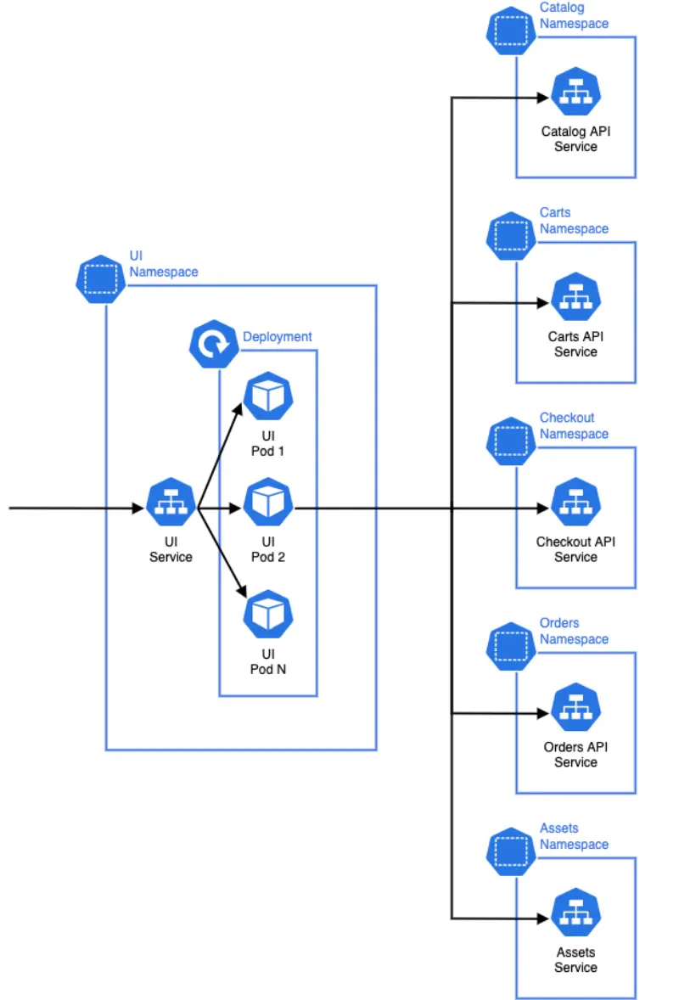

サンプルアプリケーションの全体的なアーキテクチャについて理解したところで、これをEKSに最初にどのようにデプロイするかを考えてみましょう。**catalog**コンポーネントを例に、Kubernetesの基本的な構成要素を見ていきましょう：

この図で考慮すべき点がいくつかあります：

- カタログAPIを提供するアプリケーションは[Pod](https://kubernetes.io/docs/concepts/workloads/pods/)として実行されます。これはKubernetesでデプロイ可能な最小単位です。アプリケーションPodは前のセクションで概説したコンテナイメージを実行します。
- カタログコンポーネントのPodは[Deployment](https://kubernetes.io/docs/concepts/workloads/controllers/deployment/)によって作成され、これはカタログPodの1つ以上の「レプリカ」を管理し、水平方向にスケールできるようにします。
- [Service](https://kubernetes.io/docs/concepts/services-networking/service/)は、一連のPodとして実行されているアプリケーションを公開する抽象的な方法であり、これによりカタログAPIはKubernetesクラスタ内の他のコンポーネントから呼び出すことができます。各ServiceにはそれぞれのDNSエントリが与えられます。
- このワークショップでは、MySQLデータベースをKubernetesクラスタ内で[StatefulSet](https://kubernetes.io/docs/concepts/workloads/controllers/statefulset/)として実行することから始めます。これはステートフルなワークロードを管理するように設計されています。
- これらのKubernetes構成要素はすべて、専用のカタログNamespaceでグループ化されています。アプリケーションコンポーネントにはそれぞれ独自のNamespaceがあります。

マイクロサービスアーキテクチャの各コンポーネントは、概念的にカタログと似ており、Deploymentを使用してアプリケーションのワークロードPodを管理し、Serviceを使用してこれらのPodにトラフィックをルーティングします。アーキテクチャの視点を広げると、より広範なシステム全体でのトラフィックのルーティング方法を考えることができます：

**ui**コンポーネントはHTTPリクエストを受信します（例えば、ユーザーのブラウザから）。そして、そのリクエストを処理するために、アーキテクチャ内の他のAPIコンポーネントにHTTPリクエストを送信し、ユーザーに応答を返します。各ダウンストリームコンポーネントは、独自のデータストアや他のインフラストラクチャを持つ場合があります。Namespaceは各マイクロサービスのリソースの論理的なグループであり、また、KubernetesのRBACやネットワークポリシーを効果的に実装するために使用できるソフト分離境界としても機能します。
