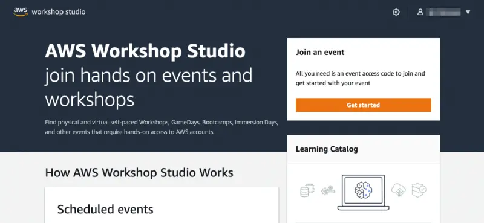
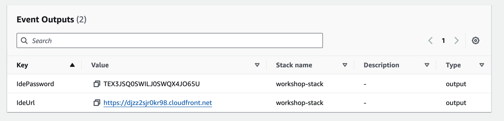

このワークショップに参加することで、演習の資料を完了するためのAWSアカウントが提供されます。[https://catalog.workshops.aws/](https://catalog.workshops.aws/)にアクセスしてポータルに接続してください。**Get Started**をクリックしてください。

サインインするよう求められます。**Email One-Time Password(OTP)**オプションを選択してください。

メールアドレスを入力して**Send passcode**を押すと、ワンタイムパスコードがあなたの受信箱に送信されます。メールが届いたら、パスコードを入力してログインしてください。

講師は演習を始める前に**イベントアクセスコード**をあなたに提供しているはずです。提供されたコードをテキストボックスに入力し、**Next**をクリックしてください。

利用規約を読んで同意し、**Join event**をクリックして続行してください。

個人ダッシュボードが表示されます。**Open AWS Console**ボタンを選択してAWSアカウントコンソールに移動します：

次に、個人ダッシュボードページに戻り、**Event Outputs**セクションまでスクロールダウンします。**IdeUrl**フィールドからURLをコピーし、新しいブラウザタブで開いてください：

パスワードの入力を求められます：

出力の**IdePassword**フィールドの値を入力すると、ウェブIDEがロードされます。

**Get started**を押してワークショップのスプラッシュページにアクセスしてください：

これで[ラボのナビゲーションセクション](/docs/introduction/navigating-labs)に進むことができます。
