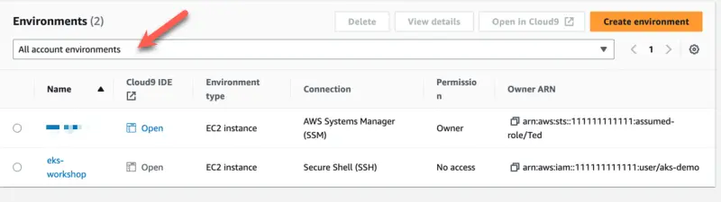
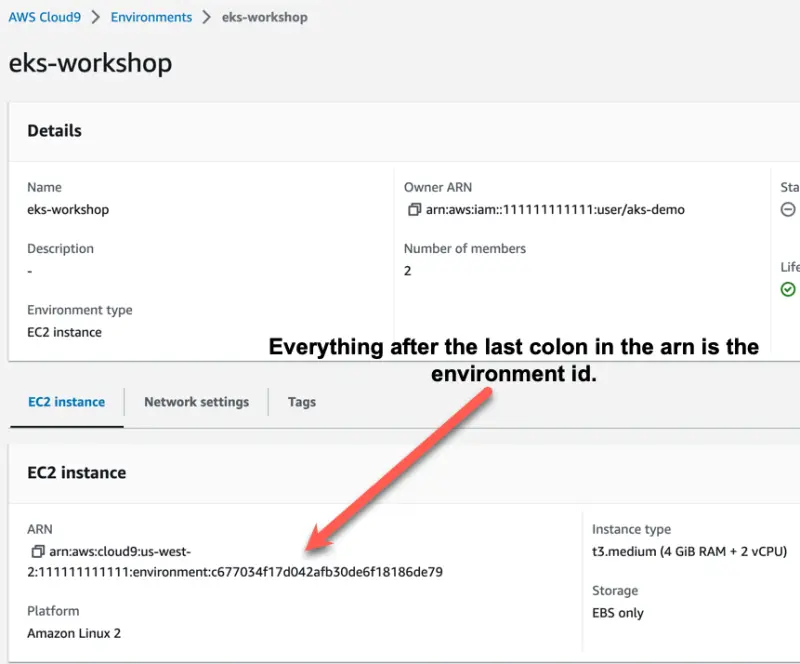

Terraformスクリプトを実行した後に**eks-workshop**という名前のCloud9インスタンスが表示されない場合は、以下を実行してください：

環境ドロップダウンを変更して**All account environments**を表示します。

**Cloud9 IDE**の下にある**Open**をクリックします。

Openリンクが機能しない場合は、ユーザーにCloud9インスタンスへのアクセス権を付与する必要があります。

AWS CLIから以下のコードを変更して、ユーザーにCloud9インスタンスへのアクセス権を付与します：

```shell
aws cloud9 create-environment-membership --environment-id environment_id_from_arn  --user-arn arn:aws:sts::1234567890:assumed-role/Admin/somerole --permissions read-write
```

2つの置き換えが必要です：

```text
arn:aws:sts::1234567890:assumed-role/Admin/somerole
```

上記のarnは、Cloud9インスタンスへのアクセスが必要なユーザーまたはロールのarnに置き換える必要があります。

```text
environment_id_from_arn
```

environment_id_from_arnは、管理したいインスタンスのarnから環境IDに置き換える必要があります。arnはインスタンス名をクリックすると確認できます。arnの最後のコロン以降がすべて環境IDです。



置換したテキストを含むコードをCLIに入力すると、Cloud9インスタンスにアクセスできるようになります。

```shell
$ aws cloud9 create-environment-membership --environment-id environment_id_from_arn  --user-arn arn:aws:sts::1234567890:assumed-role/Admin/somerole --permissions read-write
{
    "membership": {
        "permissions": "read-write",
        "userId": "XXXXXXXXXXXXXXXXXXX:someone",
        "userArn": "arn:aws:sts::111111111111:assumed-role/Admin/someone",
        "environmentId": "environment_id_from_arn",
        "lastAccess": "2023-04-07T09:27:56-04:00"

}
```
