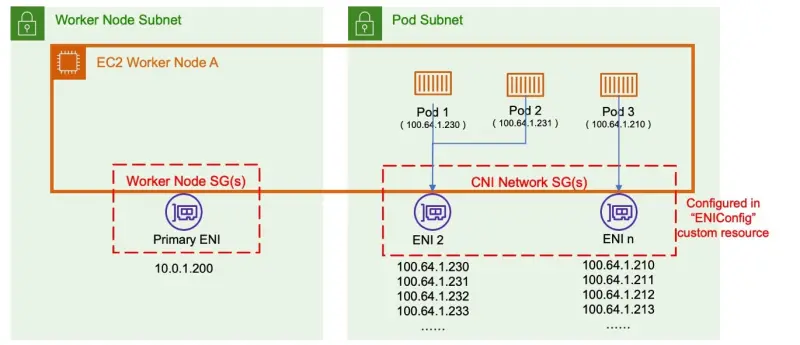

::required-time{estimatedLabExecutionTimeMinutes="10"}

:::tip 始める前に
このセクションのための環境を準備してください：

```bash wait=30 timeout=300
$ prepare-environment networking/custom-networking
```

これにより、ラボ環境に以下の変更が適用されます：

- VPCに二次CIDRレンジを追加
- 二次CIDRレンジから3つの追加サブネットを作成

これらの変更を適用するTerraformは[こちら](https://github.com/VAR::MANIFESTS_OWNER/VAR::MANIFESTS_REPOSITORY/tree/VAR::MANIFESTS_REF/manifests/modules/networking/custom-networking/.workshop/terraform)で確認できます。

:::

デフォルトでは、Amazon VPC CNIはプライマリサブネットから選択されたIPアドレスをポッドに割り当てます。プライマリサブネットは、プライマリENIが接続されているサブネットCIDR、通常はノード/ホストのサブネットです。

サブネットCIDRが小さすぎる場合、CNIはポッドに割り当てるための十分な数の二次IPアドレスを取得できない場合があります。これはEKS IPv4クラスターで一般的な課題です。

カスタムネットワーキングはこの問題の一つの解決策です。

カスタムネットワーキングは、二次VPCアドレス空間（CIDR）からポッドIPを割り当てることでIP枯渇の問題に対処します。カスタムネットワーキングはENIConfigカスタムリソースをサポートしています。ENIConfigには、ポッドが所属するセキュリティグループとともに、代替サブネットCIDRレンジ（二次VPC CIDRから切り出されたもの）が含まれています。カスタムネットワーキングが有効になると、VPC CNIはENIConfigで定義されたサブネットに二次ENIを作成します。CNIはENIConfig CRDで定義されたCIDRレンジからポッドにIPアドレスを割り当てます。



