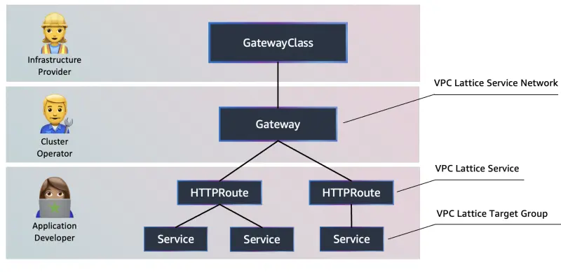

Gateway APIは、Kubernetesネットワーキングコミュニティによって管理されているオープンソースプロジェクトです。これはKubernetesにおけるアプリケーションネットワーキングをモデル化するリソースのコレクションです。Gateway APIは、GatewayClass、Gateway、Routeなどのリソースをサポートしており、多くのベンダーによって実装され、業界全体で広くサポートされています。

元々は広く知られているIngress APIの後継として考案されたもので、Gateway APIの利点には、多くの一般的に使用されているネットワークプロトコルの明示的なサポート、およびトランスポート層セキュリティ（TLS）との緊密に統合されたサポートなどが含まれます（ただしこれらに限定されません）。

AWSでは、AWS Gateway APIコントローラーを使用してGateway APIをAmazon VPC Latticeと統合しています。このコントローラーをクラスターにインストールすると、ゲートウェイやルートなどのGateway APIリソースの作成を監視し、以下の図のマッピングに従って対応するAmazon VPC Latticeオブジェクトをプロビジョニングします。AWS Gateway APIコントローラーはオープンソースプロジェクトであり、Amazonによって完全にサポートされています。

図に示すように、Kubernetes Gateway APIにはさまざまなレベルの制御に関連する異なるペルソナがあります：

- インフラストラクチャプロバイダー：VPC LatticeをGatewayClassとして識別するKubernetes `GatewayClass`を作成します。
- クラスターオペレーター：サービスネットワークに関連するVPC Latticeからの情報を取得するKubernetes `Gateway`を作成します。
- アプリケーション開発者：ゲートウェイからバックエンドKubernetesサービスにトラフィックをリダイレクトする方法を指定する`HTTPRoute`オブジェクトを作成します。

AWS Gateway APIコントローラーはAmazon VPC Latticeと統合し、以下のことを可能にします：

- VPCやアカウント間のサービス間のネットワーク接続をシームレスに処理します。
- 複数のKubernetesクラスターにまたがるこれらのサービスを発見します。
- これらのサービス間の通信を保護するための多層防御戦略を実装します。
- サービス間のリクエスト/レスポンストラフィックを観察します。

この章では、`checkout`マイクロサービスの新しいバージョンを作成し、Amazon VPC Latticeを使用してA/Bテストをシームレスに実行する方法を学びます。

