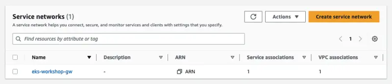

Gateway API コントローラーは、VPC Lattice サービスネットワークを自動的に作成し、Kubernetes クラスター VPC と関連付けるように構成されています。サービスネットワークは、サービスディスカバリと接続性を自動的に実装するために使用される論理的な境界であり、一連のサービスにアクセスと可観測性のポリシーを適用します。VPC 内で HTTP、HTTPS、gRPC プロトコルを介したアプリケーション間の接続を提供します。現在、コントローラーは HTTP と HTTPS をサポートしています。

`Gateway` を作成する前に、Kubernetes リソースモデルを通じて利用可能なロードバランシング実装のタイプを [GatewayClass](https://gateway-api.sigs.k8s.io/concepts/api-overview/#gatewayclass) で形式化する必要があります。Gateway API をリッスンするコントローラーは、ユーザーが `Gateway` から参照できる関連する `GatewayClass` リソースに依存しています。

::yaml{file="manifests/modules/networking/vpc-lattice/controller/gatewayclass.yaml" paths="metadata.name,spec.controllerName"}

1. `Gateway` リソースが参照するための `GatewayClass` 名として `amazon-vpc-lattice` を設定します
2. このクラスのゲートウェイを管理する AWS Gateway API コントローラーを指定するために、`controllerName` を `application-networking.k8s.aws/gateway-api-controller` に設定します

`GatewayClass` を作成しましょう：

```bash
$ kubectl apply -f ~/environment/eks-workshop/modules/networking/vpc-lattice/controller/gatewayclass.yaml
```

次の YAML は VPC Lattice の **サービスネットワーク** に関連付けられた Kubernetes の `Gateway` リソースを作成します。

::yaml{file="manifests/modules/networking/vpc-lattice/controller/eks-workshop-gw.yaml" paths="metadata.name,spec.gatewayClassName,spec.listeners.0"}

1. `metadata.name` を `EKS_CLUSTER_NAME` 環境変数に設定して、EKS クラスター名をゲートウェイ識別子として設定します
2. 先に定義した VPC Lattice GatewayClass を参照するために `gatewayClassName` を `amazon-vpc-lattice` に設定します
3. この設定では、`listener` がポート `80` で `HTTP` トラフィックを受け入れることを指定しています

以下のコマンドで適用します：

```bash
$ cat ~/environment/eks-workshop/modules/networking/vpc-lattice/controller/eks-workshop-gw.yaml \
  | envsubst | kubectl apply -f -
```

`eks-workshop` ゲートウェイが作成されたことを確認します：

```bash
$ kubectl get gateway -n checkout
NAME                CLASS                ADDRESS   PROGRAMMED   AGE
eks-workshop        amazon-vpc-lattice             True         29s
```

ゲートウェイが作成されたら、VPC Lattice サービスネットワークを見つけます。ステータスが `Reconciled` になるまで待ちます（これには約5分かかる場合があります）。

```bash
$ kubectl describe gateway ${EKS_CLUSTER_NAME} -n checkout
apiVersion: gateway.networking.k8s.io/v1beta1
kind: Gateway
status:
   conditions:
      message: 'aws-gateway-arn: arn:aws:vpc-lattice:us-west-2:1234567890:servicenetwork/sn-03015ffef38fdc005'
      reason: Programmed
      status: "True"

$ kubectl wait --for=condition=Programmed gateway/${EKS_CLUSTER_NAME} -n checkout
```

これで、[AWS コンソール](https://console.aws.amazon.com/vpc/home#ServiceNetworks)の Lattice リソースの下で作成された関連 **サービスネットワーク** を確認できます。


