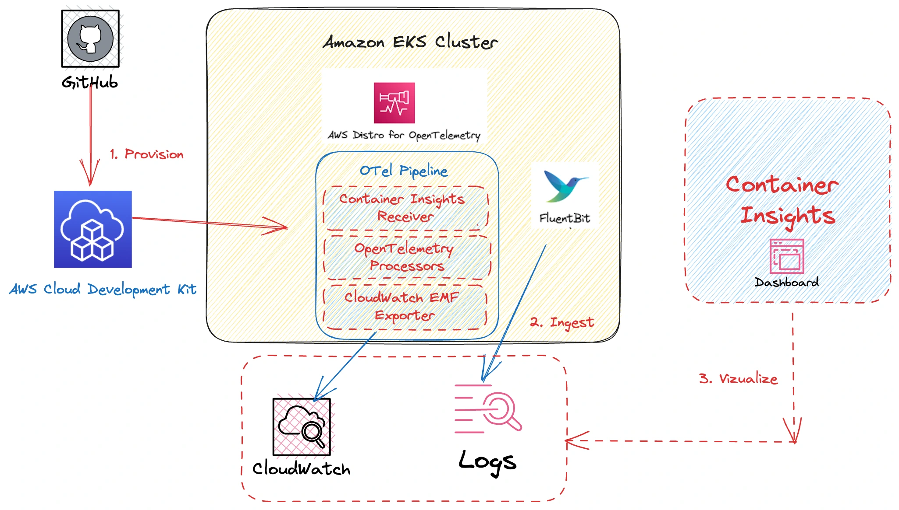
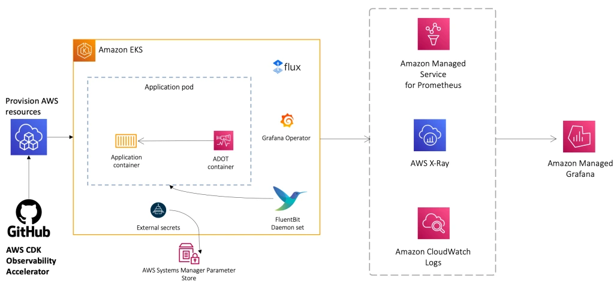

オブザーバビリティは、適切に設計されたEKS環境の基本的な要素です。AWSはEKS環境のモニタリング、ロギング、アラーミングのためのネイティブ（CloudWatch）およびオープンソースのマネージドソリューション（Amazon Managed Service for Prometheus、Amazon Managed Grafana、AWS Distro for OpenTelemetry）を提供しています。

この章では、EKSと統合されたAWSオブザーバビリティソリューションを使用して、以下の項目に関する可視性を提供する方法について説明します：

- EKSコンソールビューでのKubernetesリソース
- FluentbitによるコントロールプレーンおよびPodログ
- CloudWatch Container Insightsによるメトリクスのモニタリング
- AMPとADOTによるEKSメトリクスのモニタリング

モジュールのメンテナーの一人であるNirmal Mehta（AWS）によるオブザーバビリティモジュールのビデオウォークスルーをこちらでご覧いただけます：

<ReactPlayer controls src="https://www.youtube-nocookie.com/embed/ajPe7HVypxg" width={640} height={360} />  

:::info
AWSオブザーバビリティ機能についてさらに詳しく知りたい場合は、[One Observability Workshop](https://catalog.workshops.aws/observability/en-US)をご覧ください
:::

:::info
AWS環境のオブザーバビリティをセットアップするための意見を持ったインフラストラクチャーアズコード（IaC）モジュール群については、[AWS Observability Accelerator for CDK](https://aws-observability.github.io/cdk-aws-observability-accelerator/)および[AWS Observability Accelerator for Terraform](https://aws-observability.github.io/terraform-aws-observability-accelerator/)をご覧ください。これらのモジュールはAmazon CloudWatchなどのAWSネイティブサービスや、Amazon Managed Service for Prometheus、Amazon Managed Grafana、AWS Distro for OpenTelemetry（ADOT）などのAWSマネージドオブザーバビリティサービスと連携します。
:::

