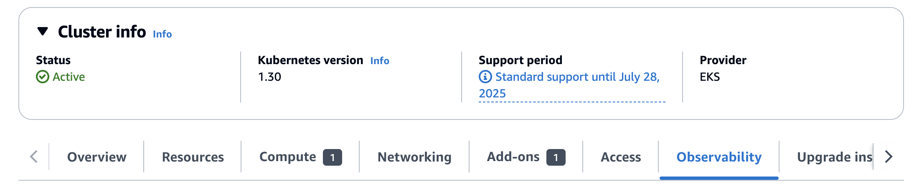
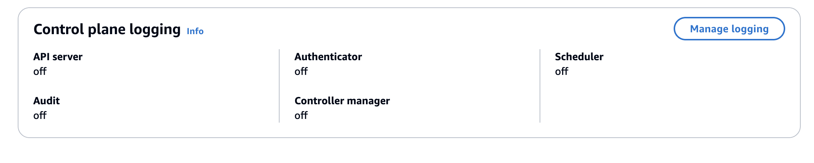
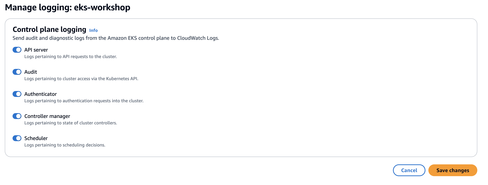
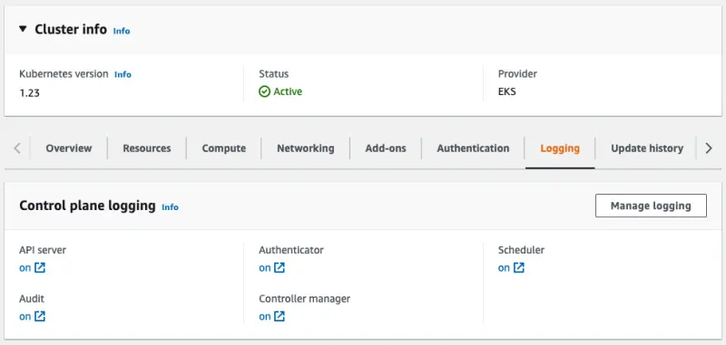

クラスターログタイプはそれぞれ個別に有効にすることができ、このラボではすべてを有効にしています。

EKSコンソールでこの設定を確認してみましょう：

<ConsoleButton url="https://console.aws.amazon.com/eks/home#/clusters/eks-workshop?selectedTab=cluster-logging-tab" service="eks" label="EKSコンソールを開く"/>

**ログ記録**タブには、クラスターのコントロールプレーンログの現在の設定が表示されます：




**管理**ボタンをクリックすることで、ログ設定を変更することができます：



また、EKS APIを通じてクラスター単位でEKSコントロールプレーンログを有効にすることもできます。これは通常、TerraformやCloudFormationを使用して設定されますが、このラボではAWS CLIを使用して機能を有効にすることができます：

```bash hook=cluster-logging
$ aws eks update-cluster-config \
    --region $AWS_REGION \
    --name $EKS_CLUSTER_NAME \
    --logging '{"clusterLogging":[{"types":["api","audit","authenticator","controllerManager","scheduler"],"enabled":true}]}'
{
    "update": {
        "id": "6d73515c-f5e7-4288-9e55-480e9c6dd084",
        "status": "InProgress",
        "type": "LoggingUpdate",
        "params": [
            {
                "type": "ClusterLogging",
                "value": "{\"clusterLogging\":[{\"types\":[\"api\",\"audit\",\"authenticator\",\"controllerManager\",\"scheduler\"],\"enabled\":true}]}"
            }
        ],
        "createdAt": "2023-05-25T19:33:16.622000+00:00",
        "errors": []
    }
}
$ sleep 30
$ aws eks wait cluster-active --name $EKS_CLUSTER_NAME
```

ご覧のとおり、クラスターログタイプはそれぞれ個別に有効にすることができ、このラボではすべてを有効にしています。

EKSコンソールでこの設定を確認してみましょう：

<ConsoleButton url="https://console.aws.amazon.com/eks/home#/clusters/eks-workshop?selectedTab=cluster-logging-tab" service="eks" label="EKSコンソールを開く"/>

**ログ記録**タブには、クラスターのコントロールプレーンログの現在の設定が表示されます：



**管理**ボタンをクリックすることで、ログ設定を変更することができます：


:::info
CDK Observability Acceleratorを使用している場合は、[CDK Observability Builder](https://aws-quickstart.github.io/cdk-eks-blueprints/builders/observability-builder/#supported-methods)をチェックしてください。これはEKSクラスターのすべてのコントロールプレーンログ機能を有効にし、CloudWatchに保存することをサポートしています。
:::

