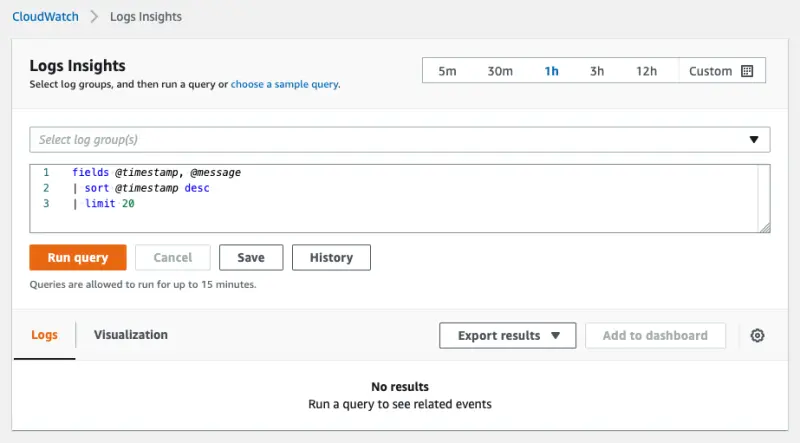
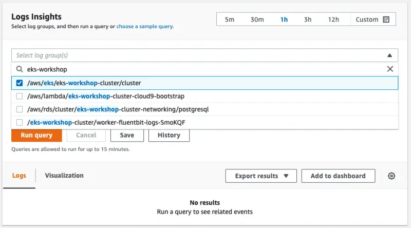
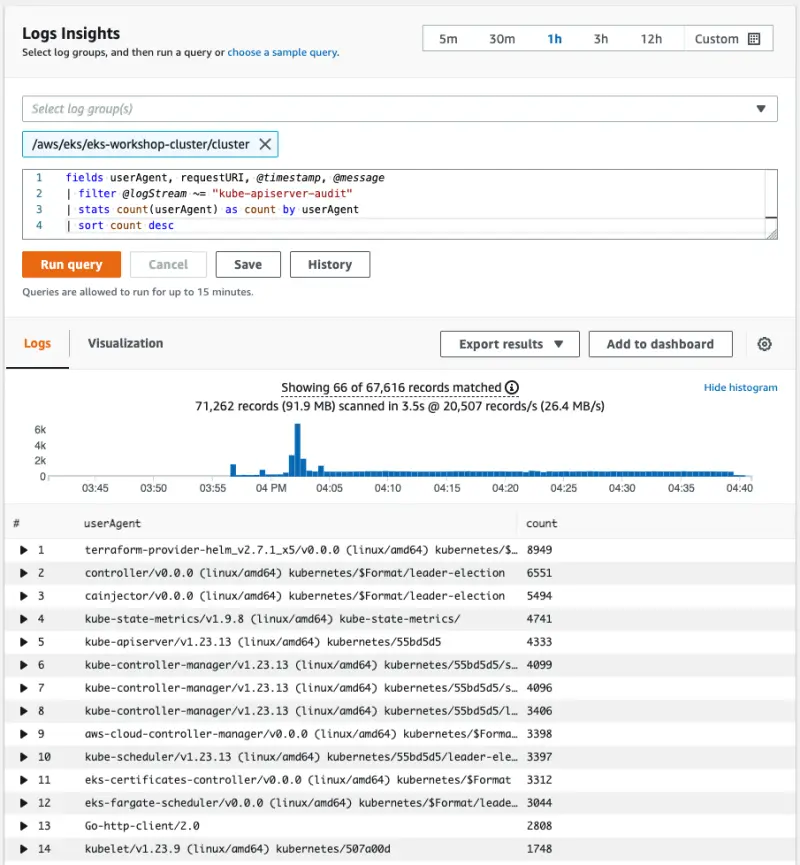

CloudWatch Logs Insightsを使用すると、CloudWatch Logsのログデータをインタラクティブに検索および分析できます。クエリを実行して、より効率的かつ効果的に運用上の問題に対応することができます。問題が発生した場合、CloudWatch Logs Insightsを使用して潜在的な原因を特定し、デプロイされた修正を検証できます。これには、いくつかの単純ながら強力なコマンドを持つ専用のクエリ言語が含まれています。

この演習では、CloudWatch Log Insightsを使用してEKSコントロールプレーンログをクエリする例を見ていきます。まず、コンソールでCloudWatch Log Insightsに移動します：

<ConsoleButton url="https://console.aws.amazon.com/cloudwatch/home#logsV2:logs-insights" service="cloudwatch" label="CloudWatchコンソールを開く"/>

次のような画面が表示されます：



CloudWatch Log Insightsの一般的なユースケースは、Kubernetes APIサーバーに対して大量のリクエストを行っているEKSクラスター内のコンポーネントを特定することです。これを行う一つの方法は、次のクエリを使用することです：

```blank
fields userAgent, requestURI, @timestamp, @message
| filter @logStream ~= "kube-apiserver-audit"
| stats count(userAgent) as count by userAgent
| sort count desc
```

このクエリは、Kubernetesの監査ログをチェックし、`userAgent`でグループ化されたAPI要求の数をカウントし、それらを降順でソートします。Log Insightsコンソールで、EKSクラスターのロググループを選択します：



クエリをコンソールにコピーして**クエリを実行**を押すと、結果が返されます：



この情報は、どのコンポーネントがAPIサーバーにリクエストを送信しているかを理解するために非常に貴重です。

:::info
CDK Observability Acceleratorを使用している場合は、[CloudWatch Insights Add-on](https://aws-quickstart.github.io/cdk-eks-blueprints/addons/aws-cloudwatch-insights/)をチェックしてください。このアドオンは、EKSのコンテナ化されたアプリケーションとマイクロサービスからメトリクスとログを収集、集約、要約します。
:::
