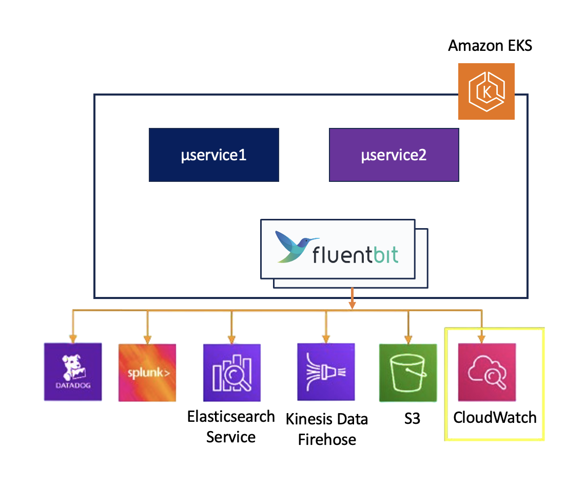

Kubernetes クラスターコンポーネントのうち、ポッドで実行されるものは、デフォルトのロギングメカニズムをバイパスして `/var/log` ディレクトリ内のファイルに書き込みます。Fluent Bit などのノードレベルのロギングエージェントをDaemonSetとして各ノードにデプロイすることで、ポッドレベルのロギングを実装できます。

[Fluent Bit](https://fluentbit.io/) は、軽量なログプロセッサおよびフォワーダーであり、さまざまなソースからデータとログを収集し、フィルターで強化してCloudWatch、Kinesis Data Firehose、Kinesis Data Streams、Amazon OpenSearch Serviceなど複数の宛先に送信することができます。

AWSはCloudWatch LogsとKinesis Data Firehose用のプラグインを備えたFluent Bitイメージを提供しています。[AWS for Fluent Bit](https://github.com/aws/aws-for-fluent-bit)イメージは[Amazon ECR Public Gallery](https://gallery.ecr.aws/aws-observability/aws-for-fluent-bit)で入手できます。

Fluent Bitは様々な宛先にログを送信するために使用できます。ただし、このラボでは、コンテナログをCloudWatchに送信するためにどのように活用されているかを見ていきます。



以下のセクションでは、Fluent BitエージェントがすでにDaemonSetとして実行され、コンテナ/ポッドログをCloudWatch Logsに送信していることを検証する方法を説明します。[コンテナからCloudWatch Logsにログを送信するためにFluent Bitをデプロイする方法](https://docs.aws.amazon.com/AmazonCloudWatch/latest/monitoring/Container-Insights-setup-logs-FluentBit.html#Container-Insights-FluentBit-troubleshoot)についての詳細をご覧ください。

まず、次のコマンドを入力して、Fluent Bit用に作成されたリソースを検証できます。各ノードには1つのポッドが必要です：

```bash hook=get-all
$ kubectl get all -n kube-system -l app.kubernetes.io/name=aws-for-fluent-bit
NAME                           READY   STATUS    RESTARTS   AGE
pod/aws-for-fluent-bit-jg4jr   1/1     Running   0          94s
pod/aws-for-fluent-bit-lvp9f   1/1     Running   0          95s
pod/aws-for-fluent-bit-q959s   1/1     Running   0          94s

NAME                         TYPE        CLUSTER-IP      EXTERNAL-IP   PORT(S)    AGE
service/aws-for-fluent-bit   ClusterIP   172.16.41.165   <none>        2020/TCP   96s

NAME                                DESIRED   CURRENT   READY   UP-TO-DATE   AVAILABLE   NODE SELECTOR   AGE
daemonset.apps/aws-for-fluent-bit   3         3         3       3            3           <none>          96s
```

aws-for-fluent-bitのConfigMapは、各ノードから`/var/log/containers/*.log`ディレクトリ内のファイルの内容をCloudWatchロググループ`/eks-workshop/worker-fluentbit-logs`にストリーミングするように設定されています：

```bash hook=desc-cm
$ kubectl describe configmap -n kube-system -l app.kubernetes.io/name=aws-for-fluent-bit
Name:         aws-for-fluent-bit
Namespace:    kube-system
Labels:       app.kubernetes.io/instance=aws-for-fluent-bit
              app.kubernetes.io/managed-by=Helm
              app.kubernetes.io/name=aws-for-fluent-bit
              app.kubernetes.io/version=2.31.12.20231011
              helm.sh/chart=aws-for-fluent-bit-0.1.32
Annotations:  meta.helm.sh/release-name: aws-for-fluent-bit
              meta.helm.sh/release-namespace: kube-system

Data
====
fluent-bit.conf:
----
[SERVICE]
    HTTP_Server  On
    HTTP_Listen  0.0.0.0
    HTTP_PORT    2020
    Health_Check On
    HC_Errors_Count 5
    HC_Retry_Failure_Count 5
    HC_Period 5

    Parsers_File /fluent-bit/parsers/parsers.conf
[INPUT]
    Name              tail
    Tag               kube.*
    Path              /var/log/containers/*.log
    DB                /var/log/flb_kube.db
    multiline.parser  docker, cri
    Mem_Buf_Limit     5MB
    Skip_Long_Lines   On
    Refresh_Interval  10
[FILTER]
    Name                kubernetes
    Match               kube.*
    Kube_URL            https://kubernetes.default.svc.cluster.local:443
    Merge_Log           On
    Merge_Log_Key       data
    Keep_Log            On
    K8S-Logging.Parser  On
    K8S-Logging.Exclude On
    Buffer_Size         32k
[OUTPUT]
    Name                  cloudwatch_logs
    Match                 *
    region                us-west-2
    log_group_name        /aws/eks/eks-workshop/aws-fluentbit-logs-20250415195811907400000002
    log_stream_prefix     fluentbit-
...
```

`kubectl logs`コマンドを使用してFluent BitポッドのログをチェックしてみましょU。サービスの新しいCloudWatchロググループとストリームが作成されるのが確認できます。

```bash hook=pods-log
$ kubectl logs daemonset.apps/aws-for-fluent-bit -n kube-system

Found 3 pods, using pod/aws-for-fluent-bit-4mnbw
AWS for Fluent Bit Container Image Version 2.28.4
Fluent Bit v1.9.9
* Copyright (C) 2015-2022 The Fluent Bit Authors
* Fluent Bit is a CNCF sub-project under the umbrella of Fluentd
* https://fluentbit.io

[2025/04/14 16:15:40] [ info] [fluent bit] version=1.9.9, commit=5fcfe330e5, pid=1
[2025/04/14 16:15:40] [ info] [storage] version=1.3.0, type=memory-only, sync=normal, checksum=disabled, max_chunks_up=128
[2025/04/14 16:15:40] [ info] [cmetrics] version=0.3.7
...
[2025/04/14 16:15:40] [ info] [filter:kubernetes:kubernetes.0] connectivity OK
[2025/04/14 16:15:40] [ info] [sp] stream processor started
[2025/04/14 16:15:40] [ info] [output:cloudwatch_logs:cloudwatch_logs.0] worker #0 started
...
[2025/04/14 16:16:01] [ info] [output:cloudwatch_logs:cloudwatch_logs.0] Creating log stream ui-8564fc5cfb-54llk.ui in log group /aws/eks/fluentbit-cloudwatch/workload/ui
[2025/04/14 16:16:01] [ info] [output:cloudwatch_logs:cloudwatch_logs.0] Log Group /aws/eks/fluentbit-cloudwatch/workload/ui not found. Will attempt to create it.
[2025/04/14 16:16:01] [ info] [output:cloudwatch_logs:cloudwatch_logs.0] Creating log group /aws/eks/fluentbit-cloudwatch/workload/ui
[2025/04/14 16:16:01] [ info] [output:cloudwatch_logs:cloudwatch_logs.0] Created log group /aws/eks/fluentbit-cloudwatch/workload/ui
[2025/04/14 16:16:01] [ info] [output:cloudwatch_logs:cloudwatch_logs.0] Creating log stream ui-8564fc5cfb-54llk.ui in log group /aws/eks/fluentbit-cloudwatch/workload/ui
[2025/04/14 16:16:01] [ info] [output:cloudwatch_logs:cloudwatch_logs.0] Created log stream ui-8564fc5cfb-54llk.ui
```
