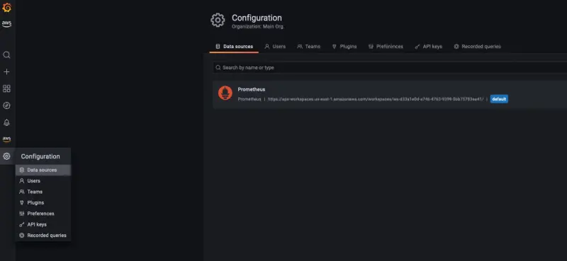

GrafanaのインスタンスはあなたのEKSクラスターに事前にインストールされています。アクセスするには、まずURLを取得する必要があります：

```bash hook=check-grafana
$ kubectl get ingress -n grafana grafana -o=jsonpath='{.status.loadBalancer.ingress[0].hostname}{"\n"}'
k8s-grafana-grafana-123497e39be-2107151316.us-west-2.elb.amazonaws.com
```

このURLをブラウザで開くと、ログイン画面が表示されます。


ユーザーの認証情報を取得するには、Grafana helmチャートによって作成されたシークレットをクエリします：

```bash
$ kubectl get -n grafana secrets/grafana -o=jsonpath='{.data.admin-user}' | base64 -d; printf "\n"
$ kubectl get -n grafana secrets/grafana -o=jsonpath='{.data.admin-password}' | base64 -d; printf "\n"
```

Grafanaコンソールにログインした後、データソースセクションを見てみましょう。Amazon Managed Service for Prometheusワークスペースがデータソースとして既に設定されているはずです。



