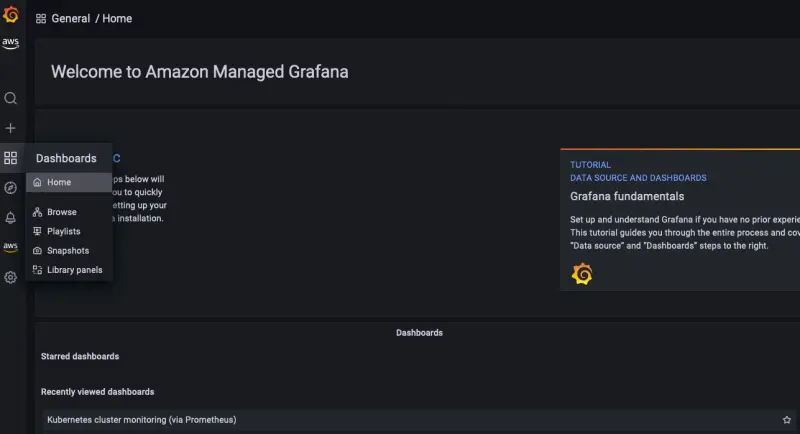

AWSディストリビューションforOpenTelemetryによって収集されたEKSクラスターメトリクスを視覚化するために、ダッシュボードセクションに移動しましょう。

ダッシュボード**Kubernetes Cluster Monitoring**をクリックして、ダッシュボード内のパネルを確認しましょう。

Total Usageパネルは、CPU、メモリ、ファイルシステムの使用率に関するクラスター全体の利用状況を示しています。

