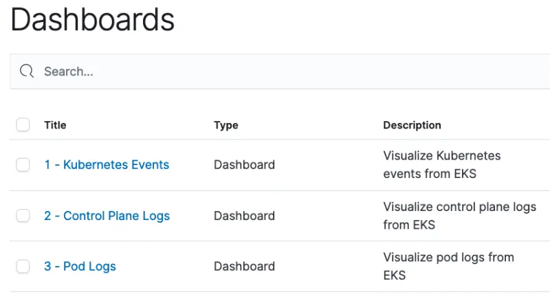

このセクションでは、AWS Systems Manager パラメータストアから OpenSearch の認証情報を取得し、Kubernetes イベントとポッドログ用の事前作成された OpenSearch ダッシュボードを読み込み、OpenSearch へのアクセスを確認します。

OpenSearch ドメインの認証情報はプロビジョニングプロセス中に AWS Systems Manager パラメータストアに保存されています。この情報を取得し、必要な環境変数を設定します。

```bash
$ export OPENSEARCH_HOST=$(aws ssm get-parameter \
      --name /eksworkshop/$EKS_CLUSTER_NAME/opensearch/host \
      --region $AWS_REGION | jq -r .Parameter.Value)
$ export OPENSEARCH_USER=$(aws ssm get-parameter \
      --name /eksworkshop/$EKS_CLUSTER_NAME/opensearch/user  \
      --region $AWS_REGION --with-decryption | jq -r .Parameter.Value)
$ export OPENSEARCH_PASSWORD=$(aws ssm get-parameter \
      --name /eksworkshop/$EKS_CLUSTER_NAME/opensearch/password \
      --region $AWS_REGION --with-decryption | jq -r .Parameter.Value)
$ export OPENSEARCH_DASHBOARD_FILE=~/environment/eks-workshop/modules/observability/opensearch/opensearch-dashboards.ndjson
```

Kubernetes イベントとポッドログを表示するための事前作成された OpenSearch ダッシュボードを読み込みます。ダッシュボードは[こちらのファイル](https://github.com/VAR::MANIFESTS_OWNER/VAR::MANIFESTS_REPOSITORY/tree/VAR::MANIFESTS_REF/manifests/modules/observability/opensearch/opensearch-dashboards.ndjson)で利用可能で、Kubernetes イベントとポッドログ用の OpenSearch インデックスパターン、視覚化、ダッシュボードが含まれています。

```bash
$ curl -s https://$OPENSEARCH_HOST/_dashboards/auth/login \
      -H 'content-type: application/json' -H 'osd-xsrf: osd-fetch' \
      --data-raw '{"username":"'"$OPENSEARCH_USER"'","password":"'"$OPENSEARCH_PASSWORD"'"}' \
      -c dashboards_cookie | jq .
{
  "username": "admin",
  "tenants": {
    "global_tenant": true,
    "admin": true
  },
  "roles": [
    "security_manager",
    "all_access"
  ],
  "backendroles": []
}

$ curl -s -X POST https://$OPENSEARCH_HOST/_dashboards/api/saved_objects/_import?overwrite=true \
        --form file=@$OPENSEARCH_DASHBOARD_FILE \
        -H "osd-xsrf: true" -b dashboards_cookie | jq .
{
  "successCount": 7,
  "success": true,
  "successResults": [
    {
      "type": "index-pattern",
      "id": "79cc3180-6c51-11ee-bdf2-9d2ccb0785e7",
      "meta": {
        "title": "eks-kubernetes-events*",
        "icon": "indexPatternApp"
      }
    },
    ...
  ]
}
```

先ほど取得した OpenSearch サーバーの座標と認証情報を確認し、OpenSearch ダッシュボードにアクセス可能であることを確認します。

```bash
$ printf "\nOpenSearch dashboard: https://%s/_dashboards/app/dashboards \nUserName: %q \nPassword: %q \n\n" \
      "$OPENSEARCH_HOST" "$OPENSEARCH_USER" "$OPENSEARCH_PASSWORD"

OpenSearch dashboard: <OpenSearch Dashboard URL>
Username: <user name>
Password: <password>
```

上記の OpenSearch ダッシュボード URL にブラウザでアクセスし、認証情報を使用してログインします。


以下のように Global テナントを選択します。OpenSearch のテナントは、インデックスパターン、視覚化、ダッシュボードなどのリソースを安全に共有するために使用できます。


先ほどのステップで読み込まれた 2 つのダッシュボード（Kubernetes イベントとポッドログ用）が表示されるはずです。現時点では OpenSearch にデータがないため、ダッシュボードは空になっています。このブラウザタブを開いたままにするか、ダッシュボードの URL を保存してください。次のセクションでダッシュボードに戻ります。



