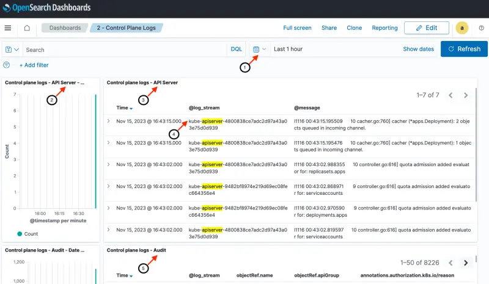
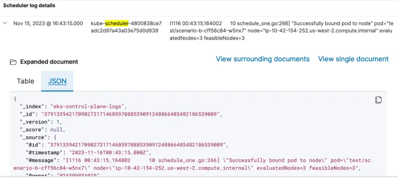

前のセクションである[EKS でのロギング](https://www.eksworkshop.com/docs/observability/logging/cluster-logging/)で見たように、Amazon EKS コントロールプレーンログは、Amazon EKS コントロールプレーンから直接監査および診断ログをアカウントの CloudWatch Logs に提供します。このモジュールの `prepare-environment` ステップの一部として設定された Lambda 関数を使用して、これらのコントロールプレーンログを CloudWatch Logs から OpenSearch に転送することで、以前のセットアップを強化します。このセクションでは、すべての EKS コントロールプレーンログを有効にし、Lambda 関数をトリガーする CloudWatch Logs サブスクリプションフィルターを追加し、OpenSearch コントロールプレーンログダッシュボードを探索します。

次の 2 つの段落では、EKS でのコントロールプレーンログの概要を説明します。EKS でのロギングに関する前のセクションをすでに読んでいる場合は、この概要をスキップしてください。

コントロールプレーンログには 5 種類あり、それぞれを個別に有効または無効にできます。各ログタイプは、Kubernetes コントロールプレーンのコンポーネントに対応しています。これらのコンポーネントの詳細については、[Kubernetes ドキュメント](https://kubernetes.io/docs/concepts/overview/components/)の Kubernetes コンポーネントと[Amazon EKS コントロールプレーンログのドキュメント](https://docs.aws.amazon.com/eks/latest/userguide/control-plane-logs.html)を参照してください。

- **Kubernetes API サーバーコンポーネントログ (api)** – クラスターの API サーバーは、Kubernetes API を公開するコントロールプレーンコンポーネントです
- **監査 (audit)** – Kubernetes 監査ログは、クラスターに影響を与えた個々のユーザー、管理者、またはシステムコンポーネントの記録を提供します
- **認証者 (authenticator)** – 認証者ログは Amazon EKS に固有のものです。これらのログは、Amazon EKS が IAM 認証情報を使用して Kubernetes の[ロールベースのアクセス制御](https://kubernetes.io/docs/reference/access-authn-authz/rbac/) (RBAC) 認証に使用するコントロールプレーンコンポーネントを表します
- **コントローラーマネージャー (controllerManager)** – コントローラーマネージャーは、Kubernetes に付属するコアコントロールループを管理します
- **スケジューラ (scheduler)** – スケジューラコンポーネントは、クラスター内でいつどこにポッドを実行するかを管理します

次の図は、このセクションのセットアップの概要を示しています。左から右へ、フローは次のとおりです：

1. コントロールプレーンログが Amazon EKS で有効になり、ログを CloudWatch Logs に送信します
2. CloudWatch Logs サブスクリプションフィルターが Lambda 関数をトリガーし、ログメッセージを送信します
3. Lambda 関数はコントロールプレーンログを OpenSearch インデックスに書き込みます
4. `eks-control-plane-logs` という名前の単一の OpenSearch インデックスがすべてのコントロールプレーンログを保存します。後ほど、OpenSearch ダッシュボード内で異なるログタイプをフィルタリングする方法を見ていきます


EKS コントロールプレーンログは、EKS API を通じてクラスターごとに有効化されます。これは通常、Terraform や CloudFormation を使用して設定されますが、このラボでは AWS CLI を使用して機能を有効にします。見ての通り、クラスターログタイプを個別に有効化することができ、このラボではすべてを有効化しています。

```bash hook=cluster-logging
$ aws eks update-cluster-config \
    --region $AWS_REGION \
    --name $EKS_CLUSTER_NAME \
    --logging '{"clusterLogging":[{"types":["api","audit","authenticator","controllerManager","scheduler"],"enabled":true}]}'
{
    "update": {
        "id": "6d73515c-f5e7-4288-9e55-480e9c6dd084",
        "status": "InProgress",
        "type": "LoggingUpdate",
        "params": [
            {
                "type": "ClusterLogging",
                "value": "{\"clusterLogging\":[{\"types\":[\"api\",\"audit\",\"authenticator\",\"controllerManager\",\"scheduler\"],\"enabled\":true}]}"
            }
        ],
        "createdAt": "2023-05-25T19:33:16.622000+00:00",
        "errors": []
    }
}
$ sleep 30
$ aws eks wait cluster-active --name $EKS_CLUSTER_NAME
```

オプションとして、AWS コンソールを使用して EKS コントロールプレーンログの設定を確認できます：

<ConsoleButton url="https://console.aws.amazon.com/eks/home#/clusters/eks-workshop?selectedTab=cluster-logging-tab" service="eks" label="Open EKS console"/>

**ログ** タブには、AWS コンソール内の EKS クラスターのコントロールプレーンログの現在の構成が表示されます：

`/aws/eks/eks-workshop/cluster` という名前の CloudWatch ロググループにアクセスします

<ConsoleButton url="https://console.aws.amazon.com/cloudwatch/home#logsV2:log-groups/log-group/$252Faws$252Feks$252Feks-workshop$252Fcluster" service="cloudwatch" label="Open CloudWatch console"/>

コントロールプレーンログタイプごとに少なくとも 1 つのログストリームが見つかります：

- Kubernetes API サーバーログの `kube-apiserver-*`
- 監査ログの `*-audit-*`
- 認証者ログの `authenticator-*`
- コントローラーマネージャーログの `kube-controller-manager-*`
- スケジューラーログの `kube-scheduler-*`

コントロールプレーンログをエクスポートするために事前にプロビジョニングされた Lambda 関数 [eks-workshop-control-plane-logs](https://console.aws.amazon.com/lambda/home#/functions/eks-workshop-control-plane-logs) に移動します。現時点では Lambda 関数にトリガーが設定されていないことに注意してください。

上記の概要図に示されているように、Lambda 関数を CloudWatch Logs と OpenSearch に接続するには 2 つのステップがあります：

1. Lambda 関数が `eks-control-plane-logs` という名前の OpenSearch インデックスに書き込みを許可する OpenSearch ロールを設定する
2. CloudWatch ロググループのサブスクリプションフィルターを Lambda 関数を宛先として構成する

Lambda 関数 ARN とその IAM ロール ARN は既に環境変数として利用可能です：

```bash
$ echo $LAMBDA_ARN
$ echo $LAMBDA_ROLE_ARN
```

Lambda エクスポーター関数に `eks-control-plane-logs` という名前の OpenSearch インデックスを作成し、そこに書き込む権限を付与します。最初のコマンドは、必要な権限を持つ OpenSearch ドメイン内に新しいロールを作成します。2 番目のコマンドは、Lambda 関数の実行ロール ARN を指定するロールマッピングを追加します。

```bash
$ curl -s -XPUT "https://${OPENSEARCH_HOST}/_plugins/_security/api/roles/lambda_role" \
    -u $OPENSEARCH_USER:$OPENSEARCH_PASSWORD -H 'Content-Type: application/json' \
    --data-raw '{"cluster_permissions": ["*"], "index_permissions": [{"index_patterns": ["eks-control-plane-logs*"], "allowed_actions": ["*"]}]}' \
    | jq .
{
  "status": "CREATED",
  "message": "'lambda_role' created."
}

$ curl -s -XPUT "https://${OPENSEARCH_HOST}/_plugins/_security/api/rolesmapping/lambda_role" \
    -u $OPENSEARCH_USER:$OPENSEARCH_PASSWORD -H 'Content-Type: application/json' \
    --data-raw '{"backend_roles": ["'"$LAMBDA_ROLE_ARN"'"]}' | jq .
{
  "status": "CREATED",
  "message": "'lambda_role' created."
}
```

CloudWatch ロググループのサブスクリプションフィルターを設定し、Lambda 関数を宛先として指定します。コマンドが `/aws/eks/eks-workshop/cluster` ロググループ名と Lambda 関数 ARN を指定していることに注意してください。最初のコマンドはフィルターを作成し、2 番目のコマンドはフィルターの詳細を取得します。

```bash
$ aws logs put-subscription-filter \
    --log-group-name /aws/eks/$EKS_CLUSTER_NAME/cluster \
    --filter-name "${EKS_CLUSTER_NAME}-Control-Plane-Logs-To-OpenSearch" \
    --filter-pattern "" \
    --destination-arn $LAMBDA_ARN

$ aws logs describe-subscription-filters \
    --log-group-name /aws/eks/$EKS_CLUSTER_NAME/cluster | jq .
{
  "subscriptionFilters": [
    {
      "filterName": "${EKS_CLUSTER_NAME} EKS Control Plane Logs to OpenSearch",
      "logGroupName": "/aws/eks/eks-workshop/cluster",
      "filterPattern": "",
      "destinationArn": "arn:aws:lambda:us-west-2:1234567890:function:control-plane-logs",
      "distribution": "ByLogStream",
      "creationTime": 1699659802922
    }
  ]
}
```

Lambda 関数 [eks-workshop-control-plane-logs](https://console.aws.amazon.com/lambda/home#/functions/eks-workshop-control-plane-logs) に戻ります。サブスクリプションフィルターを追加した後、CloudWatch Logs が Lambda 関数のトリガーとして表示されるようになりました。

これで EKS からコントロールプレーンログを OpenSearch に送信するために必要な手順が完了しました。

前に見たダッシュボードのランディングページからコントロールプレーンログダッシュボードにアクセスするか、以下のコマンドを使用して座標を取得します：

```bash
$ printf "\nPod logs dashboard: https://%s/_dashboards/app/dashboards#/view/1a1c3a70-831a-11ee-8baf-a5d5c77ada98 \
        \nUserName: %q \nPassword: %q \n\n" \
        "$OPENSEARCH_HOST" "$OPENSEARCH_USER" "$OPENSEARCH_PASSWORD"

Pod logs dashboard: <OpenSearch Dashboard URL>
Username: <user name>
Password: <password>
```

ダッシュボードは、5 つのコントロールプレーンログタイプ（アルファベット順）- Kubernetes API サーバーコンポーネントログ、監査ログ、認証者ログ、コントローラーマネージャーログ、スケジューラーログのそれぞれのヒストグラムと詳細メッセージを提供します。

1. 日付/時間範囲。このダッシュボードで探索する時間範囲をカスタマイズできます（この例では過去 1 時間）
2. API サーバーログのメッセージ数（分ごと）
3. API サーバーのログメッセージ
4. ダッシュボードのログストリームフィールドは、AWS コンソール内で先ほど見た CloudWatch ログストリーム名と同じです。ログストリームフィールドは、5 つのコントロールプレーンログタイプそれぞれのインデックスをフィルタリングするために使用されます。この場合、フィルターは API サーバーログのみを表示します
5. 残りの 4 つのログタイプについて、分ごとのメッセージ数とログメッセージが表示されます

:::tip

EKS クラスターのアクティビティレベルによっては、選択した時間範囲内にそのタイプのログアクティビティがない場合、一部のコントロールプレーンログパネルに `No result found` と表示されることがあります。このような状況に遭遇した場合は、指示に従って進め、`OpenSearch での観測可能性` セクションを離れる前にコントロールプレーンログダッシュボードに戻ってください。

:::



スケジューラーログはページの最後に表示されています。スケジューラーログメッセージが `scenario-c` に対して `Unable to schedule pod; no fit; waiting` を示していることに注意してください。このスケジュールログメッセージは、前のページで見た `scenario-c` の Kubernetes イベントと類似しています。


行を展開すると、詳細をテーブル形式または JSON 形式で表示できます。



