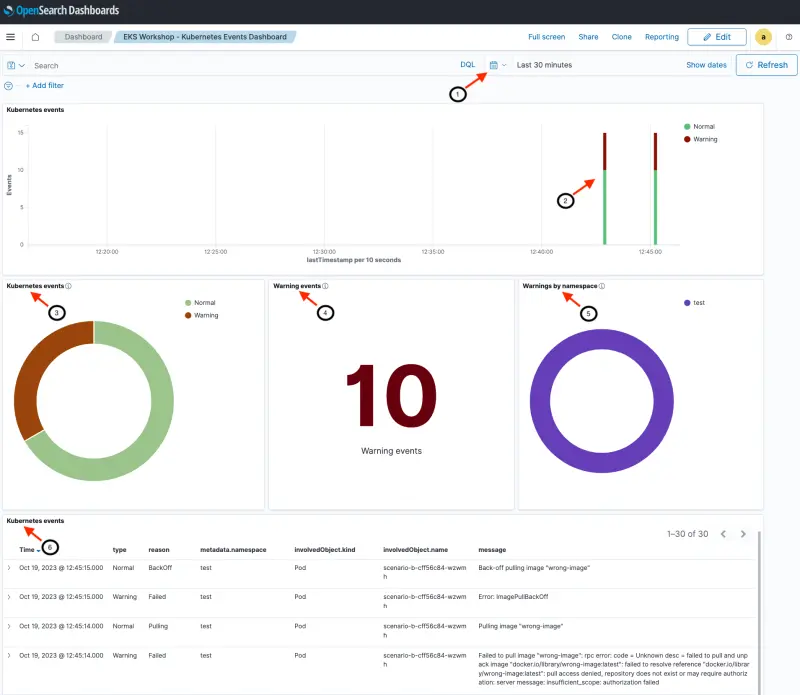

このセクションでは、Kubernetes イベントを OpenSearch にエクスポートし、OpenSearch を使用して EKS クラスターの可観測性を向上させる方法を示します。Kubernetes [events exporter](https://github.com/resmoio/kubernetes-event-exporter) をデプロイして OpenSearch にイベントを転送し、テストワークロードを作成して追加の Kubernetes イベントを生成し、OpenSearch Kubernetes イベントダッシュボードを探索して問題を特定し、オプションで Kubernetes クラスター内のイベントを調査します。

[Kubernetes Events](https://kubernetes.io/docs/reference/kubernetes-api/cluster-resources/event-v1/) は、アプリケーションとクラスターの状態を監視し、障害に対応し、診断を実行するために使用できる豊富な情報源を提供します。イベントは一般的に何らかの状態変化を示します。例えば、ポッドの作成、レプリカの追加、リソースのスケジューリングなどです。各イベントには `type` フィールドが含まれており、成功または失敗を示すために Normal または Warning に設定されています。

リソースに対して `kubectl describe` を実行したことがあれば、既に Kubernetes イベントを扱ったことがあります。以下に示すように、`kubectl describe` の出力の最後のセクションには、リソースに関連する Kubernetes イベントが表示されます。

```shell
kubectl describe pod nginx
...
Events:
  Type    Reason     Age   From               Message
  ----    ------     ----  ----               -------
  Normal  Scheduled  5s    default-scheduler  Successfully assigned default/nginx to ip-10-42-179-183.us-west-2.compute.internal
  Normal  Pulling    4s    kubelet            Pulling image "nginx"
  Normal  Pulled     4s    kubelet            Successfully pulled image "nginx" in 627.545722ms (627.553403ms including waiting)
  Normal  Created    4s    kubelet            Created container nginx
  Normal  Started    3s    kubelet            Started container nginx
```

Kubernetes イベントは継続的に生成されますが、クラスター内に保持されるのは1時間のみです。この保持期間は、Kubernetes アップストリームのデフォルトイベント存続時間（TTL）60分と一致しています。OpenSearch は、これらのイベントの収集、分析、視覚化を簡素化する永続的なストアを提供します。

次の図は、このセクションのセットアップの概要を示しています。`kubernetes-events-exporter` は `opensearch-exporter` 名前空間にデプロイされ、OpenSearch ドメインにイベントを転送するように構成されます。イベントは OpenSearch の `eks-kubernetes-events` インデックスに保存されます。以前にロードした OpenSearch ダッシュボードを使用してイベントを視覚化します。


Kubernetes イベントエクスポーターをデプロイし、OpenSearch ドメインにイベントを送信するように構成します。基本構成は[こちら](https://github.com/VAR::MANIFESTS_OWNER/VAR::MANIFESTS_REPOSITORY/tree/VAR::MANIFESTS_REF/manifests/modules/observability/opensearch/config/events-exporter-values.yaml)で入手できます。以前に取得した OpenSearch 認証情報を使用してエクスポーターを構成します。2番目のコマンドは、Kubernetes イベントポッドが実行されていることを確認します。

```bash timeout=120 wait=30
$ helm install events-to-opensearch \
    oci://registry-1.docker.io/bitnamicharts/kubernetes-event-exporter \
    --namespace opensearch-exporter --create-namespace \
    -f ~/environment/eks-workshop/modules/observability/opensearch/config/events-exporter-values.yaml \
    --set="config.receivers[0].opensearch.username"="$OPENSEARCH_USER" \
    --set="config.receivers[0].opensearch.password"="$OPENSEARCH_PASSWORD" \
    --set="config.receivers[0].opensearch.hosts[0]"="https://$OPENSEARCH_HOST" \
    --wait
...
NAME: events-to-opensearch
LAST DEPLOYED: Fri Oct 20 01:04:56 2023
NAMESPACE: opensearch-exporter
...

$ kubectl get pods -n opensearch-exporter
NAME                                                              READY   STATUS    RESTARTS      AGE
events-to-opensearch-kubernetes-event-exporter-67fc698978-2f9wc   1/1     Running   0             10s
```

次に、`scenario-a, scenario-b および scenario-c` というラベル付けされた3つのデプロイメントを `test` 名前空間内で起動して、`Normal` および `Warning` イベントを示すための追加の Kubernetes イベントを生成します。各デプロイメントには意図的にエラーが含まれています。

```bash
$ kubectl apply -k ~/environment/eks-workshop/modules/observability/opensearch/scenarios/events/base
namespace/test created
secret/some-secret created
deployment.apps/scenario-a created
deployment.apps/scenario-b created
deployment.apps/scenario-c created
```

:::tip

前のステップで起動した Kubernetes イベントエクスポーターは、過去1時間のイベントと新しいイベントを OpenSearch に送信します。したがって、次のコマンドを実行して OpenSearch ダッシュボードを調査するときに表示されるイベントの正確なリストは、過去1時間の EKS クラスターのアクティビティによって異なります。

:::

前のページで使用した OpenSearch ダッシュボードに戻って、OpenSearch Kubernetes イベントダッシュボードを探索します。以前に見たダッシュボードのランディングページから Kubernetes イベントダッシュボードにアクセスするか、以下のコマンドを使用してその座標を取得します。

```bash
$ printf "\nKubernetes Events dashboard: https://%s/_dashboards/app/dashboards#/view/06cca640-6a05-11ee-bdf2-9d2ccb0785e7 \
        \nUserName: %q \nPassword: %q \n\n" \
        "$OPENSEARCH_HOST" "$OPENSEARCH_USER" "$OPENSEARCH_PASSWORD"

Kubernetes Events dashboard: <OpenSearch Dashboard URL>
Username: <user name>
Password: <password>
```

ライブダッシュボードは下の画像に似ていますが、数値とメッセージはクラスターのアクティビティによって異なります。ダッシュボードのセクションとフィールドの説明は以下の通りです。

1. [ヘッダー] 日付/時刻範囲を表示。このダッシュボードで探索する時間範囲をカスタマイズできます（この例では過去30分）
2. [上部セクション] イベントの日付ヒストグラム（Normal と Warning イベントに分けられています）
3. [中央セクション] Kubernetes イベントは、イベントの総数（Normal と Warning）を表示します
4. [中央セクション] 選択した時間間隔で見られた Warning イベント
5. [中央セクション] 名前空間別に分類された警告。この例ではすべての警告が `test` 名前空間にあります
6. [下部セクション] 最新のイベントを最初に表示した詳細なイベントとメッセージ



次の画像は、イベントの詳細を含む下部セクションに焦点を当てています：

1. イベントの最終タイムスタンプ
1. イベントタイプ（normal または warning）。フィールドの上にマウスを置くと、その値でフィルタリングできるようになります（例：Warning イベントでフィルタリング）
1. Kubernetes リソースの名前（オブジェクトタイプと名前空間を含む）
1. 人間が読みやすいメッセージ


以下の画像のように、イベントの全詳細を掘り下げることができます：

1. 各イベントの横にある '>' をクリックすると、新しいセクションが開きます
1. 完全なイベントドキュメントは、テーブルまたはJSON形式で表示できます

Kubernetes イベント内のデータフィールドの説明は、[kubernetes.io](https://kubernetes.io/docs/reference/kubernetes-api/cluster-resources/event-v1)で見つけるか、`kubectl explain events` を実行することで確認できます。


Kubernetes イベントダッシュボードを使用して、3つのデプロイメント（`scenario-a, scenario-b および scenario-c`）が問題を経験している理由を特定できます。以前にデプロイしたすべてのポッドは `test` 名前空間にあります。

**scenario-a:** ダッシュボードから、`scenario-a` には `FailedMount` の理由があり、メッセージは `MountVolume.SetUp failed for volume "secret-volume" : secret "misspelt-secret-name" not found` です。ポッドは存在しないシークレットをマウントしようとしています。


**scenario-b:** `scenario-b` は `Failed to pull image "wrong-image": rpc error: code = Unknown desc = failed to pull and unpack image "docker.io/library/wrong-image:latest": failed to resolve reference "docker.io/library/wrong-image:latest": pull access denied, repository does not exist or may require authorization: server message: insufficient_scope: authorization failed.` というメッセージで失敗しています。ポッドは存在しないイメージを参照しているため作成されていません。


**scenario-c:** ダッシュボードには `FailedScheduling` の理由があり、メッセージは `0/3 nodes are available: 3 Insufficient cpu. preemption: 0/3 nodes are available: 3 No preemption victims found for incoming pod.` です。このデプロイメントは、現在のクラスターノードが提供できる以上の CPU を要求しています。（EKS ワークショップのこのモジュールではクラスターオートスケーリング機能が有効になっていません。）


問題を修正し、OpenSearch ダッシュボードを再訪して変更を確認します。

```bash
$ kubectl apply -k ~/environment/eks-workshop/modules/observability/opensearch/scenarios/events/fix
namespace/test unchanged
secret/some-secret unchanged
deployment.apps/scenario-a configured
deployment.apps/scenario-b configured
deployment.apps/scenario-c configured
```

OpenSearch ダッシュボードに戻り、以前の問題が解決されたことを確認します。更新されたデプロイメントは成功する新しいポッドを起動し、以前に作成されたポッド（エラーあり）は削除されます。

:::tip
問題が修正されると、新しい一連の Normal Kubernetes イベントが生成されます。以前のイベント（Normal または Warning）は履歴の一部として残ります。したがって、Normal と Warning イベントの数は常に_増加_します。
:::

オプションで、EKS クラスター内から Kubernetes イベントを調査できます。OpenSearch ダッシュボード内で調査していたイベントは、クラスター内で利用できる情報を反映しています。

クラスター内の最新の5つのイベントを取得します。

```bash
$ kubectl get events --sort-by='.lastTimestamp' -A | head -5
NAMESPACE             LAST SEEN   TYPE      REASON              OBJECT                                                                 MESSAGE
catalog               44m         Normal    SuccessfulCreate    replicaset/catalog-857f89d57d                                          Created pod: catalog-857f89d57d-xl4xc
orders                44m         Normal    Scheduled           pod/orders-5696b978f5-gk2d7                                            Successfully assigned orders/orders-5696b978f5-gk2d7 to ip-10-42-104-177.us-west-2.compute.internal
ui                    44m         Normal    Scheduled           pod/ui-5dfb7d65fc-7l94z                                                Successfully assigned ui/ui-5dfb7d65fc-7l94z to ip-10-42-190-29.us-west-2.compute.internal

```

warning または failed ステータスのイベントを確認します。

```bash
$ kubectl get events --sort-by='.lastTimestamp' --field-selector type!=Normal -A | head -5
NAMESPACE   LAST SEEN   TYPE      REASON             OBJECT                            MESSAGE
orders      44m         Warning   Unhealthy          pod/orders-5696b978f5-gk2d7       Readiness probe failed: Get "http://10.42.127.4:8080/actuator/health/liveness": dial tcp 10.42.127.4:8080: connect: connection refused
test        7m6s        Warning   FailedScheduling   pod/scenario-c-6d988b8d84-gghjv   0/3 nodes are available: 3 Insufficient cpu. preemption: 0/3 nodes are available: 3 No preemption victims found for incoming pod.
test        6m39s       Warning   Failed             pod/scenario-b-cff56c84-xn9hh     Error: ImagePullBackOff
test        6m28s       Warning   Failed             pod/scenario-b-cff56c84-xn9hh     Failed to pull image "wrong-image": rpc error: code = Unknown desc = failed to pull and unpack image "docker.io/library/wrong-image:latest": failed to resolve reference "docker.io/library/wrong-image:latest": pull access denied, repository does not exist or may require authorization: server message: insufficient_scope: authorization failed

```

最新のイベント（すべての名前空間にわたる）をJSON形式で確認します。出力が OpenSearch インデックス内で見つかった詳細と非常に似ていることに注目してください。（OpenSearch ドキュメントには、OpenSearch 内のインデックス作成を容易にするための追加フィールドがあります）。

```bash
$ kubectl get events --sort-by='.lastTimestamp' -o json -A | jq '.items[-1]'
{
  "apiVersion": "v1",
  "count": 1,
  "eventTime": null,
  "firstTimestamp": "2023-10-19T21:49:44Z",
  "involvedObject": {
    "apiVersion": "apps/v1",
    "kind": "Deployment",
    "name": "scenario-c",
    "namespace": "test",
    "resourceVersion": "1485908",
    "uid": "7b12f29b-2c83-4b3b-8aa3-a4c8b22d8a38"
  },
  "kind": "Event",
  "lastTimestamp": "2023-10-19T21:49:44Z",
  "message": "Scaled down replica set scenario-c-6d988b8d84 to 0 from 1",
  "metadata": {
    "creationTimestamp": "2023-10-19T21:49:44Z",
    "name": "scenario-c.178fa09ddad7c5e3",
    "namespace": "test",
    "resourceVersion": "1485955",
    "uid": "e56aa6b2-9808-45a8-8863-ec9112f23822"
  },
  "reason": "ScalingReplicaSet",
  "reportingComponent": "deployment-controller",
  "reportingInstance": "",
  "source": {
    "component": "deployment-controller"
  },
  "type": "Normal"
}
```

