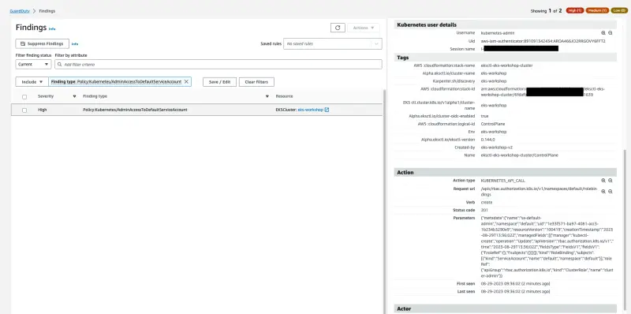

次のラボ演習では、サービスアカウントにクラスター管理者権限を付与します。これはベストプラクティスではありません。なぜなら、このサービスアカウントを使用するPodが意図せず管理者権限で起動される可能性があり、これらのPodに`exec`アクセスできるユーザーがエスカレーションして、クラスターに無制限のアクセスを取得できるようになるからです。

これをシミュレートするために、`default`名前空間内の`default`サービスアカウントに`cluster-admin`クラスターロールをバインドします。

```bash
$ kubectl -n default create rolebinding sa-default-admin --clusterrole cluster-admin --serviceaccount default:default
```

数分以内に[GuardDuty Findingsコンソール](https://console.aws.amazon.com/guardduty/home#/findings)に`Policy:Kubernetes/AdminAccessToDefaultServiceAccount`の検出結果が表示されます。検出結果の詳細、アクション、およびDetective調査を分析するための時間をとりましょう。



以下のコマンドを実行して、問題のあるロールバインディングを削除します。

```bash
$ kubectl -n default delete rolebinding sa-default-admin
```

