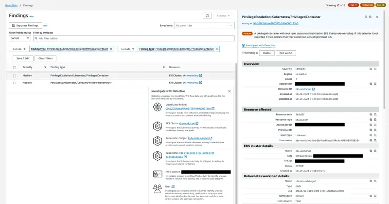

このラボでは、EKSクラスタの`default`ネームスペースにroot権限を持つ`privileged`セキュリティコンテキストを持つコンテナを作成します。この特権コンテナはホストからの機密ディレクトリをマウントし、コンテナ内でボリュームとしてアクセスできるようになります。

この演習では、2つの異なる検出結果が生成されます。`PrivilegeEscalation:Kubernetes/PrivilegedContainer`は特権権限でコンテナが起動されたことを示し、`Persistence:Kubernetes/ContainerWithSensitiveMount`はコンテナ内に機密性の高い外部ホストパスがマウントされていることを示します。

検出結果をシミュレーションするために、すでに特定のパラメータが設定された事前構成されたマニフェストを使用します：

::yaml{file="manifests/modules/security/Guardduty/mount/privileged-pod-example.yaml" paths="spec.containers.0.securityContext,spec.containers.0.volumeMounts.0.mountPath,spec.volumes.0.hostPath.path"}

1. `SecurityContext: privileged: true`を設定することでPodに完全なroot権限を付与します
2. `mountPath: /host-etc`は、マップされたホストボリュームがコンテナ内で`/host-etc`でアクセス可能であることを指定します
3. `path: /etc`は、ホストシステムの`/etc`ディレクトリがマウントのソースディレクトリになることを指定します

以下のコマンドで上記のマニフェストを適用します：

```bash
$ kubectl apply -f ~/environment/eks-workshop/modules/security/Guardduty/mount/privileged-pod-example.yaml
```

:::note
このPodは一度だけ実行され、`Completed`状態に達するまで実行されます
:::

数分以内に、[GuardDuty検出結果コンソール](https://console.aws.amazon.com/guardduty/home#/findings)で`PrivilegeEscalation:Kubernetes/PrivilegedContainer`と`Persistence:Kubernetes/ContainerWithSensitiveMount`の2つの検出結果が表示されます。




ここでも、検出結果の詳細、アクション、Detective調査を分析する時間を取りましょう。

以下のコマンドを実行してPodをクリーンアップします：

```bash
$ kubectl delete -f ~/environment/eks-workshop/modules/security/Guardduty/mount/privileged-pod-example.yaml
```

