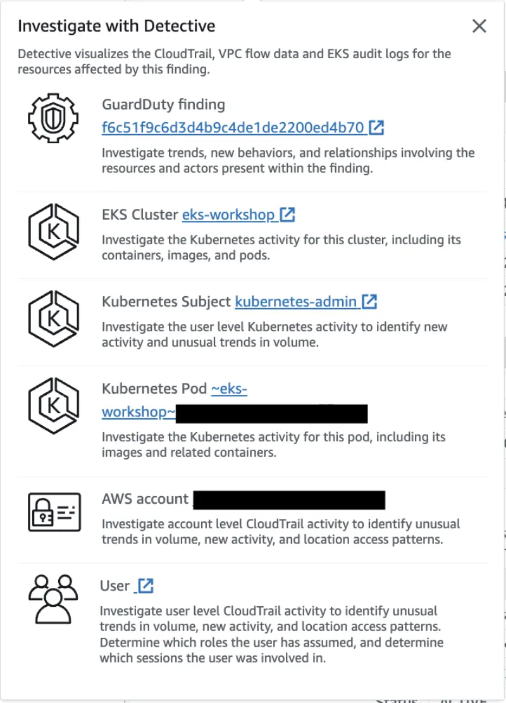
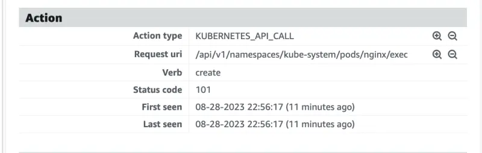

この検出結果は、EKSクラスター上の`kube-system`名前空間内のPodでコマンドが実行されたことを示しています。

まず、`kube-system`名前空間でシェル環境へのアクセスを提供するPodを実行しましょう。

```bash
$ kubectl -n kube-system run nginx --image=nginx
$ kubectl wait --for=condition=ready pod nginx -n kube-system
$ kubectl -n kube-system get pod nginx
NAME    READY   STATUS    RESTARTS   AGE
nginx   1/1     Running   0          28s
```

次に、以下のコマンドを実行して`Execution:Kubernetes/ExecInKubeSystemPod`の検出結果を生成します：

```bash
$ kubectl -n kube-system exec nginx -- pwd
/
```

数分以内に[GuardDuty検出結果コンソール](https://console.aws.amazon.com/guardduty/home#/findings)で`Execution:Kubernetes/ExecInKubeSystemPod`の検出結果が表示されます。


検出結果をクリックすると、画面の右側にタブが開き、検出結果の詳細とその簡単な説明が表示されます。


また、Amazon Detectiveを使用して検出結果を調査するオプションも提供されています。



検出結果の**Action**を確認すると、それが`KUBERNETES_API_CALL`に関連していることがわかります。



検出結果を生成するために使用した問題のあるPodをクリーンアップします：

```bash
$ kubectl -n kube-system delete pod nginx
```

