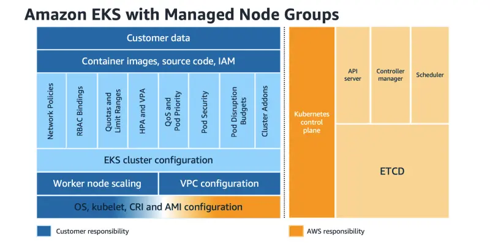
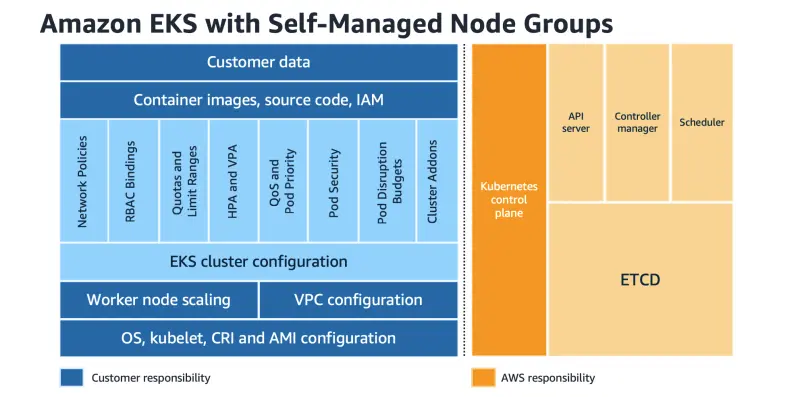

AWSにおけるセキュリティは最優先事項であり、AWSとお客様の間で責任を共有します。Amazon EKSのようなマネージドサービスを使用する場合、AWSはクラウド「自体」のセキュリティを担当し、お客様はクラウド「内」のセキュリティを担当します。

このチャプターでは、Amazon EKSに関連するセキュリティの様々な側面について探求します。EKSのセキュリティについて詳しく知るには、[EKSベストプラクティスガイド](https://aws.github.io/aws-eks-best-practices/security/docs/)を参照してください。

---

