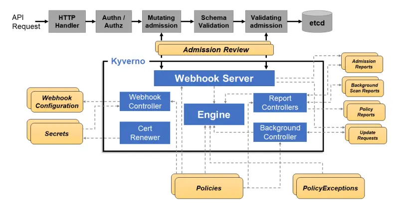

::required-time

:::tip 開始する前に
この章のための環境を準備してください：

```bash timeout=300 wait=30
$ prepare-environment security/kyverno
```

これにより、お使いのラボ環境に以下の変更が適用されます：

以下のKubernetesアドオンをEKSクラスタにインストールします：

- Kyverno Policy Manager
- Kyverno Policies
- Policy Reporter

これらの変更を適用するTerraformは[こちら](https://github.com/aws-samples/eks-workshop-v2/tree/main/manifests/modules/security/kyverno/.workshop/terraform)で確認できます。
:::

コンテナが本番環境でますます採用されるにつれて、DevOps、セキュリティ、プラットフォームチームは、ガバナンスと[ポリシーアズコード（PaC）](https://aws.github.io/aws-eks-best-practices/security/docs/pods/#policy-as-code-pac)を協力して管理するための効果的なソリューションを必要としています。これにより、すべてのチームがセキュリティに関する同じ真実の源を共有し、個々のニーズを説明する際に一貫したベースラインの「言語」を使用することができます。

Kubernetesは、その性質上、ツールを構築し、オーケストレーションするためのツールとして設計されており、最初からガードレールが定義されていません。ビルダーにセキュリティを制御する方法を提供するために、Kubernetesはバージョン1.23から[Pod Security Admission（PSA）](https://kubernetes.io/docs/concepts/security/pod-security-admission/)を提供しています。PSAは[Pod Security Standards（PSS）](https://kubernetes.io/docs/concepts/security/pod-security-standards/)で概説されているセキュリティコントロールを実装した組み込みのアドミッションコントローラであり、Amazon Elastic Kubernetes Service（EKS）ではデフォルトで有効になっています。

### Kyvernoとは何か？

[Kyverno](https://kyverno.io/)（ギリシャ語で「統治する」）は、Kubernetes専用に設計されたポリシーエンジンです。これはCloud Native Computing Foundation（CNCF）のプロジェクトであり、チームが協力してポリシーアズコードを実施することを可能にします。

Kyvernoポリシーエンジンは、[動的アドミッションコントローラ](https://kubernetes.io/docs/reference/access-authn-authz/extensible-admission-controllers/)としてKubernetes APIサーバーと統合され、インバウンドのKubernetes APIリクエストを**変更**および**検証**するポリシーを可能にします。これにより、データがクラスタに永続化され適用される前に、定義されたルールへの準拠が確保されます。

KyvernoはYAMLで記述された宣言的なKubernetesリソースを使用し、新しいポリシー言語を学ぶ必要がありません。結果はKubernetesリソースとイベントとして利用可能です。

Kyvernoポリシーは、リソース構成を**検証**、**変更**、**生成**するために使用でき、また画像の署名と証明を**検証**することもできます。これにより、包括的なソフトウェアサプライチェーンセキュリティ標準の施行に必要なすべての構成要素が提供されます。

### Kyvernoの仕組み

Kyvernoは、Kubernetesクラスタで動的アドミッションコントローラとして動作します。KubernetesAPIサーバーから検証および変更アドミッションwebhook HTTPコールバックを受信し、一致するポリシーを適用して、アドミッションポリシーを実施するか、リクエストを拒否する結果を返します。また、リクエストを監査し、実施前に環境のセキュリティ状態を監視するためにも使用できます。

以下の図は、Kyvernoの高レベルの論理アーキテクチャを示しています：



主要なコンポーネントは、Webhookサーバーとウェブフックコントローラーの2つです。**Webhookサーバー**は、Kubernetes APIサーバーから受信したAdmissionReviewリクエストを処理し、処理のためにエンジンに送信します。これは**Webhookコントローラー**によって動的に構成され、このコントローラーはインストールされたポリシーを監視し、それらのポリシーに一致するリソースのみをリクエストするようにWebhookを修正します。

---

ラボを進める前に、`prepare-environment`スクリプトによってプロビジョニングされたKyvernoリソースを検証しましょう：

```bash
$ kubectl -n kyverno get all
NAME                                                           READY   STATUS      RESTARTS   AGE
pod/kyverno-admission-controller-594c99487b-wpnsr              1/1     Running     0          8m15s
pod/kyverno-background-controller-7547578799-ltg7f             1/1     Running     0          8m15s
pod/kyverno-cleanup-admission-reports-28314690-6vjn4           0/1     Completed   0          3m20s
pod/kyverno-cleanup-cluster-admission-reports-28314690-2jjht   0/1     Completed   0          3m20s
pod/kyverno-cleanup-controller-79575cdb59-mlbz2                1/1     Running     0          8m15s
pod/kyverno-reports-controller-8668db7759-zxjdh                1/1     Running     0          8m15s
pod/policy-reporter-57f7dfc766-n48qk                           1/1     Running     0          7m53s

NAME                                            TYPE        CLUSTER-IP       EXTERNAL-IP   PORT(S)    AGE
service/kyverno-background-controller-metrics   ClusterIP   172.20.42.104    <none>        8000/TCP   8m16s
service/kyverno-cleanup-controller              ClusterIP   172.20.25.127    <none>        443/TCP    8m16s
service/kyverno-cleanup-controller-metrics      ClusterIP   172.20.184.34    <none>        8000/TCP   8m16s
service/kyverno-reports-controller-metrics      ClusterIP   172.20.84.109    <none>        8000/TCP   8m16s
service/kyverno-svc                             ClusterIP   172.20.157.100   <none>        443/TCP    8m16s
service/kyverno-svc-metrics                     ClusterIP   172.20.36.168    <none>        8000/TCP   8m16s
service/policy-reporter                         ClusterIP   172.20.175.164   <none>        8080/TCP   7m53s

NAME                                            READY   UP-TO-DATE   AVAILABLE   AGE
deployment.apps/kyverno-admission-controller    1/1     1            1           8m16s
deployment.apps/kyverno-background-controller   1/1     1            1           8m16s
deployment.apps/kyverno-cleanup-controller      1/1     1            1           8m16s
deployment.apps/kyverno-reports-controller      1/1     1            1           8m16s
deployment.apps/policy-reporter                 1/1     1            1           7m53s

NAME                                                       DESIRED   CURRENT   READY   AGE
replicaset.apps/kyverno-admission-controller-594c99487b    1         1         1       8m16s
replicaset.apps/kyverno-background-controller-7547578799   1         1         1       8m16s
replicaset.apps/kyverno-cleanup-controller-79575cdb59      1         1         1       8m16s
replicaset.apps/kyverno-reports-controller-8668db7759      1         1         1       8m16s
replicaset.apps/policy-reporter-57f7dfc766                 1         1         1       7m53s

NAME                                                      SCHEDULE       SUSPEND   ACTIVE   LAST SCHEDULE   AGE
cronjob.batch/kyverno-cleanup-admission-reports           */10 * * * *   False     0        3m20s           8m16s
cronjob.batch/kyverno-cleanup-cluster-admission-reports   */10 * * * *   False     0        3m20s           8m16s

NAME                                                           COMPLETIONS   DURATION   AGE
job.batch/kyverno-cleanup-admission-reports-28314690           1/1           13s        3m20s
job.batch/kyverno-cleanup-cluster-admission-reports-28314690   1/1           10s        3m20s
```
