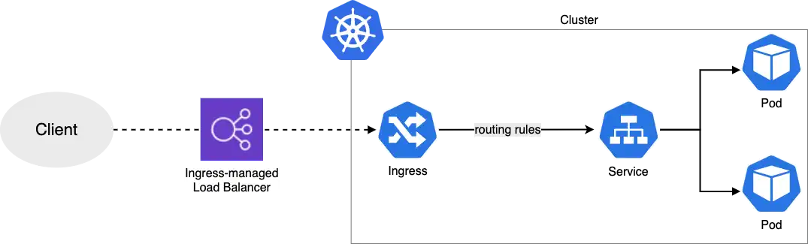

このトラブルシューティングシナリオでは、AWS Load Balancer ControllerがApplication Load Balancer（ALB）をIngressリソース用に作成しない理由を調査します。この演習の最後には、以下の画像のようにALB Ingressを通じてUIアプリケーションにアクセスできるようになります。



## トラブルシューティングを始めましょう

### ステップ1：アプリケーションのステータスを確認する

まず、UIアプリケーションのステータスを確認しましょう：

```bash
$ kubectl get pod -n ui
NAME                  READY   STATUS    RESTARTS   AGE
ui-68495c748c-jkh2z   1/1     Running   0          85s
```

### ステップ2：Ingressステータスを確認する

Ingressリソースを調べてみましょう。ADDRESSフィールドが空であることに注目してください - これはALBが作成されていないことを示しています：

```bash
$ kubectl get ingress/ui -n ui
NAME   CLASS   HOSTS   ADDRESS   PORTS   AGE
ui     alb     *                 80      105s
```

正常にデプロイされた場合、ADDRESSフィールドには次のようなALB DNSが表示されます：

```text
NAME   CLASS   HOSTS   ADDRESS                                                    PORTS   AGE
ui     alb     *      k8s-ui-ingress-xxxxxxxxxx-yyyyyyyyyy.region.elb.amazonaws.com   80   2m32s
```

### ステップ3：Ingressイベントを調査する

ALB作成が失敗した理由を理解するために、Ingressに関連するイベントを見てみましょう：

```bash
$ kubectl describe ingress/ui -n ui
Name:             ui
Labels:           <none>
Namespace:        ui
Address:
Ingress Class:    alb
Default backend:  <default>
Rules:
  Host        Path  Backends
  ----        ----  --------
  *
              /   service-ui:80 (<error: endpoints "service-ui" not found>)
Annotations:  alb.ingress.kubernetes.io/healthcheck-path: /actuator/health/liveness
              alb.ingress.kubernetes.io/scheme: internet-facing
              alb.ingress.kubernetes.io/target-type: ip
Events:
  Type     Reason            Age                    From     Message
  ----     ------            ----                   ----     -------
  Warning  FailedBuildModel  2m23s (x16 over 5m9s)  ingress  Failed build model due to couldn't auto-discover subnets: unable to resolve at least one subnet (0 match VPC and tags: [kubernetes.io/role/elb])

```

このエラーは、AWS Load Balancer Controllerがロードバランサーで使用するためにタグ付けされたサブネットを見つけることができないことを示しています。ここに[ALBをEKSで正しく設定する](https://kubernetes-sigs.github.io/aws-load-balancer-controller/v2.4/deploy/subnet_discovery/)ためのドキュメントがあります。

### ステップ4：サブネットタグを修正する

Load Balancer Controllerは、パブリックサブネットに`kubernetes.io/role/elb=1`というタグが必要です。正しいサブネットを特定してタグ付けしましょう：

#### 4.1 クラスターのサブネットを見つける

```bash
$ aws ec2 describe-subnets --filters "Name=tag:alpha.eksctl.io/cluster-name,Values=${EKS_CLUSTER_NAME}" --query 'Subnets[].SubnetId[]'
[
      "subnet-xxxxxxxxxxxxxxxxx",
      "subnet-xxxxxxxxxxxxxxxxx",
      "subnet-xxxxxxxxxxxxxxxxx",
      "subnet-xxxxxxxxxxxxxxxxx",
      "subnet-xxxxxxxxxxxxxxxxx",
      "subnet-xxxxxxxxxxxxxxxxx"
]
```

#### 4.2. ルートテーブルを確認してどのサブネットがパブリックかを識別する

:::info
サブネットIDをCLIフィルターに一度に1つずつ追加することで、どのサブネットがパブリックかを識別できます：`--filters 'Name=association.subnet-id,Values=subnet-xxxxxxxxxxxxxxxxx'`

```text
aws ec2 describe-route-tables --filters 'Name=association.subnet-id,Values=<ここにサブネットIDを入力>' --query 'RouteTables[].Routes[].[DestinationCidrBlock,GatewayId]'

```

:::

```bash
$ for subnet_id in $(aws ec2 describe-subnets --filters "Name=tag:alpha.eksctl.io/cluster-name,Values=${EKS_CLUSTER_NAME}" --query 'Subnets[].SubnetId[]' --output text); do \
    echo "Subnet: ${subnet_id}"; \
    aws ec2 describe-route-tables --filters "Name=association.subnet-id,Values=${subnet_id}" \
      --query 'RouteTables[].Routes[].[DestinationCidrBlock,GatewayId]' --output text; \
done

Subnet: subnet-xxxxxxxxxxxxxxxxx
10.42.0.0/16    local
0.0.0.0/0       igw-xxxxxxxxxxxxxxxxx
Subnet: subnet-xxxxxxxxxxxxxxxxx
10.42.0.0/16    local
0.0.0.0/0       igw-xxxxxxxxxxxxxxxxx
...
```

パブリックサブネットは、Internet Gateway（igw-xxx）を指す`0.0.0.0/0`のルートを持っています。

#### 4.3. 現在のELBタグのステータスを確認する

```bash
$ aws ec2 describe-subnets --filters 'Name=tag:kubernetes.io/role/elb,Values=1' --query 'Subnets[].SubnetId'
[]
```

#### 4.4. パブリックサブネットにタグ付けする（便宜上、環境変数に格納しています）

```bash
$ aws ec2 create-tags --resources $PUBLIC_SUBNET_1 $PUBLIC_SUBNET_2 $PUBLIC_SUBNET_3 \
      --tags 'Key="kubernetes.io/role/elb",Value=1'
```

#### 4.5. タグが適用されたことを確認する

```bash
$ aws ec2 describe-subnets --filters 'Name=tag:kubernetes.io/role/elb,Values=1' --query 'Subnets[].SubnetId'
```

#### 4.6. 新しいサブネット設定を取得するためにLoad Balancer Controllerを再起動する

```bash
$ kubectl -n kube-system rollout restart deploy aws-load-balancer-controller
deployment.apps/aws-load-balancer-controller restarted
```

#### 4.7. Ingressステータスを再確認する

```bash
$ kubectl describe ingress/ui -n ui
Warning  FailedDeployModel  50s  ingress  Failed deploy model due to AccessDenied: User: arn:aws:sts::021629549003:assumed-role/alb-controller-20250216203332410200000002/1739739040072980120 is not authorized to perform: elasticloadbalancing:CreateLoadBalancer on resource: arn:aws:elasticloadbalancing:us-west-2:021629549003:loadbalancer/app/k8s-ui-ui-5ddc3ba496/* because no identity-based policy allows the elasticloadbalancing:CreateLoadBalancer action
         status code: 403, request id: 33be0191-469b-4eff-840d-b5c9420f76c6
Warning  FailedDeployModel  9s (x5 over 49s)  ingress  (combined from similar events): Failed deploy model due to AccessDenied: User: arn:aws:sts::021629549003:assumed-role/alb-controller-20250216203332410200000002/1739739040072980120 is not authorized to perform: elasticloadbalancing:CreateLoadBalancer on resource: arn:aws:elasticloadbalancing:us-west-2:021629549003:loadbalancer/app/k8s-ui-ui-5ddc3ba496/* because no identity-based policy allows the elasticloadbalancing:CreateLoadBalancer action
         status code: 403, request id: a8d8f2c9-4911-4f3d-b4f3-81e2b0644e04
```

エラーが変わりました - 今度はIAM権限の問題が見られます：

```text
Warning  FailedDeployModel  68s  ingress  Failed deploy model due to AccessDenied: User: arn:aws:sts::xxxxxxxxxxxx:assumed-role/alb-controller-20240611131524228000000002/1718115201989397805 is not authorized to perform: elasticloadbalancing:CreateLoadBalancer
```

これは、Load Balancer ControllerのIAM権限を修正する必要があることを示しています。これは次のセクションで対処します。

:::tip
CloudTrailで最近1時間以内のCreateLoadBalancer API呼び出しを確認することで、ALB作成の試みを検証できます。
:::

