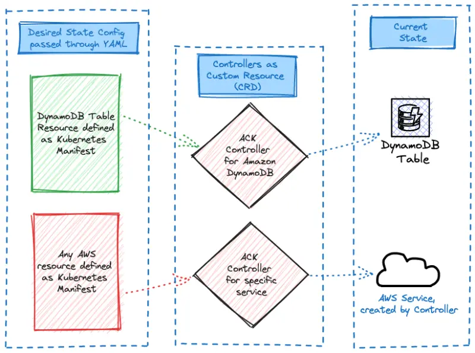

기본적으로 샘플 애플리케이션의 **Carts** 컴포넌트는 `carts-dynamodb`라는 EKS 클러스터에서 파드로 실행되는 DynamoDB 로컬 인스턴스를 사용합니다. 이번 실습에서는 Kubernetes 커스텀 리소스를 사용하여 애플리케이션을 위한 Amazon DynamoDB 클라우드 기반 테이블을 프로비저닝하고, **Carts** 배포를 구성하여 로컬 복사본 대신 새로 프로비저닝된 DynamoDB 테이블을 사용하도록 하겠습니다.



Kubernetes 매니페스트를 사용하여 DynamoDB 테이블을 생성하는 방법을 살펴보겠습니다:

```file
manifests/modules/automation/controlplanes/ack/dynamodb/dynamodb-create.yaml
```

:::info
자세히 살펴보면 YAML 명세가 `tableName`과 `attributeDefinitions`와 같은 친숙한 필드를 포함하여 DynamoDB의 [API 시그니처](https://docs.aws.amazon.com/amazondynamodb/latest/APIReference/API_CreateTable.html)와 매우 유사하다는 것을 알 수 있습니다.
:::

이제 이러한 업데이트를 클러스터에 적용해 보겠습니다:

```bash wait=10
$ kubectl kustomize ~/environment/eks-workshop/modules/automation/controlplanes/ack/dynamodb \
  | envsubst | kubectl apply -f-
table.dynamodb.services.k8s.aws/items created
```

클러스터의 ACK 컨트롤러는 이러한 새로운 리소스에 응답하고 매니페스트에 정의된 AWS 인프라를 프로비저닝할 것입니다. ACK가 테이블을 생성했는지 확인하기 위해 다음 명령을 실행하세요:

```bash timeout=300
$ kubectl wait table.dynamodb.services.k8s.aws items -n carts --for=condition=ACK.ResourceSynced --timeout=15m
table.dynamodb.services.k8s.aws/items condition met
$ kubectl get table.dynamodb.services.k8s.aws items -n carts -ojson | yq '.status."tableStatus"'
ACTIVE
```

마지막으로, AWS CLI를 사용하여 테이블이 생성되었는지 확인해 보겠습니다:

```bash
$ aws dynamodb list-tables

{
    "TableNames": [
        "eks-workshop-carts-ack"
    ]
}
```

이 출력은 새로운 테이블이 성공적으로 생성되었음을 확인해줍니다!

ACK를 활용함으로써, Kubernetes 클러스터에서 직접 클라우드 기반 DynamoDB 테이블을 원활하게 프로비저닝했으며, 이는 AWS 리소스를 관리하는 이 접근 방식의 강력함과 유연성을 보여줍니다.