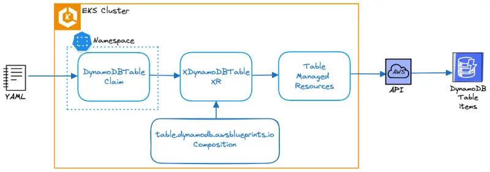

Crossplane에 새로운 XR의 세부 사항을 구성한 후에는 직접 생성하거나 클레임을 사용할 수 있습니다. 일반적으로 Crossplane 구성을 담당하는 팀(주로 플랫폼 또는 SRE 팀)만이 XR을 직접 생성할 수 있는 권한을 가집니다. 다른 모든 사람들은 Composite Resource Claim(줄여서 클레임)이라고 하는 경량화된 프록시 리소스를 통해 XR을 관리합니다.

이 클레임을 사용하면 개발자는 테이블을 생성하기 위해 기본 **DynamoDB 테이블 이름, 해시 키, 글로벌 인덱스 이름**만 지정하면 됩니다. 이를 통해 플랫폼 또는 SRE 팀은 청구 모드, 기본 읽기/쓰기 용량, 프로젝션 유형, 비용 및 인프라 관련 태그와 같은 측면을 표준화할 수 있습니다.

```file
manifests/modules/automation/controlplanes/crossplane/compositions/claim/claim.yaml
```

이전 Managed Resource 섹션에서 생성한 DynamoDB 테이블을 정리하는 것부터 시작하겠습니다:

```bash
$ kubectl delete tables.dynamodb.aws.upbound.io --all --ignore-not-found=true
$ kubectl wait --for=delete tables.dynamodb.aws.upbound.io --all --timeout=5m
```

이제 `Claim`을 생성하여 테이블을 다시 만들 수 있습니다:

```bash timeout=400
$ cat ~/environment/eks-workshop/modules/automation/controlplanes/crossplane/compositions/claim/claim.yaml \
  | envsubst | kubectl -n carts apply -f -
dynamodbtable.awsblueprints.io/eks-workshop-carts-crossplane created
$ kubectl wait dynamodbtables.awsblueprints.io ${EKS_CLUSTER_NAME}-carts-crossplane -n carts \
  --for=condition=Ready --timeout=5m
```

AWS 관리형 서비스를 프로비저닝하는 데는 시간이 걸리며, DynamoDB의 경우 최대 2분이 소요됩니다. Crossplane은 Kubernetes Composite 및 Managed 리소스의 `SYNCED` 필드에서 조정 상태를 보고합니다.

```bash
$ kubectl get table
NAME                                        READY   SYNCED   EXTERNAL-NAME                   AGE
eks-workshop-carts-crossplane-bt28w-lnb4r   True   True      eks-workshop-carts-crossplane   6s
```

이제 이 클레임을 사용하여 DynamoDB 테이블이 어떻게 배포되는지 이해해 보겠습니다:



carts 네임스페이스에 배포된 `DynamoDBTable` 클레임을 조회할 때, Composite Resource (XR) `XDynamoDBTable`을 가리키고 생성하는 것을 확인할 수 있습니다:

```bash
$ kubectl get DynamoDBTable -n carts -o yaml | grep "resourceRef:" -A 3

    resourceRef:
      apiVersion: awsblueprints.io/v1alpha1
      kind: XDynamoDBTable
      name: eks-workshop-carts-crossplane-bt28w
```

Composition `table.dynamodb.awsblueprints.io`는 Composite Resource Kind (XR-KIND)를 `XDynamoDBTable`로 보여줍니다. 이 Composition은 `XDynamoDBTable` XR을 생성할 때 Crossplane이 수행해야 할 작업을 알려줍니다. 각 Composition은 XR과 하나 이상의 Managed Resources 세트 간의 연결을 생성합니다.

```bash
$ kubectl get composition
NAME                              XR-KIND          XR-APIVERSION               AGE
table.dynamodb.awsblueprints.io   XDynamoDBTable   awsblueprints.io/v1alpha1   143m
```

네임스페이스에 국한되지 않는 `XDynamoDBTable` XR을 조회할 때, DynamoDB managed resource `Table`을 생성하는 것을 확인할 수 있습니다:

```bash
$ kubectl get XDynamoDBTable -o yaml | grep "resourceRefs:" -A 3

    resourceRefs:
    - apiVersion: dynamodb.aws.upbound.io/v1beta1
      kind: Table
      name: eks-workshop-carts-crossplane-bt28w-lnb4r
```