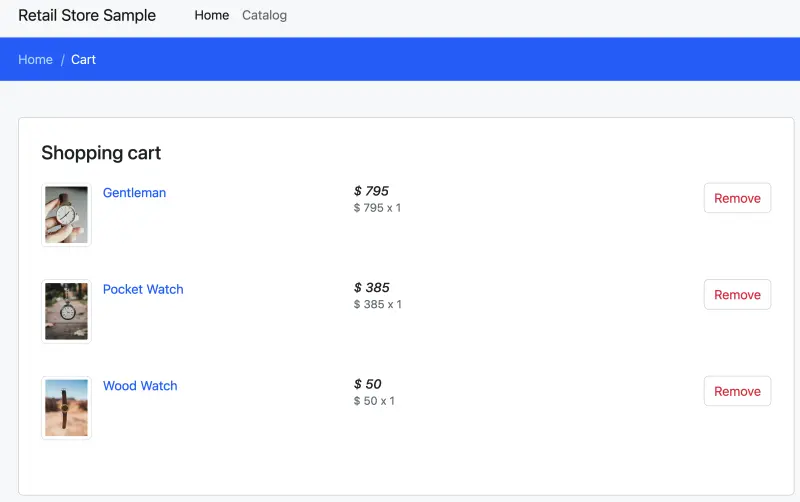

새로운 리소스가 생성되거나 업데이트될 때, 애플리케이션 구성은 이러한 새로운 리소스를 활용하기 위해 조정되어야 하는 경우가 많습니다. 환경 변수는 애플리케이션 개발자들이 구성을 저장하는데 널리 사용되는 방법이며, Kubernetes에서는 배포를 생성할 때 `container` [스펙](https://kubernetes.io/docs/tasks/inject-data-application/define-environment-variable-container/)의 `env` 필드를 통해 컨테이너에 환경 변수를 전달할 수 있습니다.

Kubernetes에서 이를 달성하는 두 가지 주요 방법이 있습니다:

1. **ConfigMaps**: 이는 Kubernetes의 핵심 리소스로, 환경 변수, 텍스트 필드 및 기타 항목과 같은 구성 요소를 Key-Value 형식으로 pod 스펙에서 사용할 수 있도록 합니다.
2. **Secrets**: 기본적으로 암호화되지 않는다는 점을 기억해야 하지만, 비밀은 비밀번호와 같은 민감한 정보를 저장하는 데 사용됩니다.

이 실습에서는 carts 컴포넌트의 ConfigMap을 업데이트하는 데 중점을 둘 것입니다. 로컬 DynamoDB를 가리키는 구성을 제거하고 대신 Crossplane에 의해 생성된 DynamoDB 테이블의 이름을 사용할 것입니다:

```kustomization
modules/automation/controlplanes/crossplane/app/kustomization.yaml
ConfigMap/carts
```

또한, carts Pod가 DynamoDB 서비스에 접근할 수 있도록 적절한 IAM 권한을 제공해야 합니다. IAM 역할이 이미 생성되었으며, IAM Roles for Service Accounts (IRSA)를 사용하여 이를 carts Pod에 적용할 것입니다:

```kustomization
modules/automation/controlplanes/crossplane/app/carts-serviceAccount.yaml
ServiceAccount/carts
```

IRSA가 어떻게 작동하는지 자세히 알아보려면 [공식 문서](https://docs.aws.amazon.com/eks/latest/userguide/iam-roles-for-service-accounts.html)를 참조하세요.

이제 이 새로운 구성을 적용해 보겠습니다:

```bash
$ kubectl kustomize ~/environment/eks-workshop/modules/automation/controlplanes/crossplane/app \
  | envsubst | kubectl apply -f-
```

이제 새로운 ConfigMap 내용을 적용하기 위해 모든 carts Pod를 재시작해야 합니다:

```bash
$ kubectl rollout restart -n carts deployment/carts
deployment.apps/carts restarted
$ kubectl rollout status -n carts deployment/carts --timeout=40s
Waiting for deployment "carts" rollout to finish: 1 old replicas are pending termination...
deployment "carts" successfully rolled out
```

애플리케이션이 새로운 DynamoDB 테이블과 함께 작동하는지 확인하기 위해, 샘플 애플리케이션을 테스트하기 위해 생성된 Network Load Balancer(NLB)를 사용할 수 있습니다. 이를 통해 웹 브라우저를 통해 직접 애플리케이션과 상호작용할 수 있습니다:

```bash
$ LB_HOSTNAME=$(kubectl -n ui get service ui-nlb -o jsonpath='{.status.loadBalancer.ingress[*].hostname}{"\n"}')
$ echo "http://$LB_HOSTNAME"
http://k8s-ui-uinlb-647e781087-6717c5049aa96bd9.elb.us-west-2.amazonaws.com
```

:::info
이 명령을 실행할 때 실제 엔드포인트는 다를 것입니다. 새로운 Network Load Balancer(NLB) 엔드포인트가 프로비저닝될 것이기 때문입니다.
:::

로드 밸런서의 프로비저닝이 완료될 때까지 기다리려면 다음 명령을 실행할 수 있습니다:

```bash timeout=610
$ wait-for-lb $(kubectl get service -n ui ui-nlb -o jsonpath="{.status.loadBalancer.ingress[*].hostname}{'\n'}")
```

로드 밸런서가 프로비저닝되면 웹 브라우저에 URL을 붙여넣어 접근할 수 있습니다. 웹 스토어의 UI가 표시되며 사용자로서 사이트를 둘러볼 수 있습니다.

<Browser url="http://k8s-ui-uinlb-a9797f0f61.elb.us-west-2.amazonaws.com">

</Browser>

**Carts** 모듈이 실제로 우리가 방금 프로비저닝한 DynamoDB 테이블을 사용하고 있는지 확인하기 위해, 장바구니에 몇 가지 항목을 추가해 보세요.



DynamoDB 테이블에도 항목이 있는지 확인하려면 다음을 실행하세요:

```bash
$ aws dynamodb scan --table-name "${EKS_CLUSTER_NAME}-carts-crossplane"
```

축하합니다! Kubernetes API의 범위를 벗어나지 않고 AWS 리소스를 성공적으로 생성하고 활용했습니다!