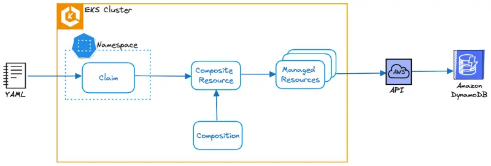

Crossplane은 두 가지 주요 구성 요소를 사용하여 클러스터 내에서 작동합니다:

1. 핵심 기능을 제공하는 Crossplane 컨트롤러
2. AWS와 같은 특정 프로바이더와 통합하기 위한 컨트롤러와 커스텀 리소스 정의를 제공하는 하나 이상의 Crossplane 프로바이더

EKS 클러스터에서는 Crossplane 컨트롤러, Upbound AWS 프로바이더, 그리고 필요한 구성 요소들이 사전 설치되어 있습니다. 이들은 `crossplane-rbac-manager`와 함께 `crossplane-system` 네임스페이스에서 디플로이먼트로 실행됩니다:

```bash
$ kubectl get deployment -n crossplane-system
NAME                                         READY   UP-TO-DATE   AVAILABLE   AGE
crossplane                                   1/1     1            1           3h7m
crossplane-rbac-manager                      1/1     1            1           3h7m
upbound-aws-provider-dynamodb-23a48a51e223   1/1     1            1           3h6m
upbound-provider-family-aws-1ac09674120f     1/1     1            1           21h
```

여기서 `upbound-provider-family-aws`는 Upbound에서 개발하고 지원하는 Amazon Web Services(AWS)용 Crossplane 프로바이더를 나타냅니다. `upbound-aws-provider-dynamodb`는 Crossplane을 통해 DynamoDB를 배포하는 데 전용된 하위 집합입니다.

Crossplane은 개발자가 클레임이라고 하는 쿠버네티스 매니페스트를 사용하여 인프라 리소스를 요청하는 프로세스를 단순화합니다. 아래 다이어그램에서 보여지듯이, 클레임은 네임스페이스 범위의 유일한 Crossplane 리소스로, 개발자 인터페이스 역할을 하며 구현 세부사항을 추상화합니다. 클레임이 클러스터에 배포되면, Composition이라고 하는 템플릿을 통해 정의된 하나 이상의 클라우드 리소스를 나타내는 쿠버네티스 커스텀 리소스인 Composite Resource(XR)를 생성합니다. 그런 다음 Composite Resource는 하나 이상의 Managed Resource를 생성하며, 이는 AWS API와 상호 작용하여 원하는 인프라 리소스의 생성을 요청합니다.



이러한 아키텍처는 높은 수준의 추상화(클레임)를 다루는 개발자와 기반 인프라 구현(Composition 및 Managed Resource)을 정의하는 플랫폼 팀 간의 명확한 관심사 분리를 가능하게 합니다.