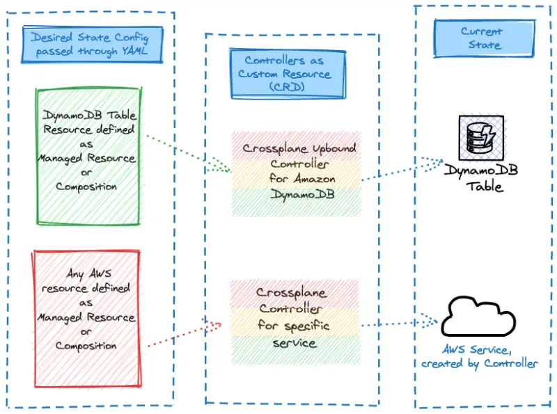

기본적으로 샘플 애플리케이션의 **Carts** 컴포넌트는 EKS 클러스터에서 `carts-dynamodb`라는 파드로 실행되는 DynamoDB 로컬 인스턴스를 사용합니다. 이번 실습에서는 Crossplane 관리형 리소스를 사용하여 애플리케이션을 위한 Amazon DynamoDB 클라우드 기반 테이블을 프로비저닝하고, **Carts** 배포를 구성하여 로컬 복사본 대신 새로 프로비저닝된 DynamoDB 테이블을 사용하도록 하겠습니다.



Crossplane 관리형 리소스 매니페스트를 통해 DynamoDB 테이블을 생성하는 방법을 살펴보겠습니다:

```file
manifests/modules/automation/controlplanes/crossplane/managed/table.yaml
```

이제 `dynamodb.aws.upbound.io` 리소스를 사용하여 DynamoDB 테이블에 대한 구성을 생성할 수 있습니다.

```bash wait=10 timeout=400 hook=table
$ kubectl kustomize ~/environment/eks-workshop/modules/automation/controlplanes/crossplane/managed \
  | envsubst | kubectl apply -f-
table.dynamodb.aws.upbound.io/eks-workshop-carts-crossplane created
$ kubectl wait tables.dynamodb.aws.upbound.io ${EKS_CLUSTER_NAME}-carts-crossplane \
  --for=condition=Ready --timeout=5m
```

AWS 관리형 서비스를 프로비저닝하는 데는 시간이 걸리며, DynamoDB의 경우 최대 2분이 소요됩니다. Crossplane은 Kubernetes 커스텀 리소스의 `status` 필드에서 조정 상태를 보고합니다.

```bash
$ kubectl get tables.dynamodb.aws.upbound.io
NAME                                        READY  SYNCED   EXTERNAL-NAME                   AGE
eks-workshop-carts-crossplane               True   True     eks-workshop-carts-crossplane   6s
```

이 구성이 적용되면 Crossplane은 AWS에 DynamoDB 테이블을 생성하며, 이후 우리 애플리케이션에서 사용할 수 있습니다. 다음 섹션에서는 애플리케이션이 이 새로 생성된 테이블을 사용하도록 업데이트하겠습니다.