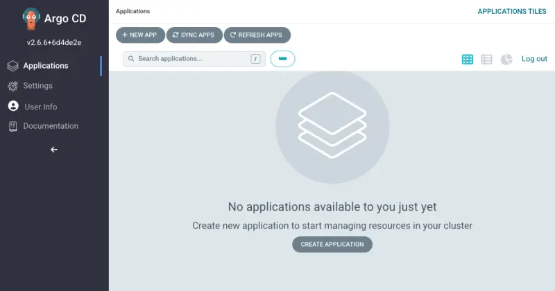

먼저 클러스터에 Argo CD를 설치해보겠습니다:

```bash
$ helm repo add argo-cd https://argoproj.github.io/argo-helm
$ helm upgrade --install argocd argo-cd/argo-cd --version "${ARGOCD_CHART_VERSION}" \
  --namespace "argocd" --create-namespace \
  --values ~/environment/eks-workshop/modules/automation/gitops/argocd/values.yaml \
  --wait
NAME: argocd
LAST DEPLOYED: [...]
NAMESPACE: argocd
STATUS: deployed
REVISION: 2
TEST SUITE: None
NOTES:
[...]
```

이 실습을 위해 Argo CD 서버 UI는 `Load Balancer` 타입의 Kubernetes Service를 사용하여 클러스터 외부에 노출되었습니다. Argo CD 서비스의 URL을 얻으려면 다음 명령을 실행하세요:

```bash
$ export ARGOCD_SERVER=$(kubectl get svc argocd-server -n argocd -o json | jq --raw-output '.status.loadBalancer.ingress[0].hostname')
$ echo "ArgoCD URL: https://$ARGOCD_SERVER"
ArgoCD URL: https://acfac042a61e5467aace45fc66aee1bf-818695545.us-west-2.elb.amazonaws.com
```

로드 밸런서가 프로비저닝되는 데 시간이 걸리므로 ArgoCD가 응답할 때까지 기다리려면 이 명령을 사용하세요:

```bash timeout=600 wait=60
$ curl --head -X GET --retry 20 --retry-all-errors --retry-delay 15 \
  --connect-timeout 5 --max-time 10 -k \
  https://$ARGOCD_SERVER
curl: (6) Could not resolve host: acfac042a61e5467aace45fc66aee1bf-818695545.us-west-2.elb.amazonaws.com
Warning: Problem : timeout. Will retry in 15 seconds. 20 retries left.
[...]
HTTP/1.1 200 OK
Accept-Ranges: bytes
Content-Length: 788
Content-Security-Policy: frame-ancestors 'self';
Content-Type: text/html; charset=utf-8
X-Frame-Options: sameorigin
X-Xss-Protection: 1
```

초기 사용자 이름은 `admin`이고 비밀번호는 자동 생성됩니다. 다음 명령을 실행하여 비밀번호를 얻을 수 있습니다:

```bash
$ export ARGOCD_PWD=$(kubectl -n argocd get secret argocd-initial-admin-secret -o jsonpath="{.data.password}" | base64 -d)
$ echo "ArgoCD admin password: $ARGOCD_PWD"
```

방금 얻은 URL과 자격 증명을 사용하여 Argo CD UI에 로그인하세요. 다음과 같은 화면이 표시됩니다:



Argo CD는 애플리케이션 관리에 사용할 수 있는 `argocd`라는 강력한 CLI 도구도 제공합니다.

:::info
이 실습을 위해 `argocd` CLI가 설치되어 있습니다. CLI 도구 설치에 대해 자세히 알아보려면 [설명서](https://argo-cd.readthedocs.io/en/stable/cli_installation/)를 참조하세요.
:::

CLI를 사용하여 Argo CD 객체와 상호 작용하려면 다음 명령을 실행하여 Argo CD 서버에 로그인해야 합니다:

```bash
$ argocd login $ARGOCD_SERVER --username admin --password $ARGOCD_PWD --insecure
'admin:login' logged in successfully
Context 'acfac042a61e5467aace45fc66aee1bf-818695545.us-west-2.elb.amazonaws.com' updated
```