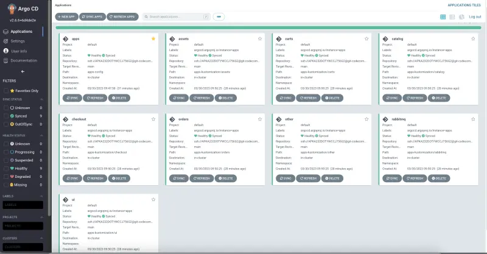
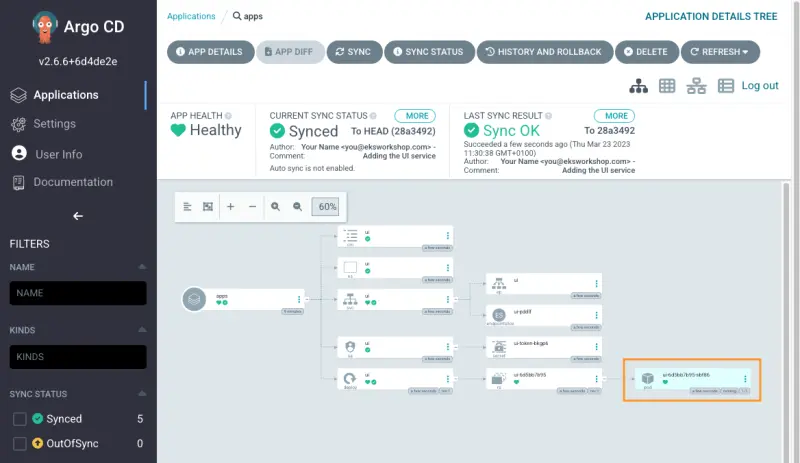

Argo CD App of Apps를 성공적으로 구성했으므로 이제 애플리케이션 세트에 대한 환경별 커스터마이제이션을 배포할 수 있습니다.

먼저 기존 애플리케이션을 제거하여 교체할 수 있도록 하겠습니다:

```bash
$ kubectl delete -k ~/environment/eks-workshop/base-application --ignore-not-found=true
namespace "assets" deleted
namespace "carts" deleted
namespace "catalog" deleted
namespace "checkout" deleted
namespace "orders" deleted
namespace "other" deleted
namespace "rabbitmq" deleted
namespace "ui" deleted
...
```

그런 다음 각 애플리케이션에 대한 커스터마이제이션을 생성해야 합니다:

```text
.
|-- app-of-apps
|   |-- ...
`-- apps-kustomization
    |-- assets
    |   `-- kustomization.yaml
    |-- carts
    |   `-- kustomization.yaml
    |-- catalog
    |   `-- kustomization.yaml
    |-- checkout
    |   `-- kustomization.yaml
    |-- orders
    |   `-- kustomization.yaml
    |-- other
    |   `-- kustomization.yaml
    |-- rabbitmq
    |   `-- kustomization.yaml
    `-- ui
        |-- deployment-patch.yaml
        `-- kustomization.yaml
```

```file
manifests/modules/automation/gitops/argocd/apps-kustomization/ui/kustomization.yaml
```

`resources`를 사용하여 애플리케이션(이 경우 `ui`)에 대한 `base` Kubernetes 매니페스트 경로를 정의합니다. 또한 `patches`를 사용하여 EKS 클러스터의 `ui` 애플리케이션에 적용할 구성을 정의합니다.

```file
manifests/modules/automation/gitops/argocd/apps-kustomization/ui/deployment-patch.yaml
```

`ui` 애플리케이션에 대해 `1`개의 레플리카를 가지도록 하겠습니다. 다른 모든 애플리케이션은 `base` Kubernetes 매니페스트의 구성을 사용할 것입니다.

Git 저장소 디렉토리에 파일을 복사합니다:

```bash
$ cp -R ~/environment/eks-workshop/modules/automation/gitops/argocd/apps-kustomization ~/environment/argocd/
```

최종 Git 디렉토리는 이제 다음과 같이 보일 것입니다. `tree ~/environment/argocd` 명령을 실행하여 확인할 수 있습니다:

```text
|-- app-of-apps
|   |-- Chart.yaml
|   |-- templates
|   |   |-- _application.yaml
|   |   `-- application.yaml
|   `-- values.yaml
|-- apps
|   ...
`-- apps-kustomization
    |-- assets
    |   `-- kustomization.yaml
    |-- carts
    |   `-- kustomization.yaml
    |-- catalog
    |   `-- kustomization.yaml
    |-- checkout
    |   `-- kustomization.yaml
    |-- orders
    |   `-- kustomization.yaml
    |-- other
    |   `-- kustomization.yaml
    |-- rabbitmq
    |   `-- kustomization.yaml
    `-- ui
        |-- deployment-patch.yaml
        `-- kustomization.yaml

12 directories, 19 files
```

Git 저장소에 변경 사항을 푸시합니다:

```bash
$ git -C ~/environment/argocd add .
$ git -C ~/environment/argocd commit -am "Adding apps kustomization"
$ git -C ~/environment/argocd push
```

ArgoCD UI에서 `Refresh`와 `Sync`를 클릭하거나, `argocd` CLI를 사용하여 `Sync`하거나, 자동 `Sync`가 완료될 때까지 기다립니다:

```bash
$ argocd app sync apps
$ argocd app sync ui
```

이제 모든 애플리케이션을 Argo CD를 사용하여 배포하도록 성공적으로 마이그레이션했으며, Git 저장소에 푸시된 추가 변경 사항은 EKS 클러스터에 자동으로 조정될 것입니다.

Argo CD가 동기화를 완료하면 모든 애플리케이션이 `Synced` 상태가 됩니다.



`ui` 애플리케이션과 관련된 모든 리소스도 배포되어 있어야 합니다. 확인하려면 다음 명령을 실행하세요:

```bash hook=deploy
$ kubectl get deployment -n ui ui
NAME   READY   UP-TO-DATE   AVAILABLE   AGE
ui     1/1     1            1           61s
$ kubectl get pod -n ui
NAME                 READY   STATUS   RESTARTS   AGE
ui-6d5bb7b95-rjfxd   1/1     Running  0          62s
```

