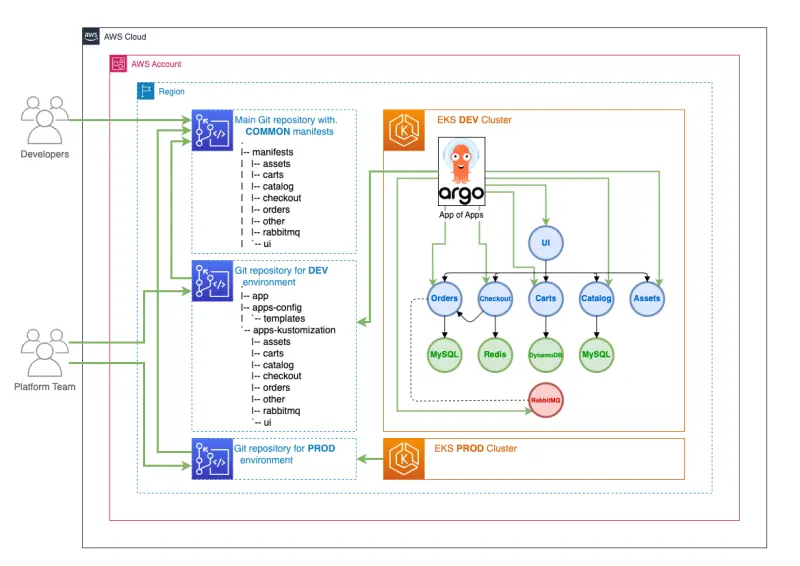

[Argo CD](https://argoproj.github.io/cd/)는 애플리케이션을 위한 `base` 쿠버네티스 매니페스트와 환경별 커스터마이제이션을 사용하여 여러 환경(DEV, TEST, PROD ...)에 애플리케이션 세트를 배포할 수 있습니다.

이 사용 사례를 구현하기 위해 [Argo CD App of Apps 패턴](https://argo-cd.readthedocs.io/en/stable/operator-manual/cluster-bootstrapping/)을 활용할 수 있습니다. 이 패턴을 통해 다른 애플리케이션들로 구성된 하나의 Argo CD 애플리케이션을 지정할 수 있습니다.



쿠버네티스 리소스를 위한 `base` 매니페스트가 포함된 Git 저장소로 [EKS Workshop Git 저장소](https://github.com/aws-samples/eks-workshop-v2/tree/main/manifests/base-application)를 참조합니다. 이 저장소는 각 애플리케이션의 초기 리소스 상태를 포함하게 됩니다.

```text
.
|-- manifests
| |-- assets
| |-- carts
| |-- catalog
| |-- checkout
| |-- orders
| |-- other
| |-- rabbitmq
| `-- ui
```

이 예제는 특정 환경(예: DEV)을 위한 구성을 생성하기 위해 Helm을 사용하는 방법을 보여줍니다.
일반적인 Git 저장소 레이아웃은 다음과 같을 수 있습니다:

```text
.
|-- app-of-apps
|   |-- ...
`-- apps-kustomization
    ...
```