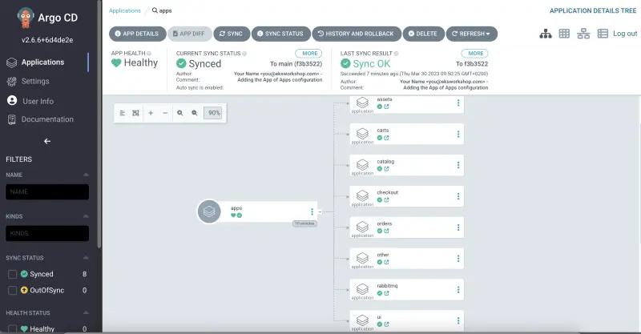
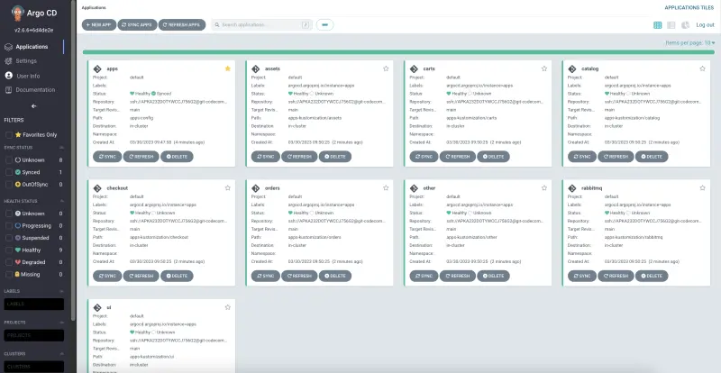

Argo CD 애플리케이션을 설정하기 전에, 우리가 `ui`를 위해 생성했던 Argo CD `Application`을 삭제해봅시다:

```bash wait=30
$ argocd app delete apps --cascade -y
```

Helm 차트에서 DRY 접근 방식을 사용하여 ArgoCD 애플리케이션 세트의 템플릿을 생성합니다:

```text
.
|-- app-of-apps
|   |-- Chart.yaml
|   |-- templates
|   |   |-- _application.yaml
|   |   `-- application.yaml
|   `-- values.yaml
`-- apps-kustomization
    ...
```

`Chart.yaml`는 보일러플레이트입니다. `templates`는 `values.yaml`에 정의된 애플리케이션을 생성하는 데 사용될 템플릿 파일을 포함합니다.

`values.yaml`은 또한 특정 환경에 특화되어 있고 모든 애플리케이션 템플릿에 적용될 값들을 포함합니다.

```file
manifests/modules/automation/gitops/argocd/app-of-apps/values.yaml
```

먼저, 위에서 설명한 `App of Apps` 구성을 Git 저장소 디렉토리에 복사합니다:

```bash
$ cp -R ~/environment/eks-workshop/modules/automation/gitops/argocd/app-of-apps ~/environment/argocd/
$ yq -i ".spec.source.repoURL = env(GITOPS_REPO_URL_ARGOCD)" ~/environment/argocd/app-of-apps/values.yaml
```

다음으로, Git 저장소에 변경사항을 푸시합니다:

```bash wait=10
$ git -C ~/environment/argocd add .
$ git -C ~/environment/argocd commit -am "Adding App of Apps"
$ git -C ~/environment/argocd push
```

마지막으로, `App of Apps` 패턴을 지원하기 위한 새로운 Argo CD `Application`을 생성해야 합니다.
`--path app-of-apps`를 사용하여 Argo CD `Application`에 대한 새로운 경로를 정의합니다.

또한 `--sync-policy automated`를 사용하여 Git 저장소의 구성과 클러스터의 상태를 자동으로 [동기화](https://argo-cd.readthedocs.io/en/stable/user-guide/auto_sync/)하도록 ArgoCD Application을 활성화합니다.

```bash
$ argocd app create apps --repo $GITOPS_REPO_URL_ARGOCD \
  --dest-server https://kubernetes.default.svc \
  --sync-policy automated --self-heal --auto-prune \
  --set-finalizer \
  --upsert \
  --path app-of-apps
 application 'apps' created
```

기본 `Refresh` 간격은 3분(180초)입니다. `argocd-cm` ConfigMap의 `timeout.reconciliation` 값을 업데이트하여 간격을 변경할 수 있습니다. 간격이 0으로 설정되면 Argo CD는 Git 저장소를 자동으로 폴링하지 않으며 웹훅 및/또는 수동 동기화와 같은 대체 방법을 사용해야 합니다.

학습 목적으로, `Refresh` 간격을 5초로 설정하고 변경사항을 더 빠르게 배포하기 위해 ArgoCD 애플리케이션 컨트롤러를 재시작해봅시다:

```bash wait=30
$ kubectl patch configmap/argocd-cm -n argocd --type merge \
  -p '{"data":{"timeout.reconciliation":"5s"}}'
$ kubectl -n argocd rollout restart deploy argocd-repo-server
$ kubectl -n argocd rollout status deploy/argocd-repo-server
$ kubectl -n argocd rollout restart statefulset argocd-application-controller
$ kubectl -n argocd rollout status statefulset argocd-application-controller
```

Argo CD UI를 열고 `apps` 애플리케이션으로 이동합니다.



ArgoCD UI에서 `Refresh`와 `Sync`를 클릭하거나, `argocd` CLI를 사용하여 `Sync`하거나, 자동 `Sync`가 완료될 때까지 기다립니다:

```bash
$ argocd app sync apps
```

Argo CD `App of Apps Application`이 배포되고 동기화되었습니다.

Argo CD `App of Apps Application`을 제외한 우리의 애플리케이션들은 아직 구성을 배포하지 않았기 때문에 `Unknown` 상태입니다.



다음 단계에서 애플리케이션들의 구성을 배포할 것입니다.