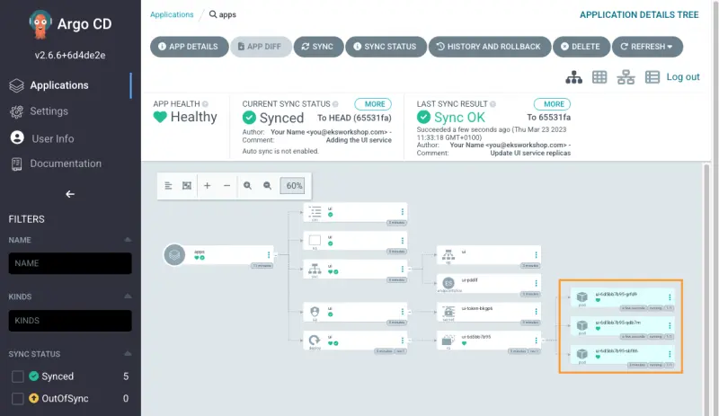

이제 Argo CD와 Kustomize를 사용하여 GitOps를 통해 애플리케이션 매니페스트에 패치를 배포할 수 있습니다. 예를 들어, `ui` 배포의 `replicas` 수를 `3`으로 늘려보겠습니다.

다음 명령을 실행하여 `apps-kustomization/ui/deployment-patch.yaml` 파일에 필요한 변경사항을 추가할 수 있습니다:

```bash
$ yq -i '.spec.replicas = 3' ~/environment/argocd/apps-kustomization/ui/deployment-patch.yaml
```

`apps-kustomization/ui/deployment-patch.yaml` 파일에서 계획된 변경사항을 검토할 수 있습니다.

```kustomization
modules/automation/gitops/argocd/update-application/deployment-patch.yaml
Deployment/ui
```

Git 저장소에 변경사항을 푸시합니다:

```bash
$ git -C ~/environment/argocd add .
$ git -C ~/environment/argocd commit -am "Update UI service replicas"
$ git -C ~/environment/argocd push
```

ArgoCD UI에서 `Refresh`와 `Sync`를 클릭하거나, `argocd` CLI를 사용하여 애플리케이션을 `Sync`하거나, 자동 `Sync`가 완료될 때까지 기다립니다:

```bash
$ argocd app sync ui
```



확인하려면 다음 명령을 실행하세요:

```bash hook=update
$ kubectl get deployment -n ui ui
NAME   READY   UP-TO-DATE   AVAILABLE   AGE
ui     3/3     3            3           3m33s
$ kubectl get pod -n ui
NAME                  READY   STATUS    RESTARTS   AGE
ui-6d5bb7b95-hzmgp   1/1     Running   0          61s
ui-6d5bb7b95-j28ww   1/1     Running   0          61s
ui-6d5bb7b95-rjfxd   1/1     Running   0          3m34s
```