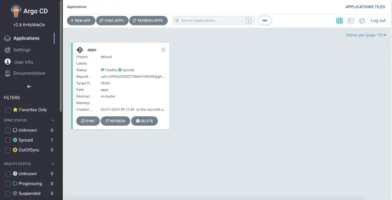

Argo CD는 Kubernetes에 `GitOps` 방법론을 적용합니다. Git을 클러스터의 원하는 상태에 대한 신뢰할 수 있는 소스로 사용합니다. Argo CD를 사용하여 애플리케이션을 배포하고, 상태를 모니터링하며, 원하는 상태와 동기화할 수 있습니다. Kubernetes 매니페스트는 다음과 같은 여러 방법으로 지정할 수 있습니다:

- Kustomize 애플리케이션
- Helm 차트
- Jsonnet 파일
- Kubernetes YAML 파일이 있는 일반 디렉토리

이 실습에서는 Argo CD를 사용하여 Kustomize로 지정된 애플리케이션을 배포할 것입니다. [EKS Workshop](https://github.com/aws-samples/eks-workshop-v2/tree/main/manifests/base-application/ui) 저장소의 `ui` 애플리케이션을 사용할 것입니다.

AWS CodeCommit에 Git 저장소가 이미 생성되어 있으므로, 이를 클론하고 초기 설정을 해보겠습니다:

```bash
$ git clone $GITOPS_REPO_URL_ARGOCD ~/environment/argocd
$ git -C ~/environment/argocd checkout -b main
Switched to a new branch 'main'
$ mkdir ~/environment/argocd/apps && touch ~/environment/argocd/apps/.gitkeep
$ git -C ~/environment/argocd add .
$ git -C ~/environment/argocd commit -am "Initial commit"
$ git -C ~/environment/argocd push --set-upstream origin main
```

Argo CD에서 Git 저장소에 접근할 수 있도록 Argo CD 시크릿을 생성합니다:

```bash
$ argocd repo add $GITOPS_REPO_URL_ARGOCD --ssh-private-key-path ${HOME}/.ssh/gitops_ssh.pem --insecure-ignore-host-key --upsert --name git-repo
Repository 'ssh://...' added
```

Argo CD 애플리케이션은 환경에 배포된 애플리케이션 인스턴스를 나타내는 Kubernetes CRD 리소스 객체입니다. 애플리케이션 이름, Git 저장소, Kubernetes 매니페스트 경로와 같은 애플리케이션의 주요 정보를 정의합니다. 애플리케이션 리소스는 또한 대상 리비전, 동기화 정책, 상태 확인 정책과 같은 애플리케이션의 원하는 상태를 정의합니다.

다음 단계로 Git 저장소의 원하는 상태와 `Sync`하는 Argo CD 애플리케이션을 생성해 보겠습니다:

```bash
$ argocd app create apps --repo $GITOPS_REPO_URL_ARGOCD \
  --path apps --dest-server https://kubernetes.default.svc
application 'apps' created
```

애플리케이션이 생성되었는지 확인합니다:

```bash
$ argocd app list
NAME         CLUSTER                         NAMESPACE  PROJECT  STATUS  HEALTH   SYNCPOLICY  CONDITIONS
argocd/apps  https://kubernetes.default.svc             default  Synced  Healthy  <none>      <none>
```

이제 ArgoCD UI에서도 이 애플리케이션을 볼 수 있습니다:



또는 `kubectl` 명령을 사용하여 클러스터의 Argo CD 객체와 상호 작용할 수도 있습니다:

```bash
$ kubectl get applications.argoproj.io -n argocd
NAME   SYNC STATUS   HEALTH STATUS
apps   Synced        Healthy
```