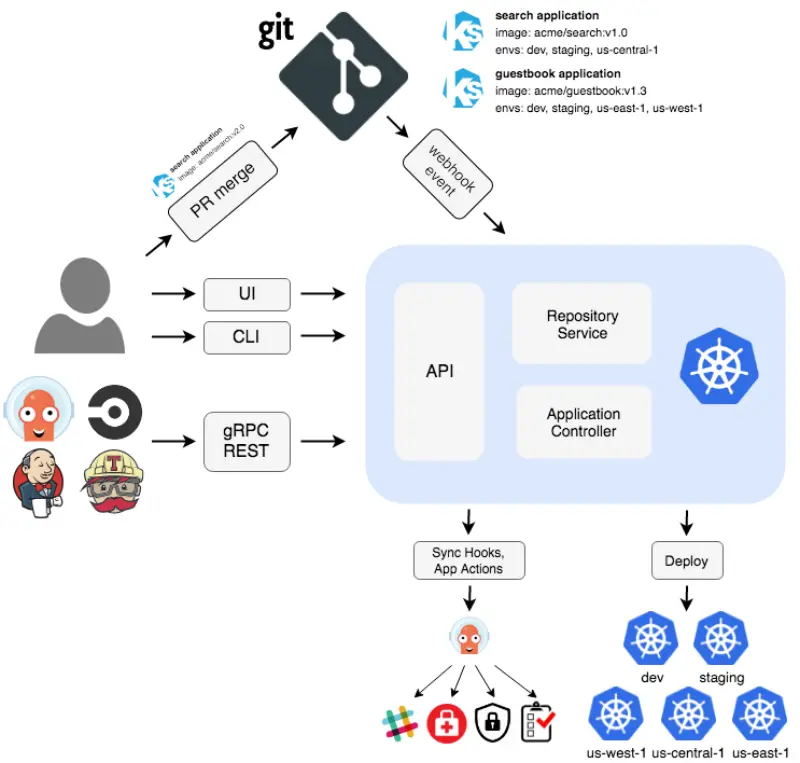

::required-time

:::tip 시작하기 전에
이 섹션을 위해 환경을 준비하세요:

```bash timeout=300 wait=120
$ prepare-environment automation/gitops/argocd
```

이는 실습 환경에 다음과 같은 변경사항을 적용합니다:

- AWS CodeCommit 리포지토리 생성
- Amazon EKS 클러스터에 ArgoCD 설치

이러한 변경사항을 적용하는 Terraform 코드는 [여기](https://github.com/VAR::MANIFESTS_OWNER/VAR::MANIFESTS_REPOSITORY/tree/VAR::MANIFESTS_REF/manifests/modules/automation/gitops/argocd/.workshop/terraform)에서 확인할 수 있습니다.

:::

[Argo CD](https://argoproj.github.io/cd/)는 Kubernetes를 위한 선언적 GitOps 지속적 배포 도구입니다. Kubernetes 클러스터의 Argo CD 컨트롤러는 클러스터의 상태를 지속적으로 모니터링하고 Git에 정의된 원하는 상태와 비교합니다. 클러스터 상태가 원하는 상태와 일치하지 않으면, Argo CD는 그 차이를 보고하고 개발자가 수동 또는 자동으로 클러스터 상태를 원하는 상태와 동기화할 수 있도록 시각화를 제공합니다.

Argo CD는 애플리케이션 상태를 관리하는 3가지 방법을 제공합니다:

- CLI - 애플리케이션을 위한 YAML 리소스 정의를 생성하고 클러스터와 동기화할 수 있는 강력한 CLI
- 사용자 인터페이스 - CLI로 할 수 있는 모든 작업을 수행할 수 있는 웹 기반 UI. 생성한 Argo CD 애플리케이션에 속한 Kubernetes 리소스를 시각화할 수 있습니다.
- 클러스터에 적용되는 Kubernetes 매니페스트와 Helm 차트

