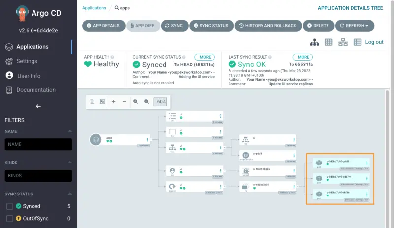

이제 Argo CD와 Kustomize를 사용하여 GitOps 방식으로 애플리케이션 매니페스트에 패치를 배포할 수 있습니다.

예를 들어, `ui` 배포의 `replicas` 수를 `3`으로 늘려보겠습니다.

<!--
```kustomization
modules/automation/gitops/argocd/update-application/deployment-patch.yaml
Deployment/ui
```

Git 저장소 디렉토리에 패치 파일을 복사합니다:

```bash
$ cp /workspace/modules/automation/gitops/argocd/update-application/deployment-patch.yaml ~/environment/argocd/apps/deployment-patch.yaml
```

`apps/deployment-patch.yaml` 파일에서 계획된 변경 사항을 검토할 수 있습니다.

패치를 적용하려면 아래 예시와 같이 `apps/kustomization.yaml` 파일을 편집할 수 있습니다:

```file
manifests/modules/automation/gitops/argocd/update-application/kustomization.yaml.example
```

편집된 `kustomization.yaml` 파일을 Git 저장소 디렉토리에 복사합니다:

```bash
$ cp /workspace/modules/automation/gitops/argocd/update-application/kustomization.yaml.example ~/environment/argocd/apps/kustomization.yaml
```
-->

`apps/deployment.yaml` 파일에 필요한 변경 사항을 추가하기 위해 다음 명령을 실행할 수 있습니다:

```bash
$ yq -i '.spec.replicas = 3' ~/environment/argocd/apps/deployment.yaml
```

Git 저장소에 변경 사항을 푸시합니다

```bash
$ git -C ~/environment/argocd add .
$ git -C ~/environment/argocd commit -am "Update UI service replicas"
$ git -C ~/environment/argocd push
```

ArgoCD UI에서 `Refresh`와 `Sync`를 클릭하거나 `argocd` CLI를 사용하여 애플리케이션을 `Sync`합니다:

```bash
$ argocd app sync apps
```

이제 `ui` 배포에 3개의 파드가 있어야 합니다



확인하려면 다음 명령을 실행하세요:

```bash hook=update
$ kubectl get deployment -n ui ui
NAME   READY   UP-TO-DATE   AVAILABLE   AGE
ui     3/3     3            3           3m33s
$ kubectl get pod -n ui
NAME                 READY   STATUS    RESTARTS   AGE
ui-6d5bb7b95-hzmgp   1/1     Running   0          61s
ui-6d5bb7b95-j28ww   1/1     Running   0          61s
ui-6d5bb7b95-rjfxd   1/1     Running   0          3m34s
```