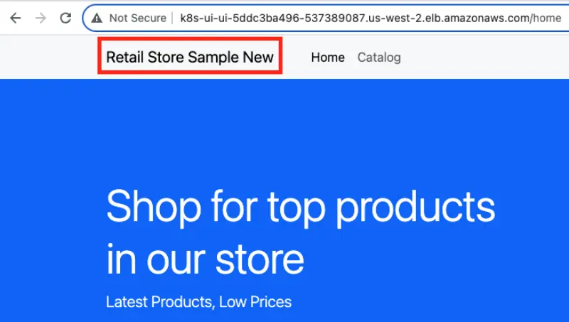

EKS 클러스터에 Flux를 성공적으로 부트스트랩하고 애플리케이션을 배포했습니다. 소스 코드의 변경사항을 적용하고, 새로운 컨테이너 이미지를 빌드하며, GitOps를 활용하여 새 이미지를 클러스터에 배포하는 방법을 보여주기 위해 지속적 통합 파이프라인을 소개합니다. AWS Developer Tools와 [DevOps 원칙](https://aws.amazon.com/devops/what-is-devops/)을 활용하여 Amazon ECR용 [멀티 아키텍처 컨테이너 이미지](https://aws.amazon.com/blogs/containers/introducing-multi-architecture-container-images-for-amazon-ecr/)를 빌드할 것입니다.

환경 준비 단계에서 지속적 통합 파이프라인을 생성했으며 이제 이를 실행해야 합니다.


먼저, 애플리케이션 소스를 위한 CodeCommit 저장소를 복제합니다:

```bash
$ git clone ssh://${GITOPS_IAM_SSH_KEY_ID}@git-codecommit.${AWS_REGION}.amazonaws.com/v1/repos/${EKS_CLUSTER_NAME}-retail-store-sample ~/environment/retail-store-sample-codecommit
```

다음으로, [샘플 애플리케이션](https://github.com/aws-containers/retail-store-sample-app)의 공개 저장소에서 소스를 CodeCommit 저장소에 채웁니다:

```bash
$ git clone https://github.com/aws-containers/retail-store-sample-app ~/environment/retail-store-sample-app
$ git -C ~/environment/retail-store-sample-codecommit checkout -b main
$ cp -R ~/environment/retail-store-sample-app/src ~/environment/retail-store-sample-codecommit
```

AWS CodeBuild를 사용하고 `buildspec.yml`을 정의하여 새로운 `x86_64`와 `arm64` 이미지를 병렬로 빌드합니다.

```file
manifests/modules/automation/gitops/flux/buildspec.yml
```

```bash
$ cp ~/environment/eks-workshop/modules/automation/gitops/flux/buildspec.yml \
  ~/environment/retail-store-sample-codecommit/buildspec.yml
```

`buildspec-manifest.yml`을 사용하여 `멀티 아키텍처 이미지`를 위한 `Image Index`를 빌드하기 위해 AWS CodeBuild도 사용합니다.

```file
manifests/modules/automation/gitops/flux/buildspec-manifest.yml
```

```bash
$ cp ~/environment/eks-workshop/modules/automation/gitops/flux/buildspec-manifest.yml \
  ~/environment/retail-store-sample-codecommit/buildspec-manifest.yml
```

이제 변경사항을 CodeCommit에 푸시하고 CodePipeline을 시작할 준비가 되었습니다.

```bash
$ git -C ~/environment/retail-store-sample-codecommit add .
$ git -C ~/environment/retail-store-sample-codecommit commit -am "initial commit"
$ git -C ~/environment/retail-store-sample-codecommit push --set-upstream origin main
```

AWS 콘솔에서 `CodePipeline`으로 이동하여 `eks-workshop-retail-store-sample` 파이프라인을 살펴볼 수 있습니다:

<ConsoleButton url="https://console.aws.amazon.com/codesuite/codepipeline/pipelines/eks-workshop-retail-store-sample/view" service="codepipeline" label="CodePipeline 콘솔 열기"/>

다음과 같이 보일 것입니다:


CodeBuild를 사용한 CodePipeline 실행 결과로 ECR에 새로운 이미지가 생성됩니다.

```bash
$ echo IMAGE_URI_UI=$IMAGE_URI_UI
```

`retail-store-sample-ui-z7llv2` 이름의 접미사 `z7llv2`는 무작위이며 귀하의 경우 다를 것입니다.


파이프라인이 새 이미지를 생성하는 동안(5-10분), 초기 Flux 부트스트랩 과정에서 설치한 Flux Image Automation 컨트롤러를 사용하여 [Git에 대한 이미지 업데이트를 자동화](https://fluxcd.io/flux/guides/image-update/)해 보겠습니다.

다음으로, `deployment.yaml` 파일을 편집하고 새 컨테이너 이미지 URL의 플레이스홀더를 추가합니다:

```bash
$ git -C ~/environment/flux pull
$ sed -i 's/^\(\s*\)image: "public.ecr.aws\/aws-containers\/retail-store-sample-ui:0.4.0"/\1image: "public.ecr.aws\/aws-containers\/retail-store-sample-ui:0.4.0" # {"$imagepolicy": "flux-system:ui"}/' ~/environment/flux/apps/ui/deployment.yaml
$ less ~/environment/flux/apps/ui/deployment.yaml | grep imagepolicy
          image: "public.ecr.aws/aws-containers/retail-store-sample-ui:0.4.0" # {"$imagepolicy": "flux-system:ui"}
```

이것은 pod 명세의 이미지를 다음과 같이 변경할 것입니다:

```text
image: "public.ecr.aws/aws-containers/retail-store-sample-ui:0.4.0" `# {"$imagepolicy": "flux-system:ui"}`
```

이러한 변경사항을 배포에 커밋합니다:

```bash
$ git -C ~/environment/flux add .
$ git -C ~/environment/flux commit -am "Adding ImagePolicy"
$ git -C ~/environment/flux push
$ flux reconcile kustomization apps --with-source
```

ECR의 새 컨테이너 이미지 모니터링과 GitOps를 사용한 자동 배포를 활성화하기 위해 Flux에 대한 사용자 정의 리소스 정의(ImageRepository, ImagePolicy, ImageUpdateAutomation)를 배포해야 합니다.

`ImageRepository`:

```file
manifests/modules/automation/gitops/flux/imagerepository.yaml
```

`ImagePolicy`:

```file
manifests/modules/automation/gitops/flux/imagepolicy.yaml
```

`ImageUpdateAutomation`:

```file
manifests/modules/automation/gitops/flux/imageupdateautomation.yaml
```

이 파일들을 애플리케이션 저장소에 추가하고 적용합니다:

```bash
$ cp ~/environment/eks-workshop/modules/automation/gitops/flux/image*.yaml \
  ~/environment/retail-store-sample-codecommit/
$ yq -i ".spec.image = env(IMAGE_URI_UI)" \
  ~/environment/retail-store-sample-codecommit/imagerepository.yaml
$ less ~/environment/retail-store-sample-codecommit/imagerepository.yaml | grep image:
$ kubectl apply -f ~/environment/retail-store-sample-codecommit/imagerepository.yaml
$ kubectl apply -f ~/environment/retail-store-sample-codecommit/imagepolicy.yaml
$ kubectl apply -f ~/environment/retail-store-sample-codecommit/imageupdateautomation.yaml
```

다음과 같은 아키텍처를 만들었습니다:


이제 변경사항을 조정해 보겠습니다.

```bash
$ flux reconcile image repository ui
$ flux reconcile kustomization apps --with-source
$ kubectl wait deployment -n ui ui --for condition=Available=True --timeout=120s
$ git -C ~/environment/flux pull
$ kubectl -n ui get pods
```

`deployment`의 `image:`가 새로운 태그로 업데이트되었는지 확인할 수 있습니다.

```bash
$ kubectl -n ui describe deployment ui | grep Image
```

브라우저를 사용하여 `UI`에 접근하기 위해 다음 매니페스트로 Ingress 리소스를 생성하여 노출해야 합니다:

```file
manifests/modules/automation/gitops/flux/ci-ingress/ingress.yaml
```

이로 인해 AWS Load Balancer 컨트롤러가 Application Load Balancer(ALB)를 프로비저닝하고 `ui` 애플리케이션의 Pod로 트래픽을 라우팅하도록 구성합니다.

```bash timeout=180 wait=10
$ kubectl apply -k ~/environment/eks-workshop/modules/automation/gitops/flux/ci-ingress
```

생성된 Ingress 객체를 검사해 보겠습니다:

```bash
$ kubectl get ingress ui -n ui
NAME   CLASS   HOSTS   ADDRESS                                            PORTS   AGE
ui     alb     *       k8s-ui-ui-1268651632.us-west-2.elb.amazonaws.com   80      15s
```

Application Load Balancer(ALB)가 프로비저닝될 때까지 2-5분 기다린 후 ingress의 URL을 사용하여 UI 페이지를 확인합니다.

```bash timeout=300
$ export UI_URL=$(kubectl get ingress -n ui ui -o jsonpath="{.status.loadBalancer.ingress[*].hostname}{'\n'}")
$ wait-for-lb $UI_URL
```


샘플 애플리케이션의 소스 코드에 변경사항을 도입해 보겠습니다.

파일을 편집합니다:

```bash
$ sed -i 's/\(^\s*<a class="navbar-brand" href="\/home">\)Retail Store Sample/\1Retail Store Sample New/' \
  ~/environment/retail-store-sample-codecommit/src/ui/src/main/resources/templates/fragments/layout.html
$ less ~/environment/retail-store-sample-codecommit/src/ui/src/main/resources/templates/fragments/layout.html | grep New
```

24번 줄을 변경합니다

`<a class="navbar-brand" href="/home">Retail Store Sample</a>`를 `<a class="navbar-brand" href="/home">Retail Store Sample New</a>`로 변경

변경사항을 커밋합니다.

```bash wait=30
$ git -C ~/environment/retail-store-sample-codecommit status
$ git -C ~/environment/retail-store-sample-codecommit add .
$ git -C ~/environment/retail-store-sample-codecommit commit -am "Update UI src"
$ git -C ~/environment/retail-store-sample-codecommit push
```

CodePipeline 실행이 완료될 때까지 기다립니다:

```bash timeout=900 wait=30
$ kubectl -n ui describe deployment ui | grep Image
$ while [[ "$(aws codepipeline get-pipeline-state --name ${EKS_CLUSTER_NAME}-retail-store-sample --query 'stageStates[1].actionStates[0].latestExecution.status' --output text)" != "InProgress" ]]; do echo "Waiting for pipeline to start ..."; sleep 10; done && echo "Pipeline started."
$ while [[ "$(aws codepipeline get-pipeline-state --name ${EKS_CLUSTER_NAME}-retail-store-sample --query 'stageStates[1].actionStates[2].latestExecution.status' --output text)" != "Succeeded" ]]; do echo "Waiting for pipeline to reach 'Succeeded' state ..."; sleep 10; done && echo "Pipeline has reached the 'Succeeded' state."
```

그런 다음 Flux를 트리거하여 새 이미지를 조정하도록 할 수 있습니다:

```bash
$ flux reconcile image repository ui
$ sleep 5
$ flux reconcile kustomization apps --with-source
$ kubectl wait deployment -n ui ui --for condition=Available=True --timeout=120s
```

Git 저장소를 가져오면 로그에서 변경된 내용을 볼 수 있습니다:

```bash
$ git -C ~/environment/flux pull
$ git -C ~/environment/flux log
commit f03661ddb83f8251036e2cc3c8ca70fe32f2df6c (HEAD -> main, origin/main, origin/HEAD)
Author: fluxcdbot <fluxcdbot@users.noreply.github.com>
Date:   Fri Nov 3 17:18:08 2023 +0000

    1234567890.dkr.ecr.us-west-2.amazonaws.com/retail-store-sample-ui-c5nmqe:i20231103171720-ac8730e8
[...]
```

마찬가지로 CodeCommit 커밋 보기에서도 활동을 확인할 수 있습니다:

<ConsoleButton url="https://console.aws.amazon.com/codesuite/codecommit/repositories/eks-workshop-gitops/commits" service="codecommit" label="CodeCommit 콘솔 열기"/>

pod를 확인하여 이미지가 업데이트되었는지 확인할 수 있습니다:

```bash
$ kubectl -n ui get pods
$ kubectl -n ui describe deployment ui | grep Image
```

성공적인 빌드와 배포(5-10분) 후에 새로운 버전의 UI 애플리케이션이 실행됩니다.

