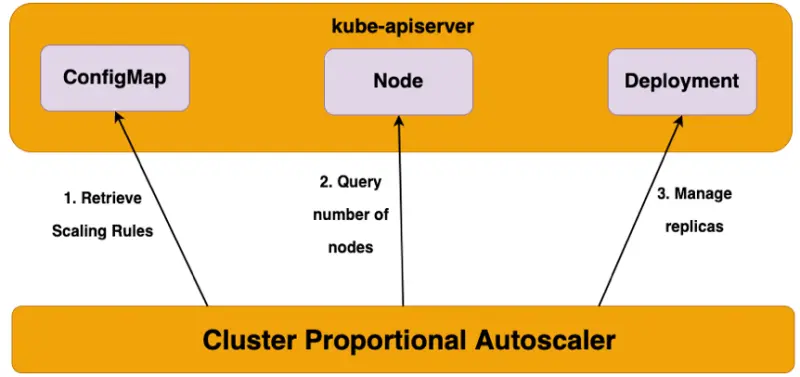

::required-time

:::tip 시작하기 전에
이 섹션을 위한 환경을 준비하세요:

```bash
$ prepare-environment autoscaling/workloads/cpa
```

:::

이 실습에서는 [클러스터 비례 오토스케일러](https://github.com/kubernetes-sigs/cluster-proportional-autoscaler)에 대해 알아보고 클러스터 컴퓨팅 크기에 비례하여 애플리케이션을 확장하는 방법을 배우겠습니다.

클러스터 비례 오토스케일러(CPA - Cluster Proportional Autoscaler)는 클러스터의 노드 수에 기반하여 레플리카를 확장하는 수평적 파드 오토스케일러(HPA)입니다. 비례 오토스케일러 컨테이너는 클러스터의 스케줄 가능한 노드와 코어의 수를 모니터링하고 레플리카의 수를 조정합니다. 이 기능은 CoreDNS와 같이 클러스터의 노드/파드 수에 따라 확장되는 애플리케이션과 같이 클러스터 크기에 맞춰 자동 확장이 필요한 애플리케이션에 유용합니다. CPA는 파드 내부에서 실행되는 Golang API 클라이언트를 통해 API 서버에 연결하여 클러스터의 노드 및 코어 수를 폴링합니다. 스케일링 파라미터와 데이터 포인트는 ConfigMap을 통해 오토스케일러에 제공되며, 매 폴링 간격마다 파라미터 테이블을 새로 고쳐 최신 스케일링 파라미터를 유지합니다. 다른 오토스케일러와 달리 CPA는 Metrics API에 의존하지 않으며 Metrics Server가 필요하지 않습니다.



CPA의 주요 사용 사례는 다음과 같습니다:

- 오버 프로비저닝
- 코어 플랫폼 서비스 확장
- `metrics` 서버나 `prometheus` 어댑터가 필요 없는 간단하고 쉬운 워크로드 확장 메커니즘

## 클러스터 비례 오토스케일러(CPA)가 사용하는 스케일링 방법

### 선형(Linear)

- 이 스케일링 방법은 클러스터에서 사용 가능한 노드 또는 코어 수에 직접적으로 비례하여 애플리케이션을 확장합니다
- `coresPerReplica` 또는 `nodesPerReplica` 중 하나를 생략할 수 있습니다
- `preventSinglePointFailure`가 `true`로 설정된 경우, 컨트롤러는 노드가 둘 이상일 때 최소 2개의 레플리카를 보장합니다
- `includeUnschedulableNodes`가 `true`로 설정된 경우, 전체 노드 수를 기준으로 레플리카가 확장됩니다. 그렇지 않으면 스케줄 가능한 노드 수(즉, 코든되고 드레이닝되는 노드는 제외)만을 기준으로 레플리카가 확장됩니다
- `min`, `max`, `preventSinglePointFailure`, `includeUnschedulableNodes`는 모두 선택사항입니다. 설정하지 않으면 `min`은 1로, `preventSinglePointFailure`는 `false`로, `includeUnschedulableNodes`는 `false`로 기본 설정됩니다
- `coresPerReplica`와 `nodesPerReplica`는 모두 부동소수점 값입니다

### 선형 ConfigMap

```text
data:
  linear: |-
    {
      "coresPerReplica": 2,
      "nodesPerReplica": 1,
      "min": 1,
      "max": 100,
      "preventSinglePointFailure": true,
      "includeUnschedulableNodes": true
    }
```

**선형 제어 모드의 방정식:**

```text
replicas = max( ceil( cores * 1/coresPerReplica ) , ceil( nodes * 1/nodesPerReplica ) )
replicas = min(replicas, max)
replicas = max(replicas, min)
```

### 계단식(Ladder)

- 이 스케일링 방법은 노드:레플리카 및/또는 코어:레플리카 비율을 결정하기 위해 계단 함수를 사용합니다
- 계단식 함수는 ConfigMap의 코어 및 노드 스케일링을 위한 데이터 포인트를 사용합니다. 더 많은 레플리카 수를 산출하는 조회 결과가 목표 스케일링 수로 사용됩니다
- `coresPerReplica` 또는 `nodesPerReplica` 중 하나를 생략할 수 있습니다
- 레플리카를 0으로 설정할 수 있습니다(선형 모드와 달리)
- 0 레플리카로의 스케일링은 클러스터가 성장함에 따라 선택적 기능을 활성화하는 데 사용될 수 있습니다

### 계단식 ConfigMap

```text
data:
  ladder: |-
    {
      "coresToReplicas":
      [
        [ 1, 1 ],
        [ 64, 3 ],
        [ 512, 5 ],
        [ 1024, 7 ],
        [ 2048, 10 ],
        [ 4096, 15 ]
      ],
      "nodesToReplicas":
      [
        [ 1, 1 ],
        [ 2, 2 ]
      ]
    }
```

#### 수평적 파드 오토스케일러(HPA)와의 비교

수평적 파드 오토스케일러(HPA)는 최상위 Kubernetes API 리소스입니다. HPA는 파드의 CPU/메모리 사용률을 모니터링하고 레플리카 수를 자동으로 조정하는 폐쇄 피드백 루프 오토스케일러입니다. HPA는 Metrics API에 의존하고 Metrics Server가 필요한 반면, 클러스터 비례 오토스케일러는 Metrics Server나 Metrics API를 사용하지 않습니다. 클러스터 비례 오토스케일러는 Kubernetes 리소스로 확장되지 않고 대신 플래그를 사용하여 대상 워크로드를 식별하고 스케일링 구성을 위해 ConfigMap을 사용합니다. CPA는 클러스터 크기를 감시하고 대상 컨트롤러를 확장하는 간단한 제어 루프를 제공합니다. CPA의 입력은 클러스터의 스케줄 가능한 코어와 노드의 수입니다.

이 실습에서는 클러스터의 컴퓨팅 양에 비례하여 EKS 클러스터의 CoreDNS 시스템 컴포넌트를 확장하는 것을 시연하겠습니다.
