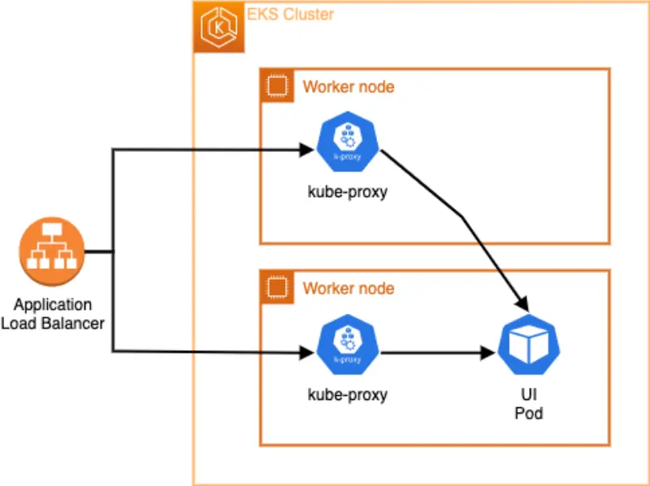

::required-time

:::tip 시작하기 전에
이 섹션을 위한 환경을 준비하세요:

```bash timeout=300 wait=30
$ prepare-environment exposing/load-balancer
```

이는 실습 환경에 다음과 같은 변경사항을 적용합니다:

- Creates an IAM role required by the AWS Load Balancer 컨트롤러

[**여기**](https://github.com/VAR::MANIFESTS_OWNER/VAR::MANIFESTS_REPOSITORY/tree/VAR::MANIFESTS_REF/manifests/modules/exposing/load-balancer/.workshop/terraform)에서 이러한 변경사항을 적용하는 Terraform을 확인할 수 있습니다.
:::

쿠버네티스는 서비스를 사용하여 클러스터 외부에 Pod를 노출합니다. AWS에서 서비스를 사용하는 가장 인기 있는 방법 중 하나는 `LoadBalancer` 유형을 사용하는 것입니다. 서비스 이름, 포트, 레이블 선택기(Selector)를 선언하는 간단한 YAML 파일로 클라우드 컨트롤러가 자동으로 로드 밸런서를 프로비저닝합니다.

```yaml
apiVersion: v1
kind: Service
metadata:
  name: search-svc # the name of our service
spec:
  type: loadBalancer
  selector:
    app: SearchApp # pods are deployed with the label app=SearchApp
  ports:
    - port: 80
```

애플리케이션 앞에 로드 밸런서를 배치하는 것이 매우 간단하기 때문에 이는 훌륭한 방법입니다. 서비스 스펙은 수년에 걸쳐 어노테이션과 추가 구성으로 확장되어 왔습니다. 두 번째 옵션은 ingress 규칙과 ingress 컨트롤러를 사용하여 외부 트래픽을 쿠버네티스  Pod로 라우팅하는 것입니다.



이 장에서는 Network Load Balancer(NLB - layer 4)를 사용하여 EKS 클러스터에서 실행 중인 애플리케이션을 인터넷에 노출하는 방법을 시연할 것입니다.