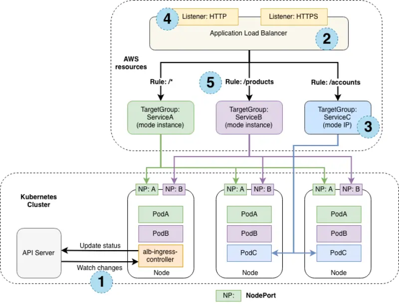

앞서 언급했듯이, 우리가 생성한 NLB는 "Instance mode"로 작동하고 있습니다. 인스턴스 대상 모드는 AWS EC2 인스턴스에서 실행되는 Pod를 지원합니다. 이 모드에서 AWS NLB는 인스턴스로 트래픽을 보내고, 개별 워커 노드의 `kube-proxy`가 쿠버네티스 클러스터의 하나 이상의 워커 노드를 통해  Pod로 전달합니다.

AWS Load Balancer 컨트롤러는 "IP mode"로 작동하는 NLB 생성도 지원합니다. 이 모드에서는 AWS NLB가 서비스 뒤의 쿠버네티스  Pod로 직접 트래픽을 보내므로, 쿠버네티스 클러스터의 워커 노드를 통한 추가 네트워크 홉이 필요하지 않습니다. IP 대상 모드는 AWS EC2 인스턴스와 AWS Fargate 모두에서 실행되는 Pod를 지원합니다.



이전 다이어그램은 대상 그룹 모드가 Instance와 IP일 때 애플리케이션 트래픽이 어떻게 다르게 흐르는지 설명합니다.

대상 그룹 모드가 Instance인 경우, 트래픽은 각 노드의 서비스를 위해 생성된 노드 포트를 통해 흐릅니다. 이 모드에서는 `kube-proxy`가 이 서비스를 실행하는  Pod로 트래픽을 라우팅합니다. 서비스 Pod는 로드 밸런서로부터 트래픽을 받은 노드와 다른 노드에서 실행될 수 있습니다. ServiceA(녹색)와 ServiceB(분홍색)는 "Instance mode"로 작동하도록 구성되어 있습니다.

반면에 대상 그룹 모드가 IP인 경우, 트래픽은 로드 밸런서에서 서비스  Pod로 직접 흐릅니다. 이 모드에서는 `kube-proxy`의 네트워크 홉을 건너뜁니다. ServiceC(파란색)는 "IP mode"로 작동하도록 구성되어 있습니다.

이전 다이어그램의 숫자들은 다음과 같은 것들을 나타냅니다.

1. 서비스가 배포된 EKS 클러스터
2. 서비스를 노출하는 ELB 인스턴스
3. 인스턴스 또는 IP가 될 수 있는 대상 그룹 모드 구성
4. 서비스가 노출되는 로드 밸런서에 구성된 리스너 프로토콜
5. 서비스 대상을 결정하는 데 사용되는 대상 그룹 규칙 구성

NLB를 IP 대상 모드로 구성하고자 하는 여러 가지 이유가 있습니다:

1. EC2 워커 노드의 `kube-proxy`를 우회하여 인바운드 연결에 대해 더 효율적인 네트워크 경로 생성
2. `externalTrafficPolicy이나` 다양한 구성 옵션의 트레이드오프를 고려할 필요가 없음
3. EC2 대신 Fargate에서 애플리케이션이 실행되는 경우

### NLB 재구성 하기

NLB를 IP 모드를 사용하도록 재구성하고 이것이 인프라에 미치는 영향을 살펴보겠습니다.

다음은 Service를 재구성하기 위해 적용할 패치입니다:

```kustomization
modules/exposing/load-balancer/ip-mode/nlb.yaml
Service/ui-nlb
```

kustomize로 매니페스트를 적용합니다:

```bash
$ kubectl apply -k ~/environment/eks-workshop/modules/exposing/load-balancer/ip-mode
```

로드 밸런서의 구성이 업데이트되는 데 몇 분이 걸릴 것입니다. 다음 명령을 실행하여 어노테이션이 업데이트되었는지 확인하세요:

```bash
$ kubectl describe service/ui-nlb -n ui
...
Annotations:              service.beta.kubernetes.io/aws-load-balancer-nlb-target-type: ip
...
```

이전과 동일한 URL을 사용하여 애플리케이션에 접근할 수 있어야 하며, 이제 NLB는 IP 모드를 사용하여 애플리케이션을 노출합니다.

```bash
$ ALB_ARN=$(aws elbv2 describe-load-balancers --query 'LoadBalancers[?contains(LoadBalancerName, `k8s-ui-uinlb`) == `true`].LoadBalancerArn' | jq -r '.[0]')
$ TARGET_GROUP_ARN=$(aws elbv2 describe-target-groups --load-balancer-arn $ALB_ARN | jq -r '.TargetGroups[0].TargetGroupArn')
$ aws elbv2 describe-target-health --target-group-arn $TARGET_GROUP_ARN
{
    "TargetHealthDescriptions": [
        {
            "Target": {
                "Id": "10.42.180.183",
                "Port": 8080,
                "AvailabilityZone": "us-west-2a"
            },
            "HealthCheckPort": "8080",
            "TargetHealth": {
                "State": "initial",
                "Reason": "Elb.RegistrationInProgress",
                "Description": "Target registration is in progress"
            }
        }
    ]
}
```

이전 섹션에서 관찰한 3개의 대상에서 단일 대상으로 변경된 것을 주목하세요. 왜 그럴까요? EKS 클러스터의 EC2 인스턴스를 등록하는 대신, 로드 밸런서 컨트롤러는 이제 개별 Pod를 등록하고 트래픽을 직접 전송하며, AWS VPC CNI와 Pod가 각각 일급 VPC IP 주소를 가지고 있다는 사실을 활용합니다.

`ui` 컴포넌트를 3개의 복제본으로 확장하여 어떤 일이 일어나는지 살펴보겠습니다:

```bash
$ kubectl scale -n ui deployment/ui --replicas=3
$ kubectl wait --for=condition=Ready pod -n ui -l app.kubernetes.io/name=ui --timeout=60s
```

이제 로드 밸런서 대상을 다시 확인해보세요:

```bash
$ ALB_ARN=$(aws elbv2 describe-load-balancers --query 'LoadBalancers[?contains(LoadBalancerName, `k8s-ui-uinlb`) == `true`].LoadBalancerArn' | jq -r '.[0]')
$ TARGET_GROUP_ARN=$(aws elbv2 describe-target-groups --load-balancer-arn $ALB_ARN | jq -r '.TargetGroups[0].TargetGroupArn')
$ aws elbv2 describe-target-health --target-group-arn $TARGET_GROUP_ARN
{
    "TargetHealthDescriptions": [
        {
            "Target": {
                "Id": "10.42.180.181",
                "Port": 8080,
                "AvailabilityZone": "us-west-2c"
            },
            "HealthCheckPort": "8080",
            "TargetHealth": {
                "State": "initial",
                "Reason": "Elb.RegistrationInProgress",
                "Description": "Target registration is in progress"
            }
        },
        {
            "Target": {
                "Id": "10.42.140.129",
                "Port": 8080,
                "AvailabilityZone": "us-west-2a"
            },
            "HealthCheckPort": "8080",
            "TargetHealth": {
                "State": "healthy"
            }
        },
        {
            "Target": {
                "Id": "10.42.105.38",
                "Port": 8080,
                "AvailabilityZone": "us-west-2a"
            },
            "HealthCheckPort": "8080",
            "TargetHealth": {
                "State": "initial",
                "Reason": "Elb.RegistrationInProgress",
                "Description": "Target registration is in progress"
            }
        }
    ]
}
```

예상대로 이제 `ui` Deployment의 복제본 수와 일치하는 3개의 대상이 있습니다.

애플리케이션이 여전히 동일하게 작동하는지 확인하기 위해 기다리고 싶다면 다음 명령을 실행하세요. 그렇지 않으면 다음 모듈로 진행할 수 있습니다

```bash timeout=240
$ wait-for-lb $(kubectl get service -n ui ui-nlb -o jsonpath="{.status.loadBalancer.ingress[*].hostname}{'\n'}")
```