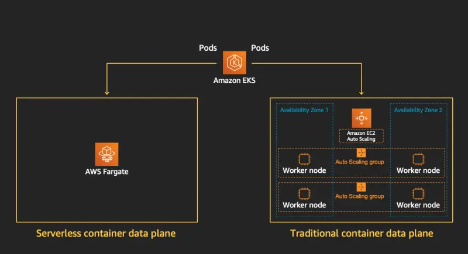

::required-time

:::tip 시작하기 전에
이 섹션을 위해 환경을 준비하세요:

```bash
$ prepare-environment fundamentals/fargate

```

이는 실습 환경에 다음과 같은 변경사항을 적용할 것입니다:

* Fargate에서 사용할 IAM 역할 생성

[여기](https://github.com/VAR::MANIFESTS_OWNER/VAR::MANIFESTS_REPOSITORY/tree/VAR::MANIFESTS_REF/manifests/modules/fundamentals/fargate/.workshop/terraform)에서 이러한 변경사항을 적용하는 Terraform을 볼 수 있습니다.
:::

이전 모듈에서 우리는 EKS 클러스터에서 Pod를 실행하기 위해 EC2 컴퓨팅 인스턴스를 프로비저닝하는 방법과 관리형 노드 그룹이 운영 부담을 줄이는 데 어떻게 도움이 되는지 살펴보았습니다. 그러나 이 모델에서는 여전히 기본 인프라의 가용성, 용량 및 유지 관리에 대한 책임이 있습니다.

[AWS Fargate](https://aws.amazon.com/fargate/)는 컨테이너를 위한 온디맨드, 적정 크기의 컴퓨팅 용량을 제공하는 기술입니다. AWS Fargate를 사용하면 컨테이너를 실행하기 위해 직접 가상 머신 그룹을 프로비저닝, 구성 또는 확장할 필요가 없습니다. 또한 서버 유형을 선택하거나, 노드 그룹을 확장할 시기를 결정하거나, 클러스터 패킹을 최적화할 필요가 없습니다. Fargate 프로필을 통해 어떤 Pod가 Fargate에서 시작되고 어떻게 실행되는지 제어할 수 있습니다. Fargate 프로필은 Amazon EKS 클러스터의 일부로 정의됩니다.



Amazon EKS는 Kubernetes에서 제공하는 업스트림, 확장 가능한 모델을 사용하여 AWS가 구축한 컨트롤러를 통해 Kubernetes를 AWS Fargate와 통합합니다. 이러한 컨트롤러는 Amazon EKS 관리형 Kubernetes 컨트롤 플레인의 일부로 실행되며 네이티브 Kubernetes Pod를 Fargate에 스케줄링하는 역할을 합니다. Fargate 컨트롤러에는 기본 Kubernetes 스케줄러와 함께 실행되는 새로운 스케줄러와 여러 변형 및 검증 승인 컨트롤러가 포함됩니다. Fargate에서 실행할 기준을 충족하는 Pod를 시작하면 클러스터에서 실행 중인 Fargate 컨트롤러가 Pod를 인식하고 업데이트하며 Fargate에 스케줄링합니다.

Fargate의 이점은 다음과 같습니다:

* AWS Fargate를 사용하면 애플리케이션에 집중할 수 있습니다. 애플리케이션 내용, 네트워킹, 스토리지 및 확장 요구사항을 정의하면 됩니다. 프로비저닝, 패치, 클러스터 용량 관리 또는 인프라 관리가 필요하지 않습니다.
* AWS Fargate는 마이크로서비스 아키텍처 애플리케이션, 배치 처리, 머신 러닝 애플리케이션 및 온프레미스 애플리케이션을 클라우드로 마이그레이션하는 등 모든 일반적인 컨테이너 사용 사례를 지원합니다.
* 격리 모델과 보안을 위해 AWS Fargate를 선택하세요. 또한 EC2 인스턴스를 프로비저닝하거나 관리하지 않고 컨테이너를 시작하려면 Fargate를 선택하세요. EC2 인스턴스에 대한 더 큰 제어나 더 넓은 사용자 지정 옵션이 필요한 경우 Fargate 없이 ECS 또는 EKS를 사용하세요.
